## 前言

>在 22 年的最后两天终于有时间开始整理填坑了，顶鸽逃跑（不是故意的）看见很多新手小白还是在文档海里扑腾找不到 K210 的资料文档，那就由这篇 K210 的避坑指南让小白的使用之路更顺利一点吧！

**这篇文档以 SIPEED `MaixDuino` 的使用为示例说明，并且大部分内容通用于 K210 系列开发板，可供购入 K210 系列顾客参考使用，`MaixDuino` 相关介绍参数[ 点击 ](https://wiki.sipeed.com/hardware/zh/maix/maixpy_develop_kit_board/maix_duino.html)查询，选购开发板指南可参考[选购指南。](https://wiki.sipeed.com/soft/maixpy/zh/develop_kit_board/get_hardware.html)**

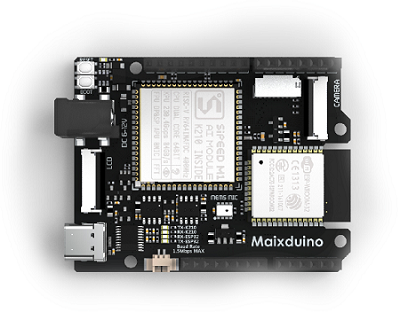

## 基础知识

在使用板子上手之前，我们需要先掌握一些基础知识**（有基础的小伙伴可跳过）**由于 `MaixPy` 是基于 `MicroPython` 之上进行开发构建的，提供给用户最终的接口是 `Micropython`，所以在使用 `MaixPy` 之初我们需要熟悉下 `MicroPython` 的基础知识与语法以及常用的 `Git` 与 `Github`。

**MaixPy 语法基础知识：**[点击查看](https://wiki.sipeed.com/soft/maixpy/zh/get_started/knowledge_micropython.html)
**Git 和 Github 介绍：**[点击查看](https://wiki.sipeed.com/soft/maixpy/zh/get_started/knowledge_git_github.html)

以下是图像及音频的背景知识，有需要或感兴趣的小伙伴可以查看。

**图像处理背景知识：**[点击查看](https://wiki.sipeed.com/soft/maixpy/zh/get_started/knowledge_image.html)
**音频处理背景知识：**[点击查看](https://wiki.sipeed.com/soft/maixpy/zh/get_started/knowledge_audio.html)

## 准备工作

无论是新手小白还是开发者在踏入 `K210 系列开发板` 学习之路前，做好充足的准备工作在一定程度上可以在使用途中避免踩坑。这篇文档是以一份避坑上手步骤的指南为核心来构写的，所以切记！！新手小白千万不可以跳着看，下图是示例硬件 `MaixDuino` 开发板、摄像头、屏幕、以及 USB Type-c 数据线。


### 上手流程图

避坑指南可以搭配上手流程图一起使用更佳~

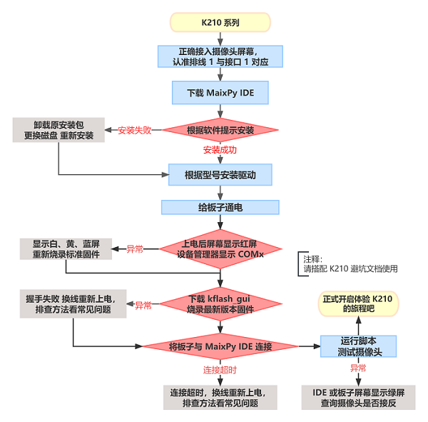

### 硬件接线

- **USB Type-C 数据线**

自行准备质量可靠或者是手机附赠的数据线，质量差的数据线会因电压问题造成开发板处于非正常工作状态导致后续影响使用，有些 Type-C 线只能供电。

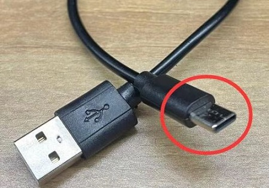

- **Micro SD/TF 卡（可选）**

在 K210 开发板上不使用 Micro SD 卡也可操作文件, 我们在内部 Flash 上保留了一部分作为文件系统, 只是 Flash 速度很慢，为了操作方便的话可以选购 Micro SD/TF 卡，以下图例为 SD 卡安装卡槽。

**如何选购 SD/TF 卡传送门：**[点击前往](eed.com/soft/maixpy/zh/develop_kit_board/get_hardware.html#Micro-SD-卡-%28TF-卡%29-%28可选%29)

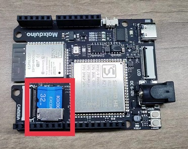

>**注意：MaixPy 不支持挂载文件系统到电脑！！！K210 芯片没有 USB 功能无法模拟 U 盘设备！！！**
>**不要再问为什么没有 U 盘或者是显示 SD 卡了！那不是 K210 那是 M2dock 跟 openmv!**

- **屏幕及摄像头接线**

当我们收到开发板后，首先对硬件进行检查是否有外表损坏，接着再根据屏幕以及摄像头的排线丝印安装到开发板上，即排线上的数字 **“1”** 和板子卡座边上引脚丝印 **“1”** 方位对应接上。

<html>
      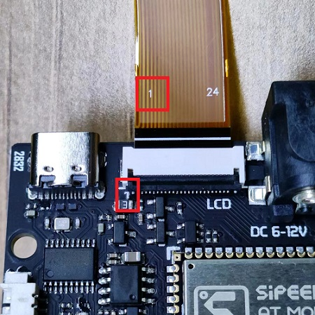
      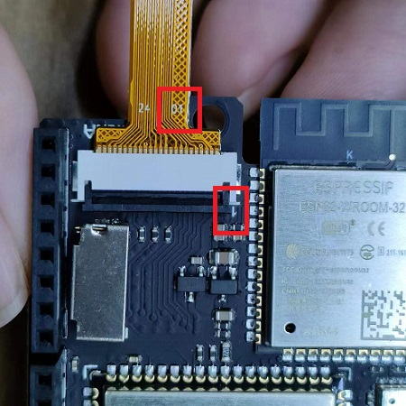
</html>

### 安装 MaixPy IDE

因 MaixPy IDE 需要一定的下载时间，我们可以提前先挂在后台下载节约小伙伴们的时间。
首先要清楚明白 MaixPy 使用 Micropython 脚本语法，所以不像 `C 语言` 一样需要编译，我们可以在电脑上进行实时的编辑、运行、保存、观看摄像头效果的操作，故而对新手小白比较友好。

**MaixPy IDE 下载传送门：**[点击前往](https://dl.sipeed.com/MAIX/MaixPy/ide/)
**MaixPy IDE 安装与使用例程：**[点击前往](https://wiki.sipeed.com/soft/maixpy/zh/get_started/env_maixpyide.html)

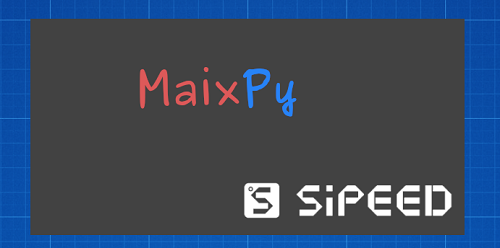

> **MaixPy IDE 支持 Linux、Windows、Macos 等系统如出现安装报错现象请前往 [MaixPy 常见问题 FAQ](https://wiki.sipeed.com/soft/maixpy/zh/others/maixpy_faq.html?highlight=SD#Micro-SD-%E5%8D%A1%E8%AF%BB%E5%8F%96%E4%B8%8D%E5%88%B0) 或 [BBS【超实用】常见问题汇总贴](https://bbs.sipeed.com/thread/489) 排查问题。**

### 给板子通电

先使用准备的 USB type-c 数据线两端分别接入板子及电脑端进行上电操作，方便后续更新固件等使用。
**如果是新购买出厂的开发板的话，上电后会显示红色屏幕。**

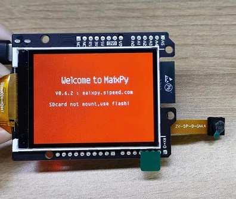

> **上电后出现白屏、黄屏、绿屏、蓝屏、闪屏等更多报错现象请前往 [MaixPy 常见问题 FAQ](https://wiki.sipeed.com/soft/maixpy/zh/others/maixpy_faq.html?highlight=SD#Micro-SD-%E5%8D%A1%E8%AF%BB%E5%8F%96%E4%B8%8D%E5%88%B0) 或 [BBS【超实用】常见问题汇总贴](https://bbs.sipeed.com/thread/489) 排查问题。**

### 安装驱动

因 K210 没有 USB 硬件支持功能需通过 USB 转串口与电脑连接，所以用户需安装串口搭建板子与电脑的连接桥梁，点击文档链接根据板子的型号下载相对应的驱动，安装成功后设备管理器会显示（COMx）端口。

**串口驱动下载传送门：**[点击前往](https://wiki.sipeed.com/soft/maixpy/zh/get_started/env_install_driver.html)

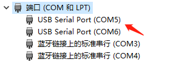

如果出现安装失败、安装后设备接入 `PC` 端的设备管理器不显示 `COM` 端口的现象，需要检查系统是不是正版或更新下（Win7 Win8）系统，部分盗版系统会导致驱动安装失败或是安装后不显示。

**更多的不显示 `COM` 端口参考解决方法：**[点击前往](https://wiki.sipeed.com/soft/maixpy/zh/get_started/env_install_driver.html#%E5%85%B3%E4%BA%8E-USB-%E4%B8%B2%E5%8F%A3%E7%9A%84%E7%96%91%E9%9A%BE%E6%9D%82%E7%97%87%E6%8E%92%E6%9F%A5)
## 如何升级固件（必看）

> 升级固件对 K210 系列板子来说至关重要，快速避免掉用户在使用中无限踩雷影响体验感，例如常见的 MaxiPy IDE 连接失败、屏幕白屏/黄屏等现象，所以板子到手后更新固件成了必不可少的一件事情。
 
- **怎么去判定自己需要的什么固件？**

**如果是第一次使用 k210 系列版更新固件，请无脑看图选标准固件（序号：15）！**
**如果是因为应用需要特殊固件，看应用文档需要什么下载什么！其余一律看功能尾缀！功能尾缀！选择固件。**
**K210 Amigo 开发板固件与以上不通用，固件请在（序号 3-6）里选择下载。**

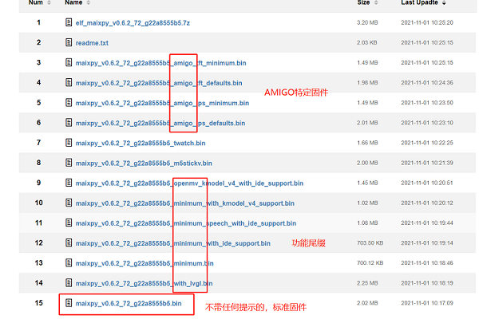

参考上方描述选择（**日期最新**）所需的固件并下载到本地，使用 `kflash_gui` 烧录工具对板子进行升级固件。


如何正确烧录固件示例可参考：[升级固件示例文档](https://wiki.sipeed.com/soft/maixpy/zh/get_started/upgrade_maixpy_firmware.html) 可搭配[ MaixPy 存储系统](https://wiki.sipeed.com/soft/maixpy/zh/get_started/get_started_fs.html)一起食用更佳。

> 注意：因 MaixPy 系列的开发板中 MaixDuino 板载了一块 ESP32 WIFI SOC，一般情况下不推荐更新板载的 ESP32 模块，如在使用途中出现 bug 可以参考[更新板载 ESP32 固件](https://wiki.sipeed.com/soft/maixpy/zh/get_started/upgrade_esp32_firmware.html)进行更新固件

## 上手运行程序

>使用 MaixPy IDE 进行调试操作的话，板子需烧录固件而且版本必须是 `v0.3.1` 以上, 否则 MaixPy IDE 会出现连接不上的现象。

### 使用 MaixPy IDE 运行程序（含测试程序）

根据下图将 K210 开发板连接 `MaixPy IDE` 软件，连接成功后步骤 3 的图标会变成红色，接下来运行 `helloworld.py` 测试摄像头及屏幕是否可用，运行后开发板屏幕以及软件会显示摄像头画面。

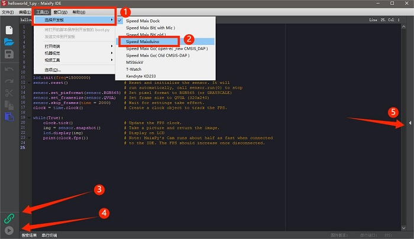

**MaixPy 软件使用例程：**[点击前往](https://wiki.sipeed.com/soft/maixpy/zh/get_started/env_maixpyide.html#%E6%B5%8B%E8%AF%95%E8%BF%90%E8%A1%8C) / **测试屏幕及摄像头源码：**[点击前往](https://wiki.sipeed.com/soft/maixpy/zh/get_started/get_started_cam_lcd.html)
如出现软件无画面的话，请参考步骤 5 是否被缩放了，更详细的连接过程请参考下文链接，测完后可在文件里`新建文件夹`编辑自己的代码并运行。

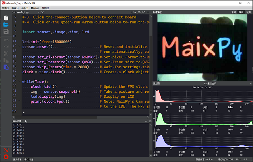

### 使用串口终端运行程序

>如果是有基础的用户较推荐使用终端来调试，`MaixPy IDE` 虽然运行报错会显示但信息可能不完整，而终端会输出更详细的报错信息方便排错。如果出现串口连接终端失败的现象，看看串口是否被占用。

使用前可以先点击了解 [串口定义是什么？](https://wiki.sipeed.com/soft/maixpy/zh/get_started/uart.html) 方便我们理解后续使用更方便。文档提供了多种串口连接工具供用户使用，有 `MaixPy IDE 终端工具`、`Mobaxterm`、`mpfshell-lite` 等在 `Windows` 环境下的工具，以及 `Linux` 下的使用方法。

- **这里我们更推荐使用 MaixPy IDE 串口终端，以下时连接以及运行示例。**

点击 MaixPy IDE 软件页面上方的 `工具`->`打开终端`->`新终端`->`连接到串口`->`确定默认串口号`->`波特率：115200` 确定自动连接，连接后按复位即可正常编辑。

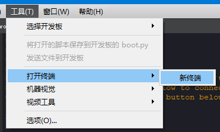
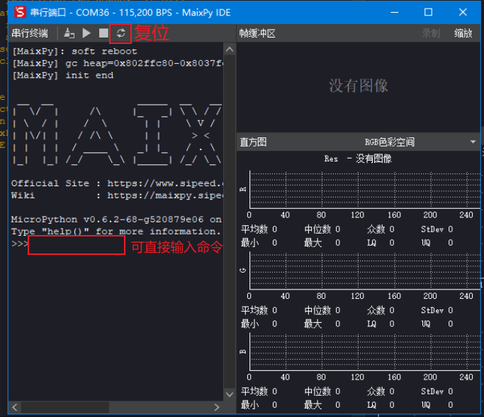

- 运行 `hello maixpy` 终端会输出打印结果，更详细的资料以及更多连接串口方式请点击下文链接查看。

```python
print("hello maixpy") #命令
#hello maixpy  #终端打印结果
```

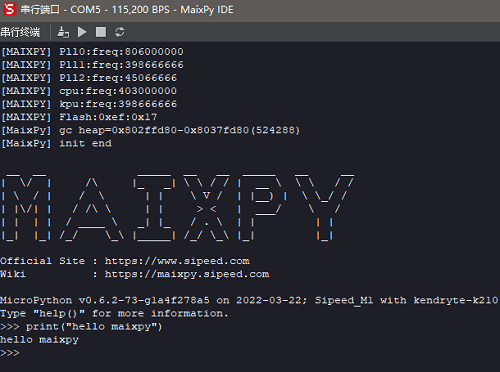

**MobaXterm 下载及使用方法：**[点击前往](https://wiki.sipeed.com/soft/maixpy/zh/get_started/env_serial_tools.html#Mobaxterm)
**MaixPy IDE 终端使用方法：**[点击前往](https://wiki.sipeed.com/soft/maixpy/zh/get_started/env_serial_tools.html#MaixPy-IDE%E7%BB%88%E7%AB%AF%E5%B7%A5%E5%85%B7)
**mpfshell-lite 工具介绍及用法：**[点击前往](https://wiki.sipeed.com/soft/maixpy/zh/get_started/mpfshell-lite/mpfshell-lite.html)
**mpfshell-lite 使用手册：**[点击前往](https://wiki.sipeed.com/soft/maixpy/zh/get_started/mpfshell-lite/mpfshell-lite-help.html)

### 如何编辑代码并运行

上文我们简单介绍了在 MaixPy IDE 上如何运行代码以及使用串口终端，但实际这些运行都是一次性并不保存到设备里，我们更希望代码保存在文件系统，这样不需要再次敲代码可直接运行程序更为便利快捷，小伙伴们可以参考以下的示例方法进行操作。

**如何编辑并保存文件请参考以下示例：**

[方法一： 使用内置编辑器 Micropython Editor(pye)](https://wiki.sipeed.com/soft/maixpy/zh/get_started/get_started_edit_file.html#%E6%96%B9%E6%B3%95%E4%B8%80%EF%BC%9A-%E4%BD%BF%E7%94%A8%E5%86%85%E7%BD%AE%E7%BC%96%E8%BE%91%E5%99%A8-%3Ca-href%3D%22https%3A//github.com/robert-hh/Micropython-Editor%22--target%3D%22_blank%22%3EMicropython-Editor%28pye%29%3C/a%3E)
[方法二： 使用 MaixPy IDE](https://wiki.sipeed.com/soft/maixpy/zh/get_started/get_started_edit_file.html#%E6%96%B9%E6%B3%95%E4%BA%8C%EF%BC%9A-%E4%BD%BF%E7%94%A8-MaixPy-IDE)
[方法三： 使用工具 uPyLoader 读取到 PC（电脑)上编辑后再保存到开发板](https://wiki.sipeed.com/soft/maixpy/zh/get_started/get_started_edit_file.html#%E6%96%B9%E6%B3%95%E4%B8%89%EF%BC%9A-%E4%BD%BF%E7%94%A8%E5%B7%A5%E5%85%B7-%3Ca-href%3D%22https%3A//github.com/BetaRavener/uPyLoader%22--target%3D%22_blank%22%3EuPyLoader%3C/a%3E-%E8%AF%BB%E5%8F%96%E5%88%B0-PC%EF%BC%88%E7%94%B5%E8%84%91%29%E4%B8%8A%E7%BC%96%E8%BE%91%E5%90%8E%E5%86%8D%E4%BF%9D%E5%AD%98%E5%88%B0%E5%BC%80%E5%8F%91%E6%9D%BF)
[方法四： 使用工具 rshell 读取到 PC（电脑)上编辑后再保存到开发板](https://wiki.sipeed.com/soft/maixpy/zh/get_started/get_started_edit_file.html#%E6%96%B9%E6%B3%95%E5%9B%9B%EF%BC%9A-%E4%BD%BF%E7%94%A8%E5%B7%A5%E5%85%B7-%3Ca-href%3D%22https%3A//github.com/dhylands/rshell%22--target%3D%22_blank%22%3Ershell%3C/a%3E-%E8%AF%BB%E5%8F%96%E5%88%B0-PC%EF%BC%88%E7%94%B5%E8%84%91%29%E4%B8%8A%E7%BC%96%E8%BE%91%E5%90%8E%E5%86%8D%E4%BF%9D%E5%AD%98%E5%88%B0%E5%BC%80%E5%8F%91%E6%9D%BF)

**如何执行文件请参考以下示例：**

[方法一： 使用 import 执行](https://wiki.sipeed.com/soft/maixpy/zh/get_started/get_started_edit_file.html#%E6%96%B9%E6%B3%95%E4%B8%80%EF%BC%9A-%3Ccode%3Eimport%3C/code%3E)
[方法二： 使用 exec() 函数来执行](https://wiki.sipeed.com/soft/maixpy/zh/get_started/get_started_edit_file.html#%E6%96%B9%E6%B3%95%E4%BA%8C%EF%BC%9A-%3Ccode%3Eexec%28%29%3C/code%3E)
[方法三： 使用 MaixPy IDE 来执行](https://wiki.sipeed.com/soft/maixpy/zh/get_started/get_started_edit_file.html#%E6%96%B9%E6%B3%95%E4%B8%89%EF%BC%9A-%E4%BD%BF%E7%94%A8-%3Cstrong%3EMaixPy-IDE%3C/strong%3E-%E6%9D%A5%E6%89%A7%E8%A1%8C)
**方法四： 使用 uPyLoader 来执行：连接好后选中文件, 点击 excute 按钮来执行文件**
**方法五： 使用 ampy 来直接运行电脑上的文件：执行命令 ampy run file_in_PC.py 来执行位于电脑上的文件（文件不会保存到开发板）**

### 如何上传代码到开发板

我们可以通过多种方式打开编辑器来直接编辑文件系统中的文件，但如果出现代码量庞大或需要高亮支持的情况就不适用了，这时可以在电脑上写完代码放入开发板的文件系统内。

**可参考以下几种方法示例进行操作：**

[方法一：使用图形工具 uPyLoader 上传、运行脚本](https://wiki.sipeed.com/soft/maixpy/zh/get_started/get_started_upload_script.html#%E4%BD%BF%E7%94%A8%E5%9B%BE%E5%BD%A2%E5%B7%A5%E5%85%B7-uPyLoader-%E4%B8%8A%E4%BC%A0%E3%80%81%E8%BF%90%E8%A1%8C%E8%84%9A%E6%9C%AC)
[方法二：使用命令行工具运行脚本](https://wiki.sipeed.com/soft/maixpy/zh/get_started/get_started_upload_script.html#%E4%BD%BF%E7%94%A8%E5%91%BD%E4%BB%A4%E8%A1%8C%E5%B7%A5%E5%85%B7)
**方法三：SD（TF） 直接运行：拷贝到 SD 卡后， 在终端中执行 `import` 文件名 或者 `exec()` 来运行脚本**
[方法四：SD 卡自动拷贝到 Flash 文件系统](https://wiki.sipeed.com/soft/maixpy/zh/get_started/get_started_upload_script.html#SD-%E5%8D%A1%E8%87%AA%E5%8A%A8%E6%8B%B7%E8%B4%9D%E5%88%B0-Flash-%E6%96%87%E4%BB%B6%E7%B3%BB%E7%BB%9F)

### 如何开机自动运行代码

**如何配置开机自启动脚本相关：**[点击查看](https://wiki.sipeed.com/soft/maixpy/zh/get_started/get_started_boot.html)

### 定制专属固件

出于满足部分小伙伴对内存的需求，可通过源码编译所需固件。

[为何需要固件定制](https://wiki.sipeed.com/soft/maixpy/zh/firmware/why_customize_firware.html)
[源码编译](https://wiki.sipeed.com/soft/maixpy/zh/firmware/compile.html)

## 存储系统介绍

MaixPy 中的存储介质主要由 `Flash`、`SD` 卡组成，并分为三块区域分别是 `MaixPy.bin 固件区`、`xxx.kmodel 模型区`、`文件系统区：Flash 上为 spiffs（SPI Flash File System）、SD 卡为 Fatfs（FAT file system)` 后续方便小伙伴们使用模型或烧写固件时参考，注意烧写时的不同区域防止报错或烧写失败。

**存储系统介绍：**[点击查看](https://wiki.sipeed.com/soft/maixpy/zh/get_started/get_started_fs.html)

## 更多功能应用

>这篇文档完全是按新手小白的使用步骤一步一步来写的，在【更多功能应用】里编写的是 MaixPy 的应用案例以及使用方式，如果是没有接触过 `Python 以及 MicroPython` 的小伙伴们一定要先学会基础的语法知识，切记！没有基础的小伙伴不可以跳过上文！！！更多功能应用是基于上文的基础下写的，可以搭配 [API 文档](https://wiki.sipeed.com/soft/maixpy/zh/api_reference/standard/index.html)和[MaixPy 例程仓库](https://github.com/sipeed/MaixPy_scripts)一同学习。

【更多功能应用】分为五大部分：`系统基础功能`、`外设模块拓展`、`图像处理基础（image）`、`传统算法应用`、`神经网络应用（AI）`因示例较多，这里列举几种常用的可点击可前往[更多功能应用](https://wiki.sipeed.com/soft/maixpy/zh/course/index.html)目录下查看所需要的示例。

- **系统基础功能：**

包含了 [CPU & RAM](https://wiki.sipeed.com/soft/maixpy/zh/course/others/system.html)、[GUI 支持](https://wiki.sipeed.com/soft/maixpy/zh/course/image/image_draw_font/image_draw_font.html)、[网络支持](https://wiki.sipeed.com/soft/maixpy/zh/course/network/network_config.html)、[媒体功能](https://wiki.sipeed.com/soft/maixpy/zh/course/media/audio.html)、[游戏模拟](https://wiki.sipeed.com/soft/maixpy/zh/api_reference/media/nes.html)。

- **外设模块拓展：**
  
包含了[片上外设](https://wiki.sipeed.com/soft/maixpy/zh/modules/on_chip/gpio.html)、[SP-MOD](https://wiki.sipeed.com/soft/maixpy/zh/modules/sp_mod/sp_bt.html)、[Grove](https://wiki.sipeed.com/soft/maixpy/zh/modules/grove/grove_ultrasonic_ranger.html)、[其他外设](https://wiki.sipeed.com/soft/maixpy/zh/develop_kit_board/module_microphone.html)。

- **图像处理基础（image）**
  
包含了[获取图像](https://wiki.sipeed.com/soft/maixpy/zh/course/image/basic/get_images.html)、[显示图像](https://wiki.sipeed.com/soft/maixpy/zh/course/image/basic/display_images.html)、[图像处理基础](https://wiki.sipeed.com/soft/maixpy/zh/course/image/basic/vary.html)、[如何在图像上写字](https://wiki.sipeed.com/soft/maixpy/zh/course/image/basic/draw.html)、[硬件加速图像模块](https://wiki.sipeed.com/soft/maixpy/zh/course/image/basic/acc_image_deal.html)。

- **传统算法应用**
  
传统算法应用里包含了[图像处理](https://wiki.sipeed.com/soft/maixpy/zh/course/image/find_color_blob.html)、[音频处理](https://wiki.sipeed.com/soft/maixpy/zh/course/speech/fft_waterfall.html)。

- **神经网络应用（AI）**

包含了[深度神经网络基础](https://wiki.sipeed.com/soft/maixpy/zh/course/ai/basic/dnn_basic.html)、[KPU 硬件加速介绍](https://wiki.sipeed.com/soft/maixpy/zh/course/ai/basic/maixpy_hardware_ai_basic.html)、[AI 图像处理](https://wiki.sipeed.com/soft/maixpy/zh/course/ai/image/face_detect.html)、[AI 音频处理](https://wiki.sipeed.com/soft/maixpy/zh/course/speech/recognizer_cnn.html)、[如何训练模型](https://wiki.sipeed.com/soft/maixpy/zh/course/ai/train/maixhub.html)。

### 如何正常使用 SD 卡

在【更多功能应用】里的部分示例里需要用到 SD 卡存储模型或固件等，很多小伙伴会遇见 SD 卡文件读取不到，先判断路径是否正确，再判断是否挂载成功了。

- 查询是否挂载成功的方法如下：

```python
import os
print(os.listdir("/"))
>>['flash'] # 没有挂载 SD 卡

>>['flash', 'sd'] # 挂载 SD 卡成功
```

如果挂载不成功的话请根据 [MaixPy 常见问题 FAQ](https://wiki.sipeed.com/soft/maixpy/zh/others/maixpy_faq.html?highlight=SD#Micro-SD-%E5%8D%A1%E8%AF%BB%E5%8F%96%E4%B8%8D%E5%88%B0) 排查相关错误再进行再次挂载尝试使用。

### 如何进行配置开发板

在使用 `外设模块拓展` 的示例时，K210 系列板子因硬件引脚的不同需要进行不同的配置写入，可参考 [Board](https://wiki.sipeed.com/soft/maixpy/zh/api_reference/builtin_py/board_info.html)文档进行配置。

### 如何连接麦克风阵列

[麦克风阵列例程](https://wiki.sipeed.com/hardware/zh/modules/micarray.html)

**K210 系列板卡连接麦克风阵列有以下两种方式供参考：**

1. **推荐：使用杜邦线连接板子与麦克风阵列的引脚，在使用例程提供的代码实现声源定位。**
2. 使用麦克风阵列标配排线搭配转接板连接板子

### 如何获取开发板（机器码）

>在【更多功能应用】里的 `神经网络应用（AI）` 讲述了如何获取并运行 AI 模型的，但在获取模型的操作中有一步是需要机器码才能下载相关的模型，机器码是一机一码的一种加密方式，用于模型文件的加密。如果使用别的机器码去加密或者下载以 `smodel` 为文件后缀的模型文件，开发板是无法使用该模型文件的。

- **参考以下示例步骤获取机器码：**
  
1. 将 key_gen.bin 这个固件通过 Kflash 烧录到开发板上。烧录这个机器码固件之后，开发板是处于一个不能使用的状态，上电屏幕只会变成一个白屏。
2. 这时将开发板通过 USB 连接到电脑上，利用【串口连接】中的方式来连接开发板。注：IDE 中的串口终端和 IDE 的连接方式相对独立的，而且串口不能通过多种方式进行连接
3. 利用串口软件连接上开发板，这时按下开发板上的 reset 的按键，就会出现一串字符在终端窗口上，这就机器码。

[机器码固件：key_gen-v1.2.bin](https://dl.sipeed.com/shareURL/MaixHub_Tools)

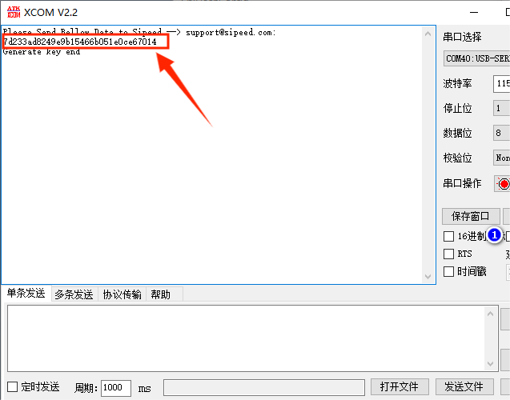

>注意：烧录过 key_gen.bin 之后的开发板将永久禁用 K210 的 JTAG 调试功能。

### 如何获取 AI 模型

除了在示例文档中给出的模型，用户还可在 [MaixHub](https://maixhub.com/model/zoo) 模型库中查找标签为 `nncase` 相关的 AI 模型供 k210 系列板子使用。

### 如何训练模型及数据集

云端训练以及相关文档介绍：[MaixHub](https://maixhub.com)  

[什么是人工智能(AI)和机器学习](https://wiki.sipeed.com/ai/zh/basic/what_is_ai.html)
[常见代码框架和工具](https://wiki.sipeed.com/ai/zh/basic/code_frameworks.html)
[部署模型到 Maix-I(M1) K210 系列开发板](https://wiki.sipeed.com/ai/zh/deploy/k210.html)
[MaixHub 训练调优方法](https://wiki.sipeed.com/ai/zh/maixhub/train_best.html)
            
`MaixHub` 提供模型训练功能和模型分享功能以及视频教学，用户不需要搭建训练环境以及代码，只需要准备好需要训练的数据集上传训练数据即可快速训练出模型，方便快速制作你的 AI 应用。

本地训练：[Windows - 环境配置](https://wiki.sipeed.com/soft/maixpy/zh/course/ai/train/local_windows_1.html)、[Windows - 使用教程](https://wiki.sipeed.com/soft/maixpy/zh/course/ai/train/local_windows_2.html)、[Linux - 使用教程](https://wiki.sipeed.com/soft/maixpy/zh/course/ai/train/local.html)。
如果是没有任何开发基础的同学们请谨慎使用本地训练，出现问题请自行解决。

## 库函数 API 手册

API 手册只罗列几种分类出来，如有需要更详细的请点击前往各分类查看下一级目录，可搭配上文【更多功能应用】使用更佳!

[库函数 API 手册 - 标准库](https://wiki.sipeed.com/soft/maixpy/zh/api_reference/standard/index.html)
[库函数 API 手册 - machine](https://wiki.sipeed.com/soft/maixpy/zh/api_reference/machine/i2c.html)
[库函数 API 手册 - Maix](https://wiki.sipeed.com/soft/maixpy/zh/api_reference/Maix/fpioa.html)
[库函数 API 手册 - helper](https://wiki.sipeed.com/soft/maixpy/zh/api_reference/builtin_py/index.html)
[库函数 API 手册 - media](https://wiki.sipeed.com/soft/maixpy/zh/api_reference/machine_vision/index.html)
[库函数 API 手册 - extend](https://wiki.sipeed.com/soft/maixpy/zh/api_reference/extend/index.html)

## 如何编译与开发

**对于想尝试开发 K210 的用户们我们也准备了相对应的文档供大家参考：**

[代码框架结构](https://wiki.sipeed.com/soft/maixpy/zh/course/advance/project_framework.html)
[如何编译 MaixPy 工程](https://wiki.sipeed.com/soft/maixpy/zh/course/advance/compile.html)
[如何用 C 添加一个 MaixPy 模块](https://wiki.sipeed.com/soft/maixpy/zh/course/advance/add_c_module.html)
[打包文件系统](https://wiki.sipeed.com/soft/maixpy/zh/course/advance/pack_fs.html)

**MaixPy 源码：[点击查看](https://github.com/sipeed/MaixPy)**
**相关原厂 K210 SDK：[点击查看](https://www.canaan-creative.com/developer)**

**以下是裸机开发可参考文章：**

[K210裸机开发（〇）简介及准备](https://blog.csdn.net/hgf_fgh/article/details/122402940#:~:text=%E6%89%93%E5%BC%80PlatformIO%E4%B8%BB%E9%A1%B5%EF%BC%8C%E5%9C%A8Boards%E9%A1%B5%E9%9D%A2%E6%90%9C%E7%B4%A2K210%EF%BC%8C%E5%9C%A8platform%E5%88%97%E6%89%BE%E5%88%B0kendryte,k210%E5%B9%B6%E7%82%B9%E8%BF%9B%E5%8E%BB%EF%BC%8C%E7%82%B9%E5%87%BBinstall%E5%AE%89%E8%A3%85%E7%AD%89%E5%BE%85%E5%8D%B3%E5%8F%AF%EF%BC%9B)

## 学会使用文档（资源）

为什么会写 **`学会使用文档`** 呢，众所周知 `K210` 系列的板卡已经是 `2019` 年的产物了，各方面的文档也好例程也好早已经是成熟的了，该踩的坑基本都在前几年就被踩完了，现在更多的新手小白踩坑可能都是因为性能上的不足或者是自身使用环境的乱导致出问题。这篇文档的初衷是想要让大家在使用的过程中避坑，但我们还是要学会把文档资源利用起来。

1. 学会搜索并利用官方的`文档社区`以及 `github issue` 资源，会让新手小白少走很多弯路雷坑。
2. 文档资源在 `常见问题 FAQ` 中基本涵盖了所有的坑，使用途中报错可以先查看这篇文档排错。
3. 在使用途中出现故障但无法自行判断（代码/硬件）问题，可以先运行测试程序测试屏幕及摄像头。
4. 想要实现更多的功能示例或需要更多的脚本源码，可前往 `MaixPy` 的源码例程仓库查找。

**文档搜索例程：**[点击查看](https://wiki.sipeed.com/soft/maixpy/zh/how_to_read.html)
**BBS 社区教程贴：**[点击前往](https://bbs.sipeed.com/thread/492)
**MaixPy 源码仓库：**[点击前往](https://github.com/sipeed/maixpy)
**MaixPy 例程仓库：**[点击前往](https://github.com/sipeed/MaixPy_scripts)
**MaixPy issue：**[点击前往](https://github.com/sipeed/MaixPy/issues?page=5&q=is%3Aissue+is%3Aopen)
**MaixPy 常见问题 FAQ：**[点击查看](https://wiki.sipeed.com/soft/maixpy/zh/others/maixpy_faq.html)
**BBS 社区常见问题汇总贴：**[点击查看](https://bbs.sipeed.com/thread/489)


## Mind+ 积木编程

**MaixDuino K210 实现积木编程例程：**[点击查看](https://wiki.sipeed.com/news/MaixPy/mind_application/mind_application.html)

Mind+ 从1.6.6 版本开始支持基于 K210 主控的 Maixduino 开发板，可满足对于 K210 开发有兴趣的用户。

## 常见问题 FAQ

### 出现 MaixPy 软件包失败现象

卸载干净之前下的软件安装包，重新下载并换磁盘安装。

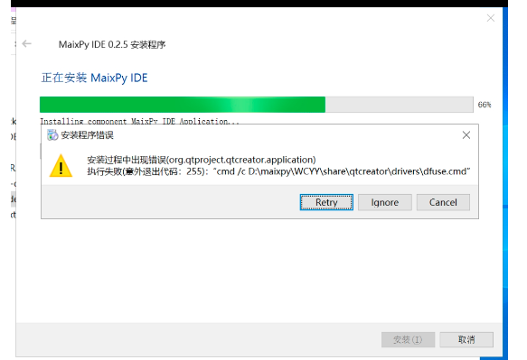

### 烧录固件途中出现握手失败等报错信息

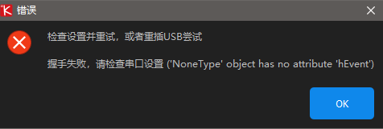
      
一般出现这个问题，先从以下几个方面判断问题（因使用环境不同造就的设备握手失败）
1. 先判断板子上电后设备管理器是否有 `COM` 端口出现，如果没有端口出现返回安装驱动的步骤或者进行更换线材。
2. 设备管理器出现 `COM` 端口，查看是否被别的软件（串口根据、手机助手、蓝牙、外设）占用了串口，查询不出再次更换线材或重启设备也可以。
3. 查看 kflash_gui 的版本（是不是太低）下载页面的配置不要改动并调小波特率。
4. 烧录前按硬件的 BOOT 键后按复位，再松开 BOOT 键尝试能不能烧录。
5. 尝试过以上的方法都不行的话请更换电脑设备尝试，还是不行的话请联系淘宝官方客服。

### 板子通电后显示白屏、黄屏、红蓝闪屏等现象

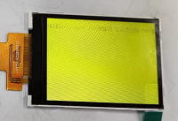

1. 白屏黄屏请参考 [MaixPy 常见问题 FAQ ](https://wiki.sipeed.com/soft/maixpy/zh/others/maixpy_faq.html?highlight=%E7%99%BD%E5%B1%8F#%E7%83%A7%E5%BD%95-MaixPy-%E4%B9%8B%E5%90%8E%EF%BC%8CMaixPy-%E5%87%BA%E7%8E%B0%E6%97%A0%E6%B3%95%E5%90%AF%E5%8A%A8)解决。
2. 出现红蓝闪屏，请重新烧录固件后然后接稳摄像头运行[测试程序](https://wiki.sipeed.com/soft/maixpy/zh/get_started/get_started_cam_lcd.html)判断摄像头是否能用，有可能是摄像头或摄像头接口出现问题导致。

### 摄像头出现黑斑现象

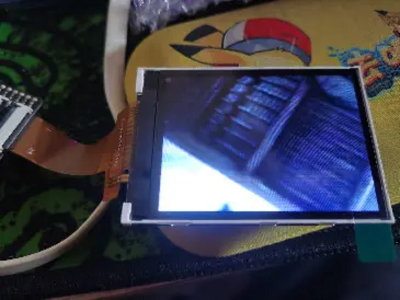

显示黑斑但是有正常画面就是摄像头内片不干净，可以把摄像头拆出来擦一擦。

### 运行摄像头程序显示：RuntimeError：Sensor timeout!

摄像头连接超时，重新连接下或者是换摄像头。

### 烧录固件后画面反色

重新擦除烧录，使用代码反色回来[点击](https://wiki.sipeed.com/soft/maixpy/zh/course/image/basic/display_images.html?highlight=%E5%8F%8D%E8%89%B2)查看。

**更多报错信息请前往 [MaixPy 常见问题 FAQ](https://wiki.sipeed.com/soft/maixpy/zh/others/maixpy_faq.html?highlight=SD#Micro-SD-%E5%8D%A1%E8%AF%BB%E5%8F%96%E4%B8%8D%E5%88%B0) 或 [BBS【超实用】常见问题汇总贴](https://bbs.sipeed.com/thread/489) 排查问题。**


