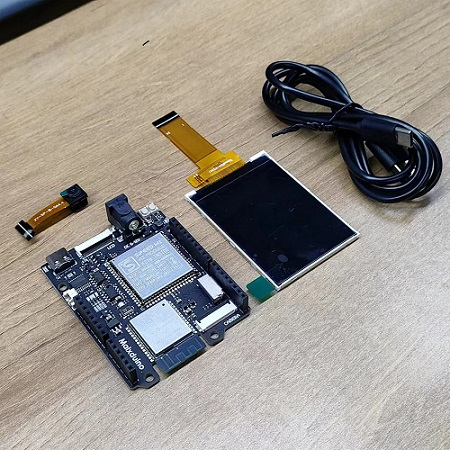

## 前言

>在 22 年的最后两天终于有时间开始整理填坑了，顶鸽逃跑（不是故意的）看见很多新手小白还是在文档海里扑腾找不到 K210 的资料文档，那就由这篇 K210 的避坑指南让小白的使用之路更顺利一点吧！

**这篇文档以 SIPEED `MaixDuino` 的使用为示例说明，并且大部分内容通用于 K210 系列开发板，可供购入 K210 系列顾客参考使用，`MaixDuino` 相关介绍参数[ 点击 ](https://wiki.sipeed.com/hardware/zh/maix/maixpy_develop_kit_board/maix_duino.html)查询，选购开发板指南可参考[选购指南。](https://wiki.sipeed.com/soft/maixpy/zh/develop_kit_board/get_hardware.html)**

## 准备工作

无论是新手小白还是有基础的开发者在踏入 `K210 系列开发板` 学习之路前，做好充足的准备工作一定程度上可以避免在使用途中踩坑影响体验感。这篇文档是以一份避坑上手的指南为核心来构写的，所以切记！！新手小白千万不可以跳着看，下图是示例硬件 `MaixDuino` 开发板、摄像头、屏幕、以及 USB Type-c 数据线。

### 使用流程图

使用流程思维导图可以搭配文档一起使用更佳~

### 硬件接线

- **USB Type-C 数据线**

在 SIPEED 淘宝官方店购买开发板会赠送 USB Type-C 连接线，如果需自行准备的话请选用质量可靠的数据线，或者是用手机附送的数据线，质量差的数据线会因电压问题造成开发板处于非正常工作状态。

- **Micro SD/TF 卡（可选）**

在 K210 开发板上不使用 Micro SD 卡也可以操作文件的, 我们在内部 Flash 上保留了一部分作为文件系统, 只是 Flash 速度很慢，为了操作方便的话可以选购 Micro SD/TF 卡，以下图例为 SD 卡安装卡槽。

**如何选购 SD/TF 卡传送门：**[点击前往](eed.com/soft/maixpy/zh/develop_kit_board/get_hardware.html#Micro-SD-卡-%28TF-卡%29-%28可选%29)

>注意：MaixPy 不支持挂载文件系统到电脑！！！K210 芯片没有 USB 功能无法模拟 U 盘设备！！！不要再问为什么没有 U 盘或者是显示 SD 卡了！那不是 K210 那是 M2dock 跟 openmv!

- **屏幕及摄像头接线**

当我们收到开发板后，首先对硬件进行检查看有没有外表损坏，然后再根据屏幕及摄像头排线上的丝印提示把外设安装到开发板上，即排线上的数字 **“1”** 和板子卡座边上引脚丝印 **“1”** 方位对应接上。

<html>
      
      
</html>

### 安装 MaixPy IDE

因 MaixPy IDE 需要一定的下载时间，我们可以提前先挂在后台下载节约小伙伴们的时间。
首先要清楚明白 MaixPy 使用 Micropython 脚本语法，所以不像 `C 语言` 一样需要编译，我们可以在电脑上进行实时的编辑、运行、保存、观看摄像头效果的操作，故而对新手小白比较友好。

**MaixPy IDE 下载传送门：**[点击前往](https://dl.sipeed.com/MAIX/MaixPy/ide/)
**MaixPy IDE 安装与使用例程：**[点击前往](https://wiki.sipeed.com/soft/maixpy/zh/get_started/env_maixpyide.html)

.. details::FAQ：如果出现 MaixPy 软件包失败的话，卸载掉之前下的包，重新下载并换磁盘安装。

      

### 安装驱动

因 K210 没有 USB 硬件支持功能需通过 USB 转串口设备与电脑连接，所以我们需要安装串口驱动去当板子与 MAIXP IDE 连接的桥梁，接入下方提供的链接，根据板子的型号下载相对应的驱动即可。

**串口驱动下载传送门：**[点击前往](https://wiki.sipeed.com/soft/maixpy/zh/get_started/env_install_driver.html)

如果出现安装失败、安装后设备接入 `PC` 端的设备管理器不显示 `COM` 端口的现象，需要检查系统是不是正版或更新下（Win7 Win8）系统，部分盗版系统会导致驱动安装失败或是安装后不显示。

**更多的不显示 `COM` 端口参考解决方法：**[点击前往](https://wiki.sipeed.com/soft/maixpy/zh/get_started/env_install_driver.html#%E5%85%B3%E4%BA%8E-USB-%E4%B8%B2%E5%8F%A3%E7%9A%84%E7%96%91%E9%9A%BE%E6%9D%82%E7%97%87%E6%8E%92%E6%9F%A5)

### 升级固件

所有的板子出厂前会烧录基础固件，用户可根据需求烧录专用固件来进行进阶使用。
建议大家使用最新版本的固件，搭配使用工具 `kflash_gui` 软件进行烧录。

**更新固件例程传送门：**[点击前往](https://wiki.sipeed.com/soft/maixpy/zh/get_started/upgrade_maixpy_firmware.html)
**MaixPy 存储系统介绍：**[点击前往](https://wiki.sipeed.com/soft/maixpy/zh/get_started/get_started_fs.html)

.. details::FAQ：烧录固件途中出现握手失败等报错信息，可参考以下解决方法。
      
      
      一般出现这个问题，先从以下几个方面判断问题（因使用环境不同造就的设备握手失败）
      1. 先判断板子上电后设备管理器是否有 `COM` 端口出现，如果没有端口出现返回安装驱动的步骤或者进行更换线材。
      2. 设备管理器出现 `COM` 端口，查看是否被别的软件（串口根据、手机助手、蓝牙、外设）占用了串口，查询不出再次更换线材或重启设备也可以。
      3. 查看 kflash_gui 的版本（是不是太低）下载页面的配置不要改动并调小波特率。
      4. 烧录前按硬件的 BOOT 键后按复位，再松开 BOOT 键尝试能不能烧录。
      5. 尝试过以上的方法都不行的话请更换电脑设备尝试，还是不行的话请联系淘宝官方客服。

> 注意：因 MaixPy 系列的开发板中 MaixDuino 板载了一块 ESP32 WIFI SOC，一般情况下不推荐更新板载的 ESP32 模块，如在使用途中出现 bug 可以参考[更新板载 ESP32 固件](https://wiki.sipeed.com/soft/maixpy/zh/get_started/upgrade_esp32_firmware.html)进行更新固件
## 学会使用文档

为什么会写 **`学会使用文档`** 呢，众所周知 `K210` 系列的板卡已经是 `2020` 年的产物了，各方面的文档也好例程也好早已经是成熟的了，该踩的坑基本都在前几年就被踩完了，现在更多的新手小白踩坑可能都是因为性能上的不足或者是自身使用环境的乱导致出问题。这篇文档的初衷是想要让大家在使用的过程中避坑，但我们还是要学会把文档资源利用起来。

1. 学会搜索并利用官方的`文档社区`以及 `github issue` 资源，会让新手小白少走很多弯路雷坑。
2. 文档资源在 `常见问题 FAQ` 中基本涵盖了所有的坑，使用途中报错可以先查看这篇文档排错。
3. 在使用途中出现故障但无法自行判断（代码/硬件）问题，可以先根据下文运行程序测试屏幕及摄像头。
4. 想要实现更多的功能示例或需要更多的脚本源码，可前往 `MaixPy` 的源码例程仓库查找。

**文档搜索例程：**[点击查看](https://wiki.sipeed.com/soft/maixpy/zh/how_to_read.html)
**BBS 社区：**[点击前往](https://bbs.sipeed.com/)
**MaixPy issue：**[点击前往](https://github.com/sipeed/MaixPy/issues?page=5&q=is%3Aissue+is%3Aopen)
**MaixPy 常见问题 FAQ：**[点击查看](https://wiki.sipeed.com/soft/maixpy/zh/others/maixpy_faq.html)
**MaixPy 源码仓库：**[点击前往](https://github.com/sipeed/maixpy)
**MaixPy 例程仓库：**[点击前往](https://github.com/sipeed/MaixPy_scripts)

## 编程基础知识（适合新手）

在编辑代码运行程序之前，我们需要先掌握一些基础知识**（适合新手有基础的小伙伴可跳过）**由于 MaixPy 是基于 MicroPython 之上进行开发构建的，提供给用户最终的接口是 Micropython，所以在使用 MaixPy 之初我们需要熟悉下 MicroPython 的基础知识与语法以及常用的 Git 与 Github。

**MaixPy 语法基础知识：**[点击查看](https://wiki.sipeed.com/soft/maixpy/zh/get_started/knowledge_micropython.html)
**Git 和 Github 介绍：**[点击查看](https://wiki.sipeed.com/soft/maixpy/zh/get_started/knowledge_git_github.html)

以下是图像及音频的背景知识，有需要或感兴趣的小伙伴可以查看。

**图像处理背景知识：**[点击查看](https://wiki.sipeed.com/soft/maixpy/zh/get_started/knowledge_image.html)
**音频处理背景知识：**[点击查看](https://wiki.sipeed.com/soft/maixpy/zh/get_started/knowledge_audio.html)

## 存储系统介绍

MaixPy 中的存储介质主要由 `Flash`、`SD` 卡组成，并分为三块区域分别是 `MaixPy.bin 固件区`、`xxx.kmodel 模型区`、`文件系统区：Flash 上为 spiffs（SPI Flash File System）、SD 卡为 Fatfs（FAT file system)` 后续方便小伙伴们使用模型或烧写固件时参考，注意烧写时的不同区域防止报错或烧写失败。

**存储系统介绍：**[点击查看](https://wiki.sipeed.com/soft/maixpy/zh/get_started/get_started_fs.html)

## 上手运行程序

在运行程序前先使用准备的 USB type-c 数据线两端分别接入板子以及电脑端，给板子进行上电操作。
如果是新出厂的开发板的话，上电后会显示红色屏幕。

.. details::FAQ：板子通电后显示白屏、黄屏、红蓝闪屏等的话，请参考以下方法进行处理解决。
      
      白屏黄屏请参考 [MaixPy 常见问题 FAQ ](https://wiki.sipeed.com/soft/maixpy/zh/others/maixpy_faq.html?highlight=%E7%99%BD%E5%B1%8F#%E7%83%A7%E5%BD%95-MaixPy-%E4%B9%8B%E5%90%8E%EF%BC%8CMaixPy-%E5%87%BA%E7%8E%B0%E6%97%A0%E6%B3%95%E5%90%AF%E5%8A%A8)解决。
      出现红蓝闪屏，请运行下文程序判断摄像头是否能用，有可能是摄像头或摄像头接口出现问题导致。

### 使用 MaixPy IDE 运行程序（含测试程序）

参考 `MaixPy IDE 软件使用例程` 先学习怎么使软用件直连开发板，然后运行 `MaixPy IDE` 打开就显示的 `helloworld.py` 文件测试摄像头及屏幕是否正常可用，运行后屏幕会显示摄像头的画面。

**MaixPy 软件使用例程：**[点击前往](https://wiki.sipeed.com/soft/maixpy/zh/get_started/env_maixpyide.html#%E6%B5%8B%E8%AF%95%E8%BF%90%E8%A1%8C)
**测试屏幕及摄像头源码：**[点击前往](https://wiki.sipeed.com/soft/maixpy/zh/get_started/get_started_cam_lcd.html)

- **使用 `MaixPy IDE` 软件进行编辑代码运行。**

### 使用串口终端运行程序

使用前可以先简单的了解 `串口的定义`以及`串口是什么？`方便我们理解后续使用更方便。文档提供了多种串口连接工具供用户使用，有 `MaixPy IDE 终端工具`、`Mobaxterm`、`mpfshell-lite` 等在 `Windows` 环境下的工具，以及 `Linux` 下的使用方法。

**串口是什么？**[点击前往](https://wiki.sipeed.com/soft/maixpy/zh/get_started/uart.html)
**MobaXterm 下载及使用方法：**[点击前往](https://wiki.sipeed.com/soft/maixpy/zh/get_started/env_serial_tools.html#Mobaxterm)
**MaixPy IDE 终端使用方法：**[点击前往](https://wiki.sipeed.com/soft/maixpy/zh/get_started/env_serial_tools.html#MaixPy-IDE%E7%BB%88%E7%AB%AF%E5%B7%A5%E5%85%B7)
**mpfshell-lite 工具介绍及用法：**[点击前往](https://wiki.sipeed.com/soft/maixpy/zh/get_started/mpfshell-lite/mpfshell-lite.html)
**mpfshell-lite 使用手册：**[点击前往](https://wiki.sipeed.com/soft/maixpy/zh/get_started/mpfshell-lite/mpfshell-lite-help.html)

>有一定基础的同学们比较推荐使用终端来运行程序，`MaixPy IDE` 虽然运行出错会弹框显示错误但信息可能会不完整，而终端会输出更详细的报错信息方便排错。如果出现串口连接终端失败的现象，看看串口是否被占用。

### 如何编辑代码并运行

相较于上文简单了介绍 MaixPy IDE 以及串口的的使用方法，但在实际运行时我们更希望代码保存在文件系统，这样不需要再次敲代码可直接运行程序更为便利快捷，小伙伴们可以参考以下的示例方法进行操作。

**如何编辑并保存文件请参考以下示例：**

[方法一： 使用内置编辑器 Micropython Editor(pye)](https://wiki.sipeed.com/soft/maixpy/zh/get_started/get_started_edit_file.html#%E6%96%B9%E6%B3%95%E4%B8%80%EF%BC%9A-%E4%BD%BF%E7%94%A8%E5%86%85%E7%BD%AE%E7%BC%96%E8%BE%91%E5%99%A8-%3Ca-href%3D%22https%3A//github.com/robert-hh/Micropython-Editor%22--target%3D%22_blank%22%3EMicropython-Editor%28pye%29%3C/a%3E)
[方法二： 使用 MaixPy IDE](https://wiki.sipeed.com/soft/maixpy/zh/get_started/get_started_edit_file.html#%E6%96%B9%E6%B3%95%E4%BA%8C%EF%BC%9A-%E4%BD%BF%E7%94%A8-MaixPy-IDE)
[方法三： 使用工具 uPyLoader 读取到 PC（电脑)上编辑后再保存到开发板](https://wiki.sipeed.com/soft/maixpy/zh/get_started/get_started_edit_file.html#%E6%96%B9%E6%B3%95%E4%B8%89%EF%BC%9A-%E4%BD%BF%E7%94%A8%E5%B7%A5%E5%85%B7-%3Ca-href%3D%22https%3A//github.com/BetaRavener/uPyLoader%22--target%3D%22_blank%22%3EuPyLoader%3C/a%3E-%E8%AF%BB%E5%8F%96%E5%88%B0-PC%EF%BC%88%E7%94%B5%E8%84%91%29%E4%B8%8A%E7%BC%96%E8%BE%91%E5%90%8E%E5%86%8D%E4%BF%9D%E5%AD%98%E5%88%B0%E5%BC%80%E5%8F%91%E6%9D%BF)
[方法四： 使用工具 rshell 读取到 PC（电脑)上编辑后再保存到开发板](https://wiki.sipeed.com/soft/maixpy/zh/get_started/get_started_edit_file.html#%E6%96%B9%E6%B3%95%E5%9B%9B%EF%BC%9A-%E4%BD%BF%E7%94%A8%E5%B7%A5%E5%85%B7-%3Ca-href%3D%22https%3A//github.com/dhylands/rshell%22--target%3D%22_blank%22%3Ershell%3C/a%3E-%E8%AF%BB%E5%8F%96%E5%88%B0-PC%EF%BC%88%E7%94%B5%E8%84%91%29%E4%B8%8A%E7%BC%96%E8%BE%91%E5%90%8E%E5%86%8D%E4%BF%9D%E5%AD%98%E5%88%B0%E5%BC%80%E5%8F%91%E6%9D%BF)

**如何执行文件请参考以下示例：**

[方法一： 使用 import 执行](https://wiki.sipeed.com/soft/maixpy/zh/get_started/get_started_edit_file.html#%E6%96%B9%E6%B3%95%E4%B8%80%EF%BC%9A-%3Ccode%3Eimport%3C/code%3E)
[方法二： 使用 exec() 函数来执行](https://wiki.sipeed.com/soft/maixpy/zh/get_started/get_started_edit_file.html#%E6%96%B9%E6%B3%95%E4%BA%8C%EF%BC%9A-%3Ccode%3Eexec%28%29%3C/code%3E)
[方法三： 使用 MaixPy IDE 来执行](https://wiki.sipeed.com/soft/maixpy/zh/get_started/get_started_edit_file.html#%E6%96%B9%E6%B3%95%E4%B8%89%EF%BC%9A-%E4%BD%BF%E7%94%A8-%3Cstrong%3EMaixPy-IDE%3C/strong%3E-%E6%9D%A5%E6%89%A7%E8%A1%8C)
**方法四： 使用 uPyLoader 来执行：连接好后选中文件, 点击 excute 按钮来执行文件**
**方法五： 使用 ampy 来直接运行电脑上的文件：执行命令 ampy run file_in_PC.py 来执行位于电脑上的文件（文件不会保存到开发板）**

### 如何上传代码到开发板

我们可以通过多种方式打开编辑器来直接编辑文件系统中的文件，但如果出现代码量庞大或需要高亮支持的情况就不适用了，这时可以在电脑上写完代码放入开发板的文件系统内。

**可参考以下几种方法示例进行操作：**

[方法一：使用图形工具 uPyLoader 上传、运行脚本](https://wiki.sipeed.com/soft/maixpy/zh/get_started/get_started_upload_script.html#%E4%BD%BF%E7%94%A8%E5%9B%BE%E5%BD%A2%E5%B7%A5%E5%85%B7-uPyLoader-%E4%B8%8A%E4%BC%A0%E3%80%81%E8%BF%90%E8%A1%8C%E8%84%9A%E6%9C%AC)
[方法二：使用命令行工具运行脚本](https://wiki.sipeed.com/soft/maixpy/zh/get_started/get_started_upload_script.html#%E4%BD%BF%E7%94%A8%E5%91%BD%E4%BB%A4%E8%A1%8C%E5%B7%A5%E5%85%B7)
**方法三：SD（TF） 直接运行：拷贝到 SD 卡后， 在终端中执行 `import` 文件名 或者 `exec()` 来运行脚本**
[方法四：SD 卡自动拷贝到 Flash 文件系统](https://wiki.sipeed.com/soft/maixpy/zh/get_started/get_started_upload_script.html#SD-%E5%8D%A1%E8%87%AA%E5%8A%A8%E6%8B%B7%E8%B4%9D%E5%88%B0-Flash-%E6%96%87%E4%BB%B6%E7%B3%BB%E7%BB%9F)

### 如何开机自动运行代码

**如何配置开机自启动脚本相关：**[点击查看](https://wiki.sipeed.com/soft/maixpy/zh/get_started/get_started_boot.html)

## 更多功能应用

>这篇文档完全是按新手小白的使用步骤一步一步来写的，在【更多功能应用】里编写的是 MaixPy 的应用案例以及使用方式，如果是没有接触过 `Python 以及 MicroPython` 的小伙伴们一定要先学会基础的语法知识，切记！没有基础的小伙伴不可以跳过上文！！！更多功能应用是基于上文的基础下写的，可以搭配 API 文档和[MaixPy 例程仓库](https://github.com/sipeed/MaixPy_scripts)一同学习。

更多功能应用分为五大部分：`系统基础功能`、`外设模块拓展`、`图像处理基础（image）`、`传统算法应用`、`神经网络应用（AI）`点击可前往[更多功能应用](https://wiki.sipeed.com/soft/maixpy/zh/course/index.html)查看。

### 如何正常使用 SD 卡

在 `系统基础功能` 内有音频等

### 如何进行配置开发板

在【更多功能应用】里的`外设模块拓展`在使用外设模块拓展的时候，很多的小伙伴跑例程会报错极多的片上外设示例因不同的板卡配置不同需要进行相对应手动配置才能使用。
可参考 [Board](https://wiki.sipeed.com/soft/maixpy/zh/api_reference/builtin_py/board_info.html)文档进行配置。

### 如何获取开发板（机器码）

>在【更多功能应用】里的 `神经网络应用（AI）` 讲述了如何获取并运行 AI 模型的，但在获取模型的操作中有一步是需要机器码才能下载相关的模型，机器码是一机一码的一种加密方式，用于模型文件的加密。如果使用别的机器码去加密或者下载以 `smodel` 为文件后缀的模型文件，开发板是无法使用该模型文件的。

- **参考以下示例步骤获取机器码：**
  
1. 将 key_gen.bin 这个固件通过 Kflash 烧录到开发板上。烧录这个机器码固件之后，开发板是处于一个不能使用的状态，上电屏幕只会变成一个白屏。
2. 这时将开发板通过 USB 连接到电脑上，利用【串口连接】中的方式来连接开发板。注：IDE 中的串口终端和 IDE 的连接方式相对独立的，而且串口不能通过多种方式进行连接
3. 利用串口软件连接上开发板，这时按下开发板上的 reset 的按键，就会出现一串字符在终端窗口上，这就机器码。如果机器码

>注意：烧录过 key_gen.bin 之后的开发板将永久禁用 K210 的 JTAG 调试功能。

### 系统基础功能

## Mind+ 积木编程

**Maixduino K210 如何实现积木编程指南：**[点击查看](https://wiki.sipeed.com/news/MaixPy/mind_application/mind_application.html)

Mind+ 从1.6.6版本开始支持基于 K210 主控的 Maixduino 开发板，可满足对于 K210 开发有兴趣的用户。

## Mixly 积木编程

Mixly（米思齐）是国内自主研发且免费开源的一款图形化编程软件，用户可以通过拼接积木的方式来编写程序，Mixly 支持基于 K210 主控的 Maixduino 等开发板，可满足对于 K210 实现积木编程有兴趣的用户。

**K210 如何在 Mixly 上实现积木编程指南：**[点击查看](https://wiki.sipeed.com/news/MaixPy/mixly_application/mixly.html)

可参考上文的 `K210 如何在 Mixly 上实现积木编程指南` 来实现.