快来体验 Maixduino 不一样的有趣玩法

<!-- more -->

[原文链接](https://mindplus.dfrobot.com.cn/maixduino)

## 说明

Mind+ 从1.6.6版本开始支持基于 K210 主控的 Maixduino 开发板，可满足对于 K210 开发有兴趣的用户。
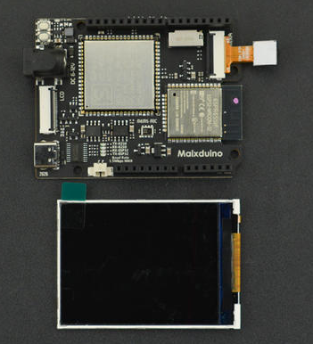

## 使用流程

### 器材准备

- Mind+ 1.6.6及以上版本
- Maixduino主控板
- Type-C数据线

### 环境准备

1. 打开 Mind+ 切换至上传模式，扩展库中选择主控板下的 Maixduino 后返回主界面。
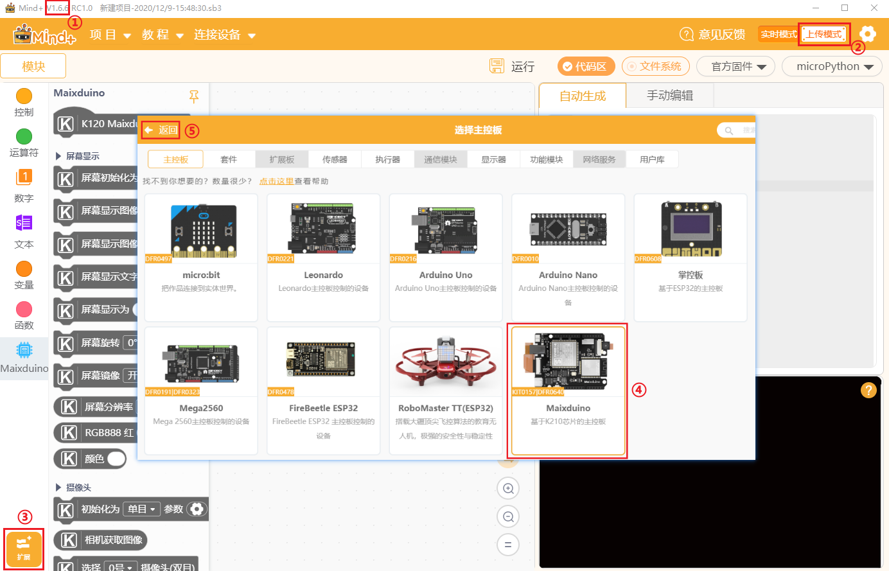
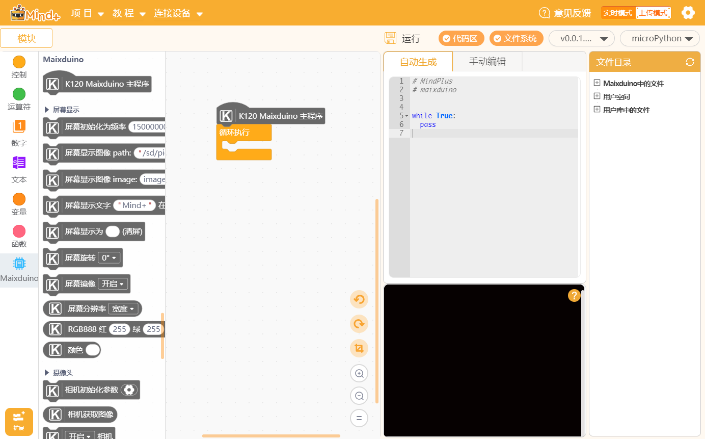

1. 使用 USB 线连接主控板与电脑，设备菜单中会出现两个 COM 口，选择其中 Maixduino 的 COM 口，软件会自动烧录固件，右下角小黑窗会显示提示语。

|              |                                                                  |       |
| :----------- | :----------------------------------------------------------------- | :--- |
| 打开设备管理器       |  打开系统的设备管理器，方便检查端口或驱动问题。                      |      |
| 一键安装串口驱动       |  如果首次使用软件板子没有出现 COM 口，则可以安装驱动。                                                |      |
| 恢复设备初始设置       |   首次使用 Mind+ 或出现异常情况时，可以使用恢复设备初始设置功能擦除板子内的固件, 使用时需要先选择 COM 口再选择此功能，恢复完成后手动断开连接再选择端口。                                 |      |   |

注意

- 如果是首次使用需要选择 ESP32 (网卡)的 COM 口然后选择恢复设备初始设置功能更新网卡，否则可能会出现模拟输入功能无法使用。
- Mind+ 中的固件与 Maixduino 官方固件不同，可以线选择 Maixduino 的 COM 口然后选择恢复设备初始设置，然后断开再次连接，即可自动刷入 Mind+ 固件。
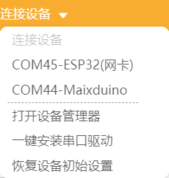

### 编程使用

编写一个程序，在屏幕中显示摄像头画面，完成后点击运行，程序即可运行，板子上就可以看到效果了。
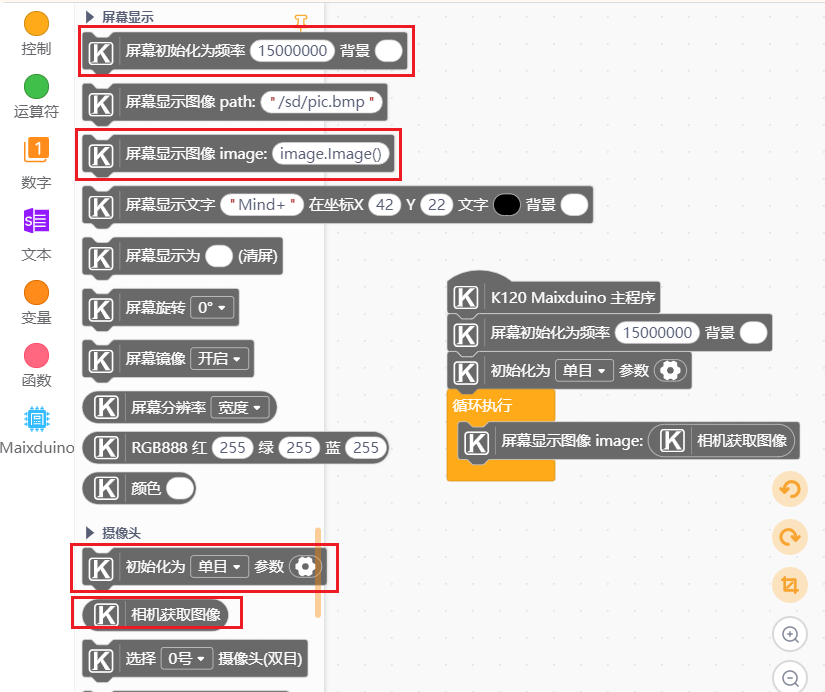
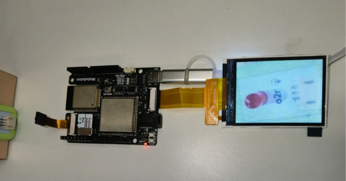

## 手动编辑

手动编辑模式中可以手动编写代码，需要先在文件系统新建文件然后打开，再保存，运行程序需要右键选择运行。
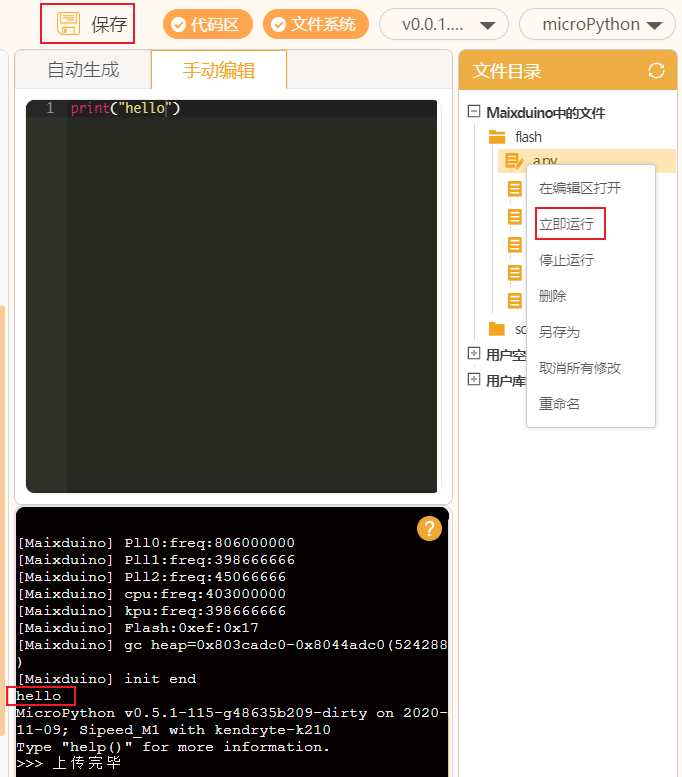

## 固件说明

Maixduino 有各种版本的固件，Mind+ 图形化部分为保持积木生成代码的稳定，内置的固件包含了图形化需要的库，同时为保持 Maixduino 使用的灵活性，Mind+ 也支持使用其他固件。

### 如何区分是否为 Mind+ 内置固件？

1. 如下图，终端中的输出信息以 Maixduino 开头的即为 Mind+ 内置固件。
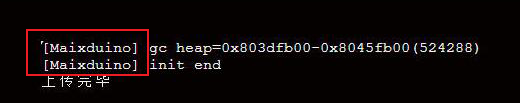
2. 如下图，终端中输出信息为 MiaxPy 或者其他则不是 Mind+ 内置固件，则这些固件可能会缺失图形化中的某些功能导致无法使用，如果需要使用图形化的功能请刷入 Mind+ 内置固件。
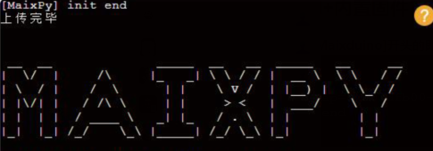

### Mind+ 中固件烧录逻辑说明

选择 Maixduino 的 COM 口之后，软件会检测板子中是否有固件，如果有固件（不论是 Mind+ 内置的固件或第三方均为有固件）则连接终端开始使用，如果没有则自动烧录固件选择区所选择的固件。
  
### 因此如果需要烧录第三方固件，操作方法为：

1. 选择 Maixduino 的 COM 口，选择恢复设备初始设置（这个功能会擦除板子 flash 固件会被擦除）.
2. 在选择固件处点击本地加载，加载想烧录的第三方固件文件，然后点击加载的固件，然后再次选择 Maixduino 的 COM 口，此时因为固件被擦除了就会烧录这个新的固件，等待烧录完成即可。
3. 注意：因 Mind+ 积木生成的代码是固定的，因此如果烧录了第三方固件可能会出现部分功能无法使用（例如引脚映射文件在新的固件下没有会出错）此时可以使用手动编辑功能直接使用代码，如果继续想使用图形化，则可以使用开放扩展库自己写图形化积木扩展实现，教程[点击](https://mindplus.dfrobot.com.cn/extensions-user).
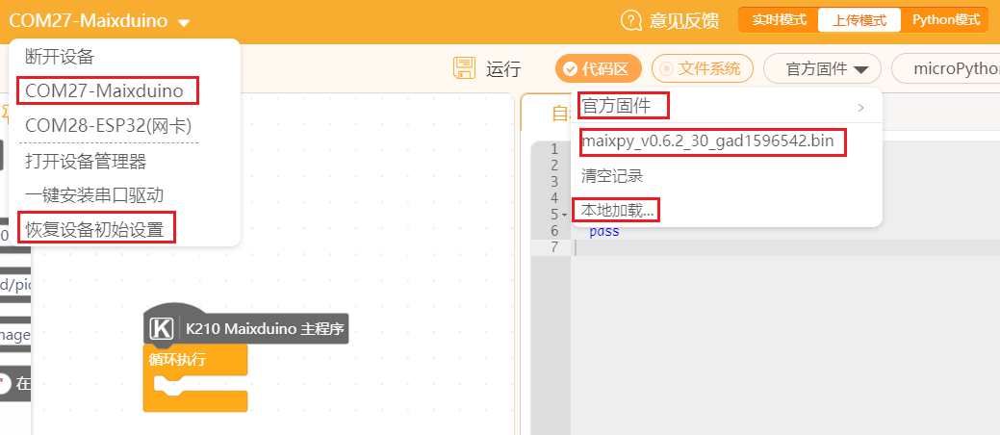

### 同理如果要从第三方固件切换为 Mind+ 内置固件，操作方法为：

1. 选择 Maixduino 的 COM 口，选择恢复设备初始设置（这个功能会擦除板子 flash，固件会被擦除）。
2. 在选择固件处点击官方固件，然后再次选择 Maixduino 的 COM 口，此时因为固件被擦除了就会烧录 Mind+ 内置的官方固件，等待烧录完成即可。
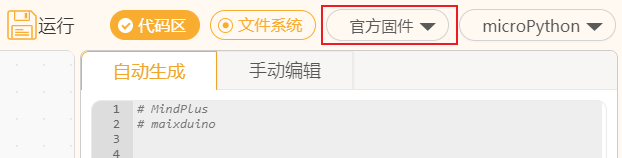

## 教程

**社区用户驴友花雕的系列教程**
- [【花雕测评】【AI】Mind+文字图片显示、呼吸灯及网络应用的22项小实验](https://makelog.dfrobot.com.cn/article-311386.html)
- [【花雕测评】【AI】Mind+机器视觉之数字图像处理和显示的22种小测试](https://makelog.dfrobot.com.cn/article-311405.html)
- [【花雕测评】【AI】Mind+机器视觉之颜色、维码与形状识别的8个小实验](https://makelog.dfrobot.com.cn/article-311417.html)

**社区用户 hockel 的系别教程**
- [【mind+ 玩转MAIXDUINO 系列0】 工欲善其事，必先利其器](https://mc.dfrobot.com.cn/thread-307857-1-1.html)
- [【Mind+ 玩转Maixduino系列1】你好，世界](https://mc.dfrobot.com.cn/thread-307857-1-1.html)
- [【mind+ Maixduino用户库】NES 游戏扩展库 【mind+ 用户库】Maixduino 中文字模、图片英文显示](https://mc.dfrobot.com.cn/thread-308037-1-1.html)

**社区用户 DFByaoZQN5E 的系列教程**
- [[教程]mind+ k210主板第一课 hello word!](https://mc.dfrobot.com.cn/thread-307820-1-1.html)
- [[教程]mind+ k210主板第二课 gpio(1)](https://mc.dfrobot.com.cn/thread-307850-1-1.html)
- [[教程]mind+ k210 第三课 gpio (2)](https://mc.dfrobot.com.cn/thread-307877-1-1.html)
- [[教程]mind+ k210 第四课 gpio (3)](https://mc.dfrobot.com.cn/thread-307969-1-1.html)

**社区用户肥罗-阿勇的教程**
- [Mind+Maixduino应用案例集合](https://mc.dfrobot.com.cn/thread-307946-1-1.html)

**社区用户 hmilycheng 的系列教程**
- [Maixduino轻松学系列 —— （1）初识Maixduino](https://makelog.dfrobot.com.cn/article-311375.html)
- [Maixduino轻松学系列 —— （2）Mind+带你畅玩经典红白机游戏](https://makelog.dfrobot.com.cn/article-311392.html)
- [Maixduino轻松学系列 —— （3）基于Mind+的简易NTP网络时钟](https://makelog.dfrobot.com.cn/article-311401.html)
- [Maixduino轻松学系列 —— （4）基于Mind+的图像识别：人脸检测](https://makelog.dfrobot.com.cn/article-311411.html)
- [Maixduino轻松学系列 —— （5）有屏幕的地方就有BAD APPLE](https://makelog.dfrobot.com.cn/article-311418.html)
- [Maixduino轻松学系列 —— （6）基于ASR语音识别控制红绿灯](https://makelog.dfrobot.com.cn/article-311420.html)
- [Maixduino轻松学系列 —— （7）超声波传感器的认识与使用](https://makelog.dfrobot.com.cn/article-311425.html)

## 注意事项 & FAQ

0. 断电重启之后，按一下板子上的 RESET 键即可启动程序。
1. 如果是首次使用需要选择 ESP32 (网卡)的 COM 口然后选择恢复设备初始设置功能更新网卡，否则可能会出现模拟输入功能没有读值的情况。
2. 涉及到 SD 卡读取或存储的操作，需要插入内存卡（断电后插拔内存卡）才可正常使用。

3. 不支持的硬件可以使用用户库功能自行添加，详情查看官方文档中自定义用户库教程。
4. 人工智能项目需要导入模型文件，请将模型文件拷贝到内存卡目录下。
[下载连接](https://pan.baidu.com/share/init?surl=dTB0UHRKVrCtS4cMrxgDhQ) 提取码：mind
5. 注意变量名字不要与内置的库名字重复，例如不要命名变量为 image
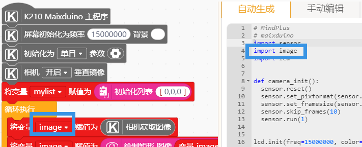

6. FAQ

|  问题        |   解决思路                                                       |       |
| :----------- | :----------------------------------------------------------------- | :--- |
|  在执行有模型的 AI 程序时出现 out of memory 或者 memory not enough 等内存不足的错误怎么办？                       |  程序使用的模型对应的固件可能不是 Mind+ 内置的，尝试找到对应的固件或[寻找maixpy的固件](https://mc.dfrobot.com.cn/thread-308995-1-1.html)。                                                                   |      | 
|  报错 kpu: img w=xxx,h=xxx, but model w=xxx,h=xxx kpu: check img format err! 怎么办？                      |  使用的 kmodel 模型文件训练的时候的分辨率与程序中使用的摄像头分辨率不同，尝试修改相机设置窗口。                                                                      |      |     
| 提示 no module named 'pin' 错误怎么办？                     |   说明固件不是 Mind+ 中的，如果需要使用 Mind+ 内置固件，则选择 Maixduino 的 COM 口,恢复设备初始设置擦除固件，然后断开再次连接即会自动刷入 Mind+ 提供的固件。如果依然要使用非 Mind+ 内置固件，则需要导入对应依赖库，[点击查看教程](https://mc.dfrobot.com.cn/thread-309510-1-1.html)。                                                                   |      |      
|  使用 WiFi 连接功能时提示 hard spi Get version fail hard spi 或卡住怎么办？ 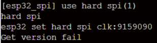                     |  用到网络功能时需要插上内存卡再使用。                                                                     |      | 

