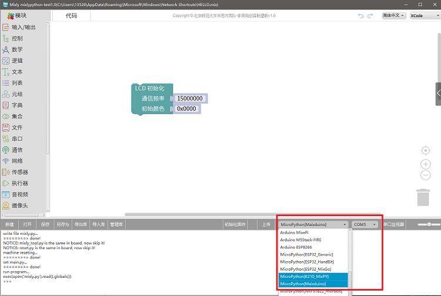
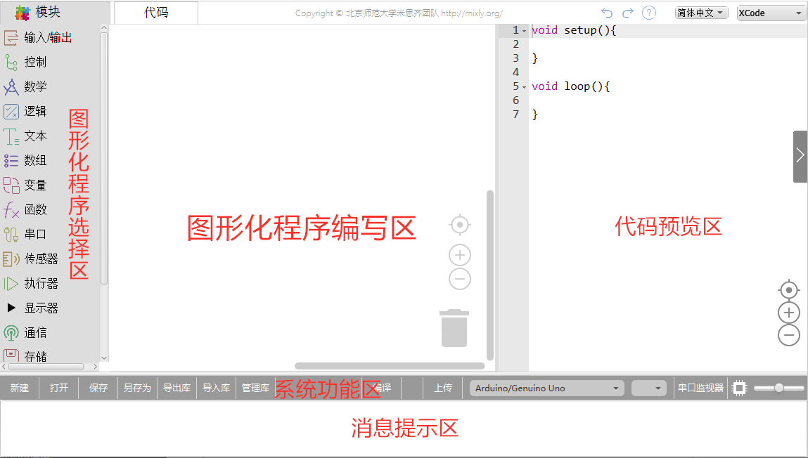
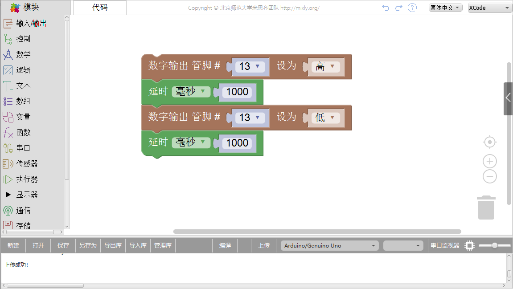
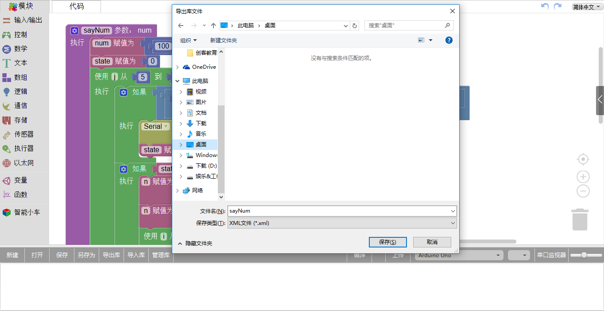
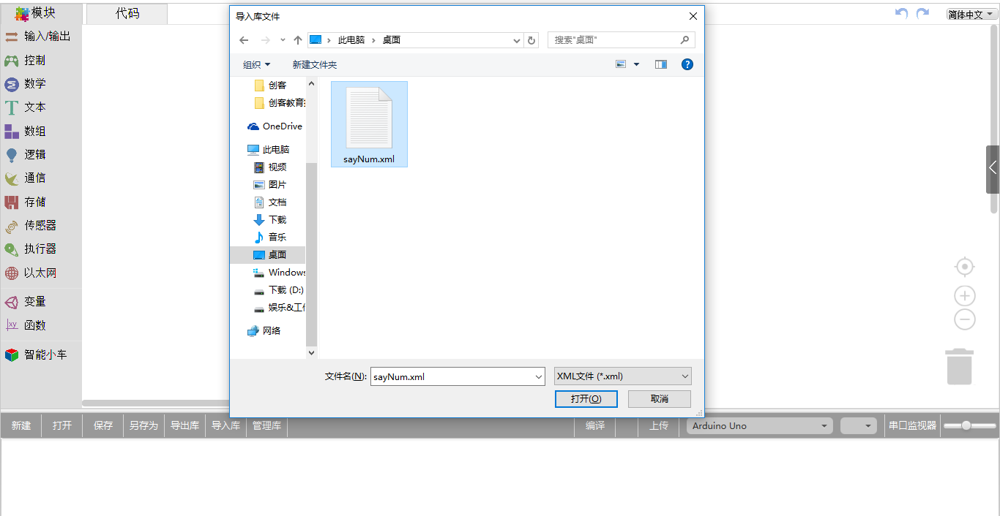
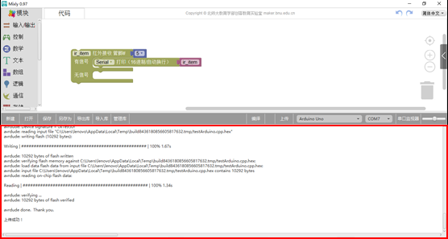
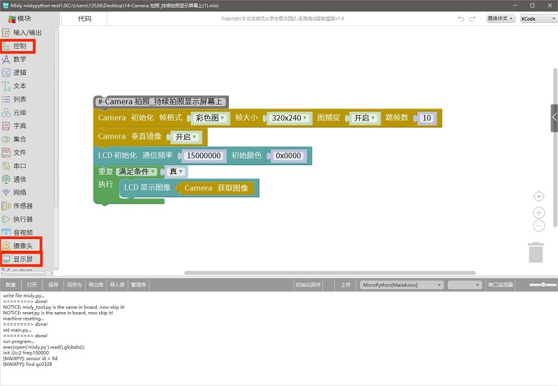
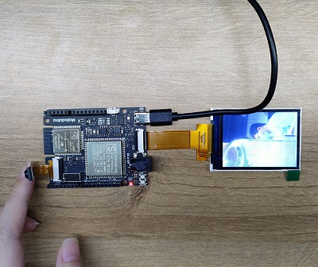
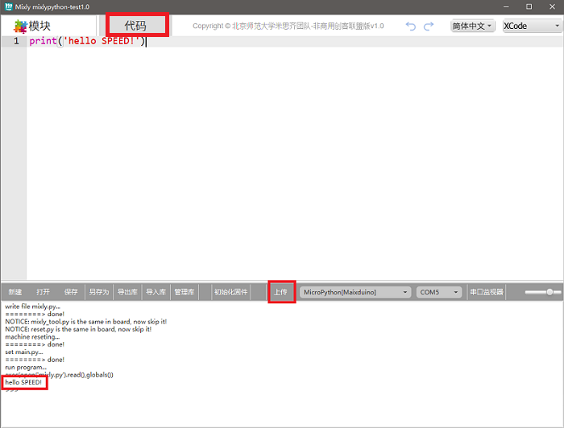
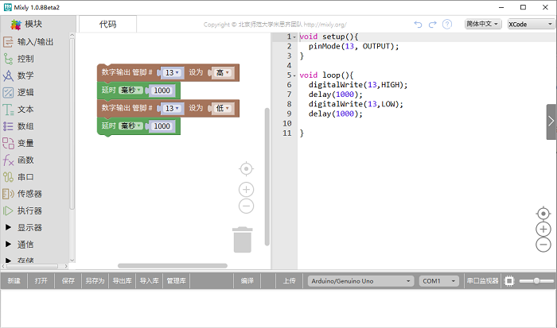

## Mixly 是什么？

**Mixly**（米思齐）是国内自主研发且免费开源的一款图形化编程软件，用户可以通过拼接积木块的方式来编写程序。目前为止 **Mixly** 已支持 `Arduino/micropython/python` 等编程语言。


### 说明

**Mixly** 支持基于 K210 主控的 Maixduino 等开发板，可满足对于 K210 实现积木编程有兴趣的用户。
这篇 **Mixly** 的基础使用指南供小伙伴们参考，与 SIPEED 一起遨游于新奇的积木编程世界吧！


## 使用流程

### 器材准备

- Mixly v1.0 版本
  **Mixly 软件**：[点击前往下载](https://mixly.org/bnu-maker/mixl2.0rc) 
  **Mixly 安装教程**：[点击查看](https://mixly.readthedocs.io/zh_CN/latest/basic/02Installation-update.html)

- Maixduino / Maixdock 等开发板设备
  **Maix Py 系列资料**：[点击查看](https://wiki.sipeed.com/hardware/zh/maix/maixpy_develop_kit_board/maix_duino.html)
  **Maix Py 系列购买传送门**：[点击前往](https://item.taobao.com/item.htm?id=595216523162) 

- Type-C 线 

### 环境准备

- 使用之前需要先给 Maixduino 开发板烧录固件方便我们后续使用。

    **MaixPy 固件包**：[点击前往下载](https://dl.sipeed.com/shareURL/MAIX/MaixPy/release/master/maixpy_v0.6.2_84_g8fcd84a58)
    **Kflash_gui 烧录工具**：[点击前往下载](https://wiki.sipeed.com/soft/maixpy/zh/get_started/upgrade_maixpy_firmware.html)
    **MaixPy 烧录固件教程**：[点击前往查看](https://wiki.sipeed.com/soft/maixpy/zh/get_started/upgrade_maixpy_firmware.html)

- 先把我们准备的开发板接入 `PC` 端打开我们安装成功的 **Mixly** 软件，然后在软件下方的操作栏右侧**选择相应的 `Maixduino` 设备**，操作完后**点击上传**连接设备。

        

        **上传成功调试信息框会弹出以下日志：**

        ```bash
        write file mixly.py...
        ========> done!
        NOTICE: mixly_tool.py is the same in board, now skip it!
        NOTICE: reset.py is the same in board, now skip it!
        machine reseting...
        ========> done!
        set main.py...
        ========> done!
        run program...
        exec(open('mixly.py').read(),globals())
        >>> 
        ```

        >**注意**：如有上传失败现象请检查接线是否正确？是否烧录基础固件？或使用 Kfalsh_gui 整片擦除重新烧录基础固件。

### 界面介绍

界面介绍转载了 **Mixly** 官方文档：[点击查看原文链接](https://mixly.readthedocs.io/zh_CN/latest/basic/03Interface_introduction.html).
**Mixly** 软件主要分成图形化程序选择区、图形化程序编辑区、代码预览区、系统功能区、消息提示区。



#### 图形化程序选择区

图形化程序选择区中包含了各类图形化程序，每一个类别中都包含多个图形化，通过将这些图形块拖动到图形化程序编辑区就可以完成编程。


#### 程序编写区



- 程序编写

我们通常把能完成一定功能的代码块拖动到该区域处进行连接。

- 程序删除

1. 将不需要的代码拖到右下方的垃圾桶。
2. 将不用的代码拖到最左侧的图形化程序选择区。
3. 选中不用的代码后点击键盘 `Delete` 或者`Backspace` 键。

- 程序缩放

**右下角垃圾桶上方有缩放按钮**

1. 第一个按钮是图形块大小正常化并居中。
2. 第二个是放大图形块。
3. 第三个是缩小图形块。
当然也可以直接使用鼠标滚轮进行缩放。

- 程序整理

当编写的程序比较多时，需要对程序进行整理，在空白区右击选择清理块。

#### 系统功能区

系统功能区主要执行的功能有新建、打开、保存、另存为、导出库、导入库、管理库、编译、上传、选择主控板型号及端口、串口监视器及软件界面放大缩小等功能。


- 库功能

为了方便用户使用及代码分享 **Mixly** 特增加了库功能。库功能分别包括：导出库，导入库以及管理库。 
当用户编写完一段代码后（比如语音播报），代码可集成在一个函数中（假设该函数为 `sayNum`）只需要点击导出库并给该库起个名字便能使用。



保存后就可以将该库上传至平台，供其他用户下载进行使用学习。
下载该代码后可直接将该库进行导入并使用，并点击导入库可找到该文件的位置。



导入后界面会刷新，请耐心等待 1-2 秒便可在模块选择区见到新导入的库。同时在消息提示区也会提示**“导入自定义库成功”**接着可直接点击 `sayNum` 库，将指令拖入程序构建区调用该函数即可。


管理库的功能是可以对已导入的库进行重命名、删除和打开目录。

#### 消息提示区

消息提示区通常是给用户信息反馈的场所。比如编译或上传进程中，编译或上传是否成功？
如果失败原因是什么？或者是导入库是否成功等消息。



### 编程使用

从图形化程序选择区拖动板块编写程序，在屏幕中显示摄像头画面，**程序拼接完成后点击上传**即可运行.



可在我们接入的设备上看到摄像头运行的的效果。



### 代码编辑 

除了可拖动的图形化区域还有代码可编辑区域，我们也可以在**编写代码并点击上传**运行即可。





## 相关教程

**来自社区大佬 hockel 的系列教程**

- [【MaixPy教程】用maixHub训练模型进行开源硬件识别](https://mc.dfrobot.com.cn/thread-304993-1-1.html)
- [【MaixPy 教程】用mixly玩转K210——口罩识别](https://mc.dfrobot.com.cn/thread-305026-1-1.html)
- [【MaixPy教程】用mixly玩转K210——调用AI-OneNET API实现车牌识别](https://mc.dfrobot.com.cn/thread-305038-1-1.html)
- [【MaixPy 教程】用mixly玩转K210——人脸追踪](https://mc.dfrobot.com.cn/thread-305097-1-1.html)
- [【MaixPy 教程】用mixly玩转K210——20类对象检测](https://mc.dfrobot.com.cn/thread-305125-1-1.html)
- [【MaixPy 教程】用mixly玩转K210——一键本地模型训练](https://mc.dfrobot.com.cn/thread-305291-1-1.html)
- [【MaixPy 教程】用mixly玩转k210——MixNo通过TCP/IP与掌控板进行通讯](https://mc.dfrobot.com.cn/thread-305317-1-1.html)
