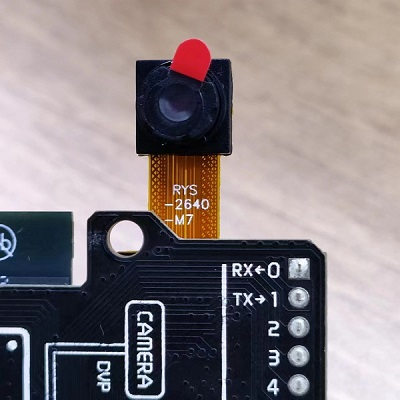
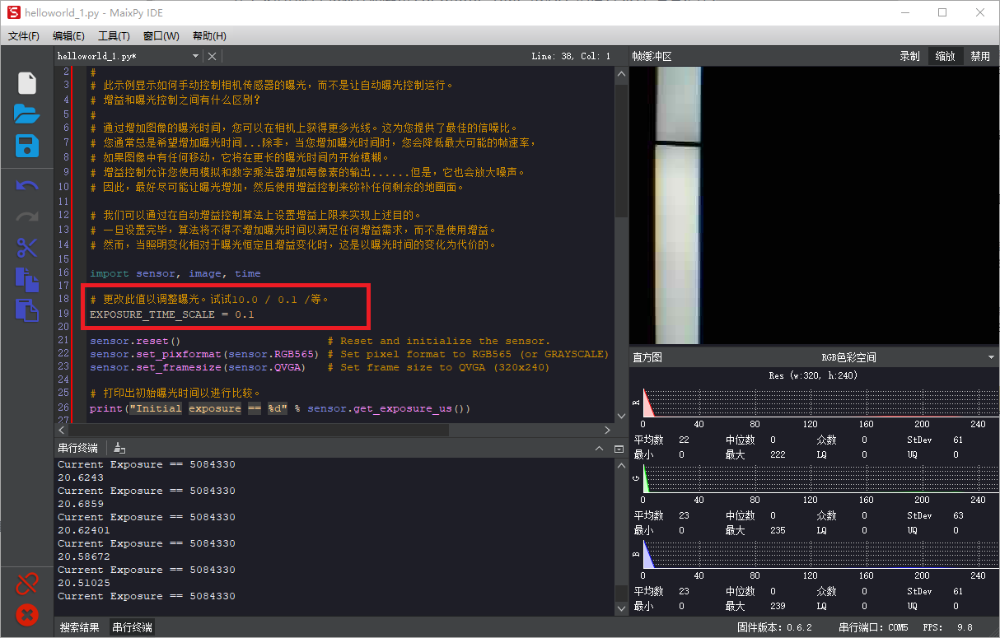
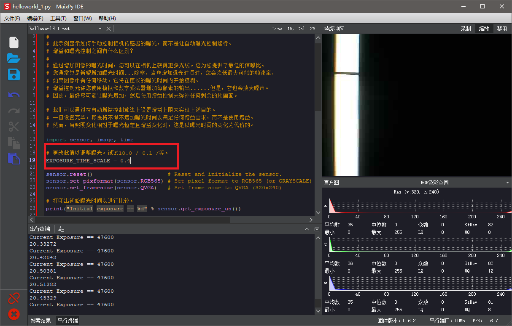
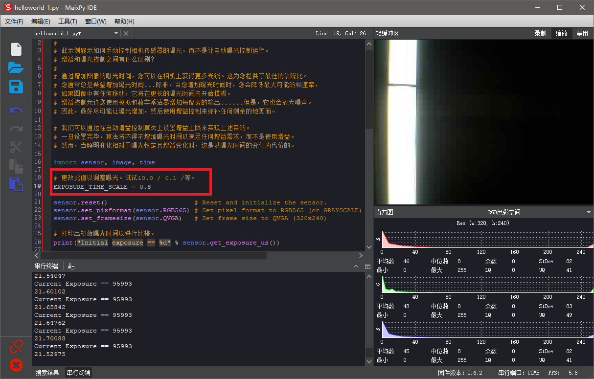

> 最近有社区的小伙伴在实现功能时需对 Sensor 摄像头的曝光强弱进行调整以及修改，可根据下文的代码来进行调整曝光，源代码链接：[点击](https://book.openmv.cc/example/21-Sensor-Control/sensor_exposure_control.html)查看。

## 摄像头型号

我们测过两种型号的摄像头分别是：`OV2640` 以及 `OV5640`，只有 `OV2640` 型号的支持使用 `sensor_exposure_control` 对曝光进行修改以及控制。



## 控制曝光代码

```python

import sensor, image, time

# 更改此值以调整曝光。试试10.0 / 0.1 /等。
EXPOSURE_TIME_SCALE = 0.01

sensor.reset()                      # Reset and initialize the sensor.
sensor.set_pixformat(sensor.RGB565) # Set pixel format to RGB565 (or GRAYSCALE)
sensor.set_framesize(sensor.QVGA)   # Set frame size to QVGA (320x240)

# 打印出初始曝光时间以进行比较。
print("Initial exposure == %d" % sensor.get_exposure_us())

sensor.skip_frames(time = 2000)     # Wait for settings take effect.
clock = time.clock()                # Create a clock object to track the FPS.

# 您必须关闭自动增益控制和自动白平衡，否则他们将更改图像增益以撤消您放置的任何曝光设置...
sensor.set_auto_gain(False)
sensor.set_auto_whitebal(False)
# 需要让以上设置生效
sensor.skip_frames(time = 500)

print("New exposure == %d" % sensor.get_exposure_us())

# 如果要重新打开自动曝光，请执行以下操作：sensor.set_auto_exposure(True)
# 请注意，相机传感器将根据需要更改曝光时间。

current_exposure_time_in_microseconds = sensor.get_exposure_us()
sensor.set_auto_exposure(False, exposure_us = int(current_exposure_time_in_microseconds * EXPOSURE_TIME_SCALE))

sensor.set_auto_exposure(False)
# 执行：sensor.set_auto_exposure(False)，只是禁用曝光值更新，但不会更改相机传感器确定的曝光值。

while(True):
    current_exposure_time_in_microseconds = sensor.get_exposure_us()
    print("Current Exposure == %d" % current_exposure_time_in_microseconds)
        
    clock.tick()                    # Update the FPS clock.
    img = sensor.snapshot()         # Take a picture and return the image.
    print(clock.fps())              # Note: OpenMV Cam runs about half as fast when connected
                                    # to the IDE. The FPS should increase once disconnected.
```

## 用法以及效果演示

### 修改 EXPOSURE_TIME_SCALE 的值为 0.1

在上文的代码中修改控制曝光 EXPOSURE_TIME_SCALE 的值为 0.1，看看是什么效果。



### 修改 EXPOSURE_TIME_SCALE 的值为 0.4

递增修改控制曝光 EXPOSURE_TIME_SCALE 的值为 0.4，看看是什么效果。



### 修改 EXPOSURE_TIME_SCALE 的值为 0.8

再次修改控制曝光 EXPOSURE_TIME_SCALE 的值为 0.8，看看是什么效果。



> 从应用效果来看 0.1 跟 0.8 的曝光补光的图像差距非常大，用户可根据自己的需求进行修改值即可。