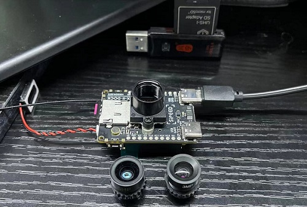
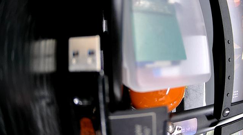
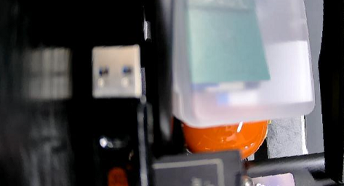
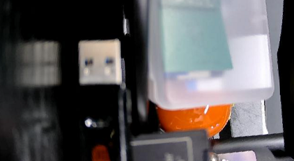
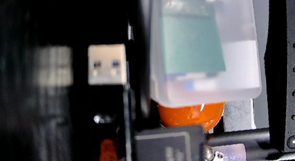
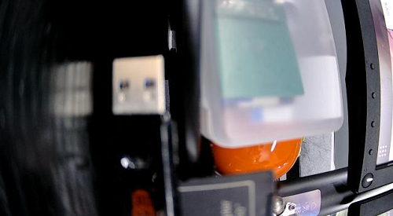

这篇是关于镜头畸变矫正 `lens_corr` 函数的现象和用法。

## 准备工作

这些交代一些相关的测试场景、以及准备工作等相关说明。



### Jupyter 基础用法

这里默认大家已掌握 `Jupyter` 的相关使用方法，还有疑惑的小伙伴请自行学习。

## 用法演示及效果

### 获取一张 640*360 图像

先来试试摄像头正常捕捉 640*360 的图像效果。

```python
from maix import camera, display, image
camera.config(size=(640, 360))
while True:
    img = camera.capture()
    display.show(img)
```



### 添加 lens_corr 畸变矫正函数

相关代码行：`img = img.lens_corr(strength=1.8, zoom=1.0)`

- **strength**：是一个浮点数而该值确定了对图像进行去鱼眼效果的程度.
- **zoom**：是在对图像进行缩放的数值（默认值为 1.0）.

>使用以上函数对镜头进行畸变校正，去除因镜头畸变造成的图像鱼眼效果。

#### 试试 strength 为 1.8 的效果

```python
from maix import camera, display, image
camera.config(size=(640, 360))
while True:
    img = camera.capture()
    img = img.lens_corr(strength=1.8, zoom=1.0)
    display.show(img)
```



#### 试试 strength 为 2.0 的效果

```python
from maix import camera, display, image
camera.config(size=(640, 360))
while True:
    img = camera.capture()
    img = img.lens_corr(strength=2.0, zoom=1.0)
    display.show(img)
```



#### 试试 strength 为 2.1 的效果

```python
from maix import camera, display, image
camera.config(size=(640, 360))
while True:
    img = camera.capture()
    img = img.lens_corr(strength=2.1, zoom=0.9)
    display.show(img)
```



#### 畸变矫正前与后的对比

这里再获取一张未进行畸变矫正前的图像与上文进行对比，让效果更直观明显点。

```python
from maix import camera, display, image
camera.config(size=(640, 360))
while True:
    img = camera.capture()
    display.show(img)
```


