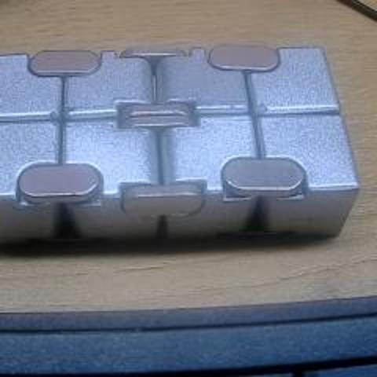
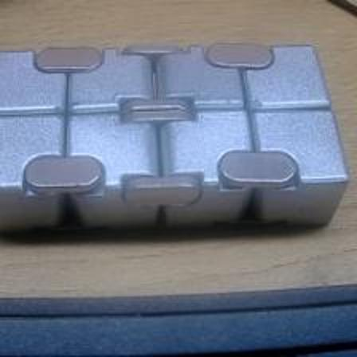
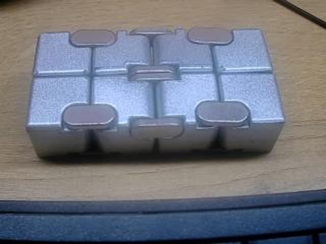
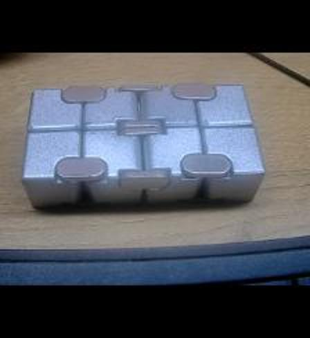
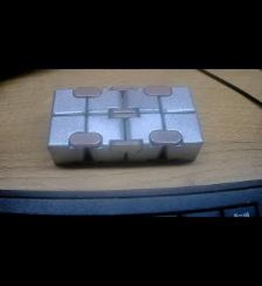

点击下载对应的 ipynb 文件后导入到 jupyter 照样能阅读 [源文件](https://dl.sipeed.com/fileList/others/wiki_news/maixpy3_resize/camera_resize.ipynb)

<!-- more -->

## 先写一些 jupyter 用法

- 每一个框框都被称之为单元格

- 单元格左方会有 蓝色 或者 绿色 两种颜色。绿色表示编辑模式；蓝色表示命令模式。
    - 通用：
        - Shift+ Enter ：运行单元格，且以命令模式切换到下一个单元格
        - Ctrl + Enter ：运行单元格，且进入命令模式
    - 编辑模式中：
        - Esc       ：进入命令模式
    - 命令模式中：
        - **h    :打开帮助**
        - Enter :进入编辑模式
        - x    :剪切单元格
        - c    :复制单元格
        - v    :粘贴单元格
        - dd   :删除整个单元格
        - ii   :终止运行 

## 开始演示效果

### 试一下推流

```python
import os
os.system("killall python3")             #先杀一次预防 camera is busy
from maix import camera, display, image #引入python模块包
while True:
    img = camera.capture()    #从摄像头中获取一张图像
    display.show(img)         #将图像显示出来
    
    #因为这是死循环，所以按一下 Esc 进入编辑模式然后 ii 终止一下代码
```

效果如下（视频被截成图片了）：


### 设置一下图像分辨率

下面就直接捕获原图和使用 image.resize() 放一起对比一下

#### 试试 240*240 的显示效果

``` python
import os
os.system("killall python3")
from maix import camera, display
camera.config(size=(240, 240))   #设置获取图像分辨率
img = camera.capture()
print(img)
display.show(img)
img.save("240x240.jpg")
```



#### 240\*240图片resize到224\*224

```python
from maix import camera, display

camera.config(size=(240, 240))
img = camera.capture().resize(224, 224)
display.show(img)
```



#### 试试 320*240 的显示效果

```python
import os
os.system("killall python3")
from maix import camera, display
camera.config(size=(320, 240))
img = camera.capture()
print(img)
display.show(img)
img.save("320x240.jpg")
```



#### 320\*240图像resize到224\*224

```python
from maix import camera, display

camera.config(size=(320, 240))
img = camera.capture().resize(224, 244)
display.show(img)
```



#### 再试试 320*180 显示效果

```python
import os
os.system("killall python3")
from maix import camera, display
camera.config(size=(320, 180))    #设置摄像头分辨率
img = camera.capture()
print(img)
display.show(img)
img.save("320x180.jpg")
```


#### 320\*180图像resize到224\*224

```python
from maix import camera, display

camera.config(size=(320, 180))
img = camera.capture().resize(224, 244)
display.show(img)
```


