<!-- more -->

作者[Song](QQ群友)，原文文件 [点我下载](https://dl.sipeed.com/fileList/others/wiki_news/v831_lvgl_news/220519UbuntuForV831%E9%85%8D%E7%BD%AE%E6%95%99%E7%A8%8B.pptx)

下面为重新整理的部分内容

## 准备环境

### 准备 linux

一般在 linux 系统下开发比 windows 系统里问题少。因此首先自己整一个 linux 环境先。

- 物理机和虚拟机都可以

下面使用 Ubuntu18.04 作为实验系统。

首先安装相关依赖 `sudo apt install build-essential cmake python3 sshpass git`

然后确保一下cmake版本>=3.9
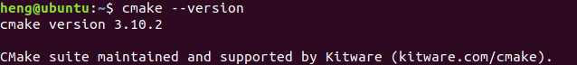

### 配置交叉编译链

先下载这个[点我跳转](https://dl.sipeed.com/shareURL/MaixII/MaixII-Dock/SDK/Toolchain)
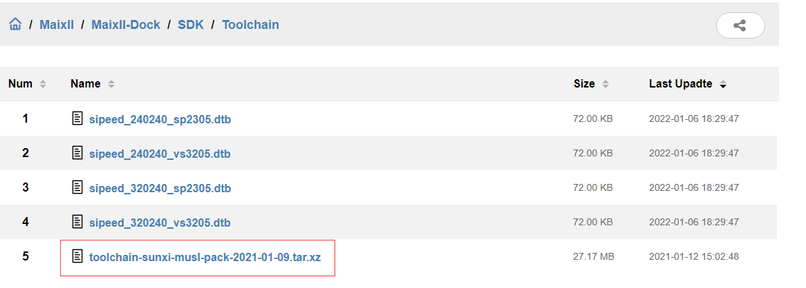

接着再对应的下载目录执行下面的命令将工具链解压到 /opt 目录下
`sudo tar -Jxvf toolchain-sunxi-musl-pack-2021-01-09.tar.xz -C /opt`

### 获取libmaix源码

新建一个文件夹后打开文件夹。
在对应文件夹的终端使用下面命令来获取源码
`git clone https://github.com/sipeed/libmaix --recursive`

一定要确保全部下载完成，否则后面会因为找不到文件编译出错。

### 开始编译

#### 尝试编译helloworld

先进入 libmaix 源码目录的 helloworld 文件夹里
```bash
cd libmaix/examples/hello-world
```

根据 CPU 架构选择工具链和前缀
```bash
python3 project.py --toolchain /opt/toolchain-sunxi-musl/toolchain/bin --toolchain-prefix arm-openwrt-linux-muslgnueabi- config
```
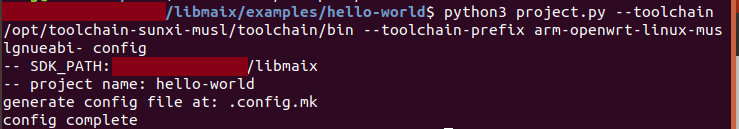

接着就可以编译 helloworld 了。在上面的命令成功执行后接着执行下面的命令
```bash
python3 project.py menuconfig
```

若出现以下画面，则说明下载内容完整。若报错先尝试使用sudo执行，否则需重新下载解压
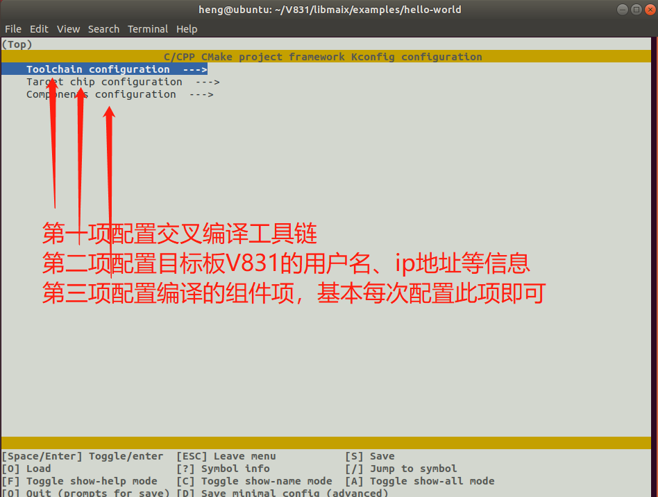

如第三项选择了Enable 3rd party component，则在编译时时间就会较长，因为会编译所有勾选的第三方组件。编译过程中可能会报一些warning，但最终出现下图画面则说明编译过程无误
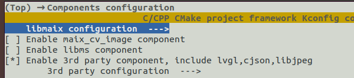
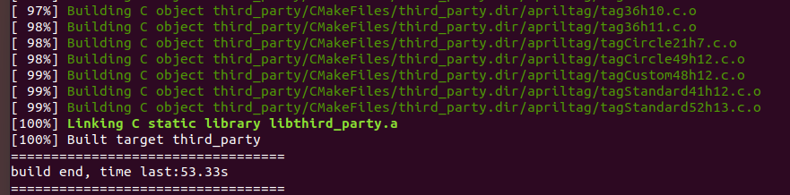

前面的都顺利结束后在当前目录下会有一个 dist 文件夹。里面的 helloworld 文件就是 v831 的可执行程序。

我们可以用 ssh 或者使用 v831在电脑上显示的U盘 把 helloworld 可执行文件传输到板子上

接着在对应的目录下直接执行就可以看到结果了
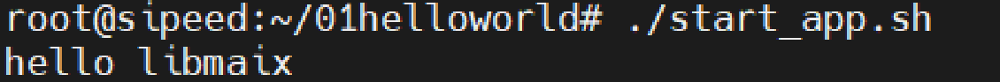

#### lvgl编译与测试

在 libmaix 源码的路径下的 /examples/mpp_v83x_vivo 执行下面命令后按照图示配置
```bash
python3 project.py menuconfig
```
<html>
<div class="imbox">
    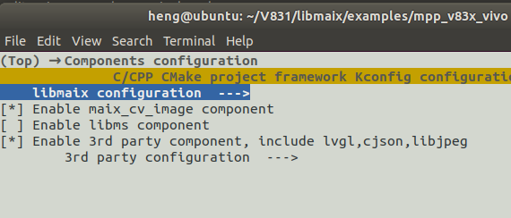
    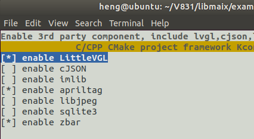
</div>
</html>

检查选项是否如以上配置所示，确认无误后在命令行执行
```bash
python3 project.py build
```
- 注：若同时勾选所有组件，则可能会发生重复定义函数的报错导致编译失败

若出现如图所示情况，则说明编译成功
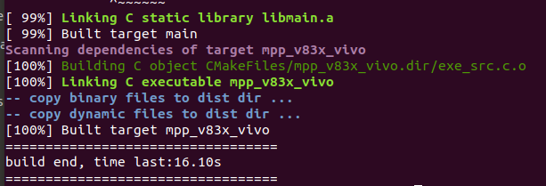

在板子上运行
<html>
<div class="imbox">
    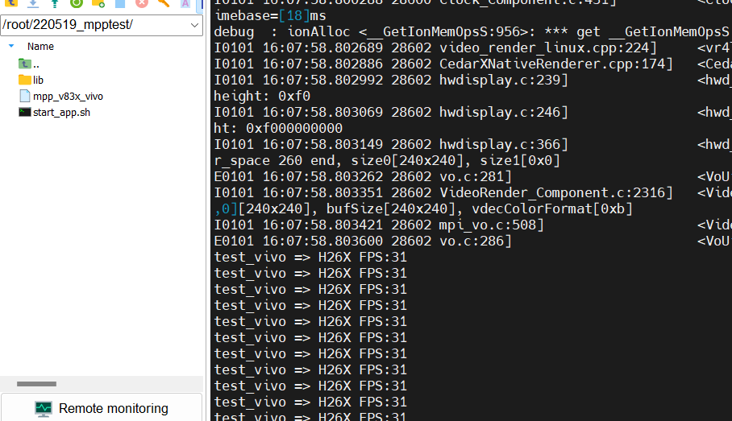
    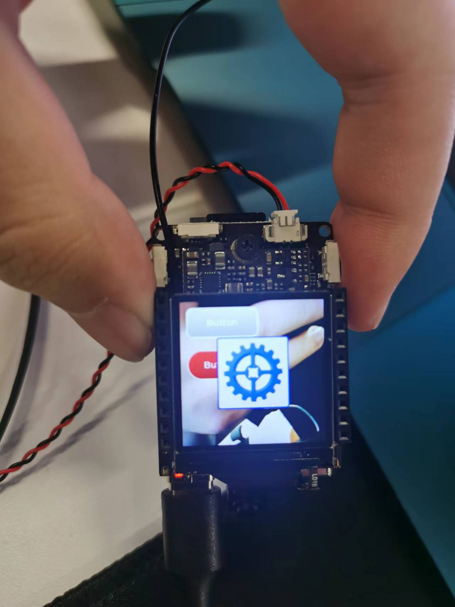
<style>
.imbox{
     display:flex;
     flex-direction: row;
     }
</style>
</div>
</html>


