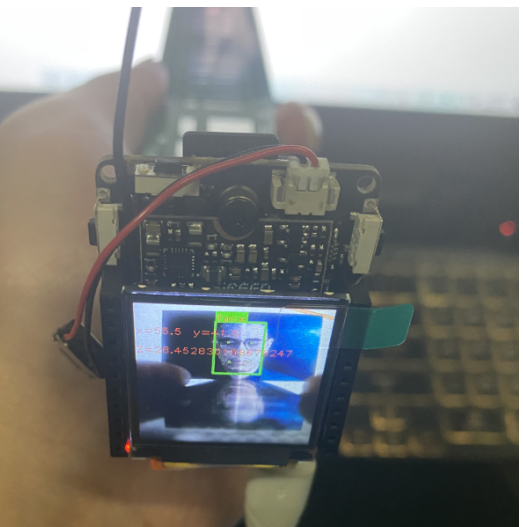
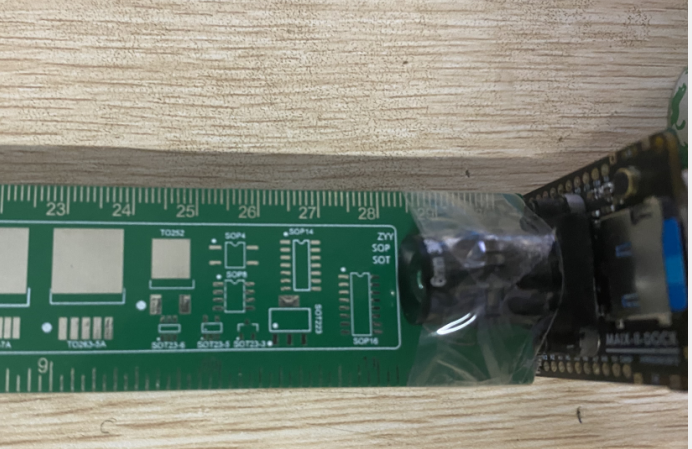

<!-- more -->

作者[我与nano](https://qichenxi.blog.csdn.net/?type=blog)，[原文链接](https://blog.csdn.net/qq_51963216/article/details/123745657)

## 前言

经过一下午的努力，最终终于实现了完美的单目测距，网上教的都是opencv怎么测算距离，人家有函数唉，入手了V831，做了人脸识别，同时进行了测距，K210通用。废话不多说上图。



它那个镜头其实还要在靠近里面一点，距离应该是28.4到28.5之间。测得真的特别准。

## 单目测距的原理


小孔成像。很简单，用的是小孔成像，原理大家都知道。该怎么做呢。
我们需要以下几个参数：
1、相机焦距
2、物体宽度
3、一个常数

## 参数计算

### 相机焦距
假设我们有一个宽度为 W 的目标。然后我们将这个目标放在距离我们的相机为 D 的位置。我们用相机对物体进行拍照并且测量物体的像素宽度 P 。这样我们就得出了相机焦距的公式：

F = (P x D) / W

举个例子，假设我在离相机距离 D = 28cm的地方放一张 待识别图片（W = 13)并且拍下一张照片。我测量出照片的像素宽度为 P = 53 像素


因此我的焦距 F 是：

F = (53*28) / 13 = 116

有人会问像素怎么获得呢，直接看代码吧
```python
 img.draw_rectangle(box[0], box[1], box[0] + box[2], box[1] + box[3], color=bg_color, thickness=2)
            img.draw_rectangle(box[0], box[1] - font_wh[1], box[0] + font_wh[0], box[1], color=bg_color, thickness = -1)
            img.draw_string(box[0], box[1] - font_wh[1], disp_str, color=font_color)
            img.draw_string(0,30, "x="+str(((box[0]+box[3])/2)-35), color= font_color)
            img.draw_string(70,30, "y="+str((box[1]+box[2])/2), color= font_color)

            Lm = (box[1]+box[3])/2
            length = K*13/Lm
            img.draw_string(0,60 , "Z="+str(length), color= font_color)

```
你识别到一个物体，然后给它画框，用一个列表表示出来四个点
Lm=（box[1]+box[3]）/2 这个就是像素值

### 测距
继续将相机移动，靠近或者离远物体或者目标时，可以用相似三角形计算出物体离相机的距离：
L= (W x F) / P
假设我将相机移到距离目标 28cm 的地方识别物体。通过自动的图形处理我可以获得图片的像素为 53像素。将这个代入公式，得：
L= (13 x 116) / 53 = 28
这样我们就精准的算出了距离。

附上代码
```python
from maix import camera, image, display
import serial
ser = serial.Serial("/dev/ttyS1",115200)    # 连接串口
K=116
class Face_recognize :
    score_threshold = 70                            #识别分数阈值
    input_size = (224, 224, 3)                      #输入图片尺寸
    input_size_fe = (128, 128, 3)                   #输入人脸数据
    feature_len = 256                               #人脸数据宽度
    steps = [8, 16, 32]                             #
    channel_num = 0                                 #通道数量
    users = []                                      #初始化用户列表
    threshold = 0.5                                         #人脸阈值
    nms = 0.3
    max_face_num = 3                                        #输出的画面中的人脸
    def __init__(self):
        from maix import nn, camera, image, display
        from maix.nn.app.face import FaceRecognize
        for i in range(len(self.steps)):
            self.channel_num += self.input_size[1] / self.steps[i] * (self.input_size[0] / self.steps[i]) * 2
        self.channel_num = int(self.channel_num)     #统计通道数量
global face_recognizer
face_recognizer = Face_recognize()
while True:
    img = camera.capture()                       #获取224*224*3的图像数据
    AI_img = img.copy().resize(224, 224)
    faces = face_recognizer.face_recognizer.get_faces(AI_img.tobytes(),False)           #提取人脸特征信息

    if faces:
        for prob, box, landmarks, feature in faces:
            disp_str = "face"
            bg_color = (0, 255, 0)
            font_color=(255, 0, 0)
            box,points = face_recognizer.map_face(box,landmarks)
            font_wh = image.get_string_size(disp_str)
            for p in points:
                img.draw_rectangle(p[0] - 1, p[1] -1, p[0] + 1, p[1] + 1, color=bg_color)
            img.draw_rectangle(box[0], box[1], box[0] + box[2], box[1] + box[3], color=bg_color, thickness=2)
            img.draw_rectangle(box[0], box[1] - font_wh[1], box[0] + font_wh[0], box[1], color=bg_color, thickness = -1)
            img.draw_string(box[0], box[1] - font_wh[1], disp_str, color=font_color)
            img.draw_string(0,30, "x="+str(((box[0]+box[3])/2-28)), color= font_color)
            img.draw_string(70,30, "y="+str((box[1]+box[2])/2-20), color= font_color)
            x=(box[0]+box[3])/2-28
            y=(box[1]+box[2])/2
            Lm = (box[1]+box[3])/2
            length = K*13/Lm
            img.draw_string(0,60 , "Z="+str(round(length)), color= font_color)
           
    display.show(img)

```

## 总结

**主要原理就是小孔成像**
