先看看效果， 一个检测小鸭子（可同时检测多个相同或者不同目标），另外一个是表情分类模型：

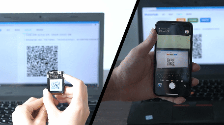

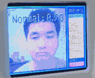

<!-- more -->

> 原文： https://neucrack.com/p/444 , 持续更新
> 视频： [基于K210的情绪识别与可视化](https://www.bilibili.com/video/BV1Xe4y1D7ne?spm_id_from=333.337.search-card.all.click&vd_source=6c974e13f53439d17d6a092a499df304)

## 新版 [MaixHub](https://maixhub.com) 简介

[MaixHub](https://maixhub.com) 推出了新版！支持了更多设备，包括 K210, V831, NCNN, TFjs, TinyMaix(所有单片机上运行)！更新了一大堆功能：
* 多种上传数据集方式：

  * 本地文件上传
  * 设备直接拍照后一键上传
  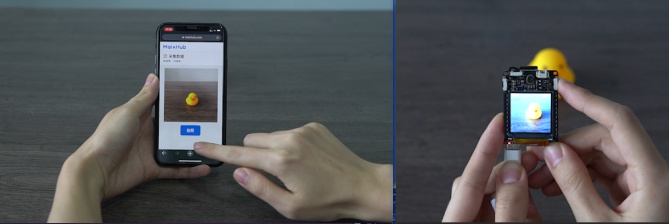
  * 导入本地标注
* 支持在线标注，简单快速好用，以及支持视频自动标注哦
  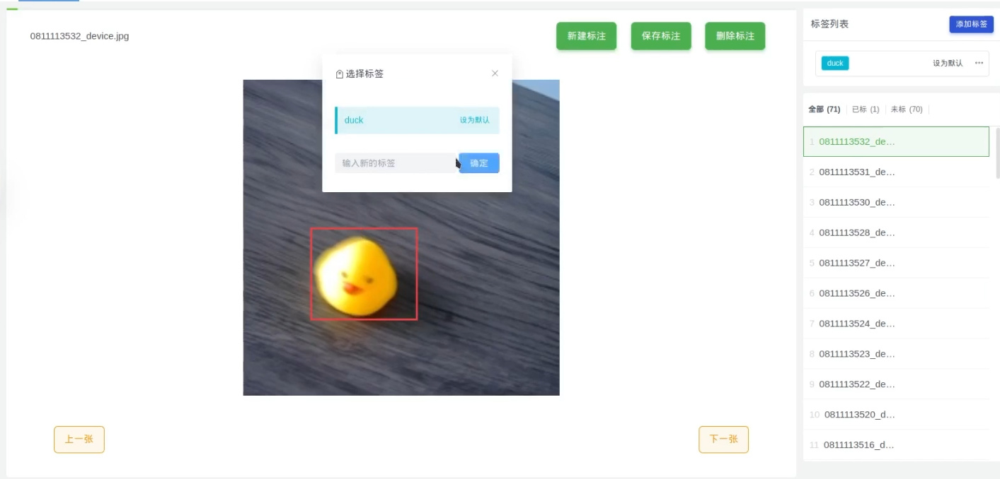
* 多种训练参数自定义支持
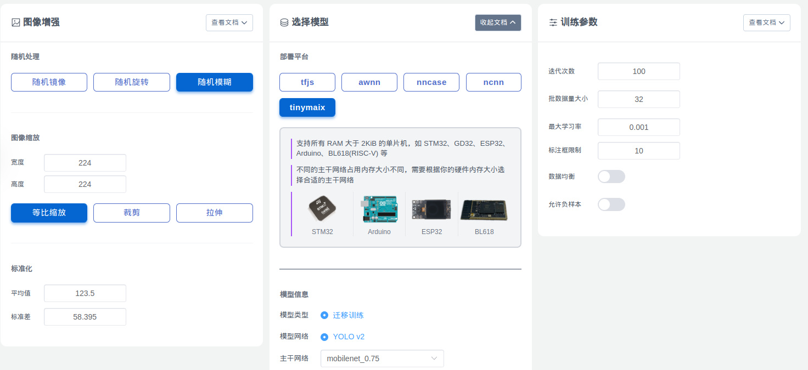
* 多种平台（硬件平台）
  * 手机、电脑
  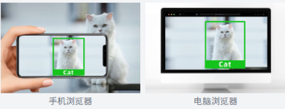
  * 带硬件NPU加速的高性价比板子，比如[Maix-II-Dock](https://wiki.sipeed.com/hardware/zh/maixII/M2/resources.html)
  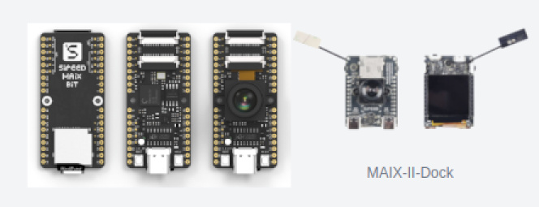
  * 通用单片机，更是推出了超轻量的单片上运行的模型推理库[TinyMaix](https://github.com/sipeed/TinyMaix)，可以移植到任意单片机，甚至能在 2KiB RAM的arduino上跑
  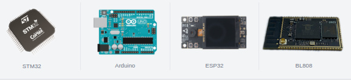
* 训练过程、日志、图标展示，以及验证结果展示，方便分析和优化模型

* 一键部署到设备
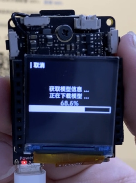
* 一键分享到模型库（模型平台/model zoo），同时模型库也支持手动上传分享更厉害好玩的模型哦
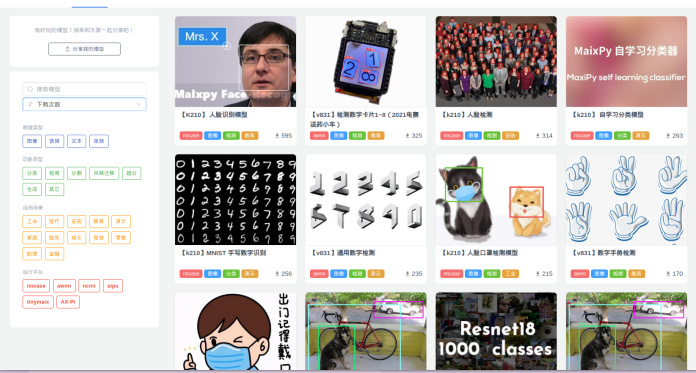

## 训练一个模型试试

注意 MaixHub 在不停更新，可能有些地方在未来会有些许变化，原理变化不大，举一反三即可

* 创建训练项目，选择检测任务，检测任务能框出物体的位置，后面需要我们标注数据，分类任务则不需要标注框，用来区分多种物体

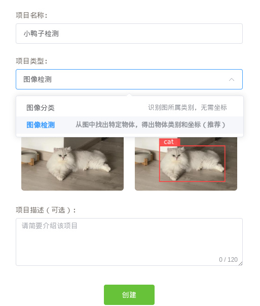

* 创建数据集
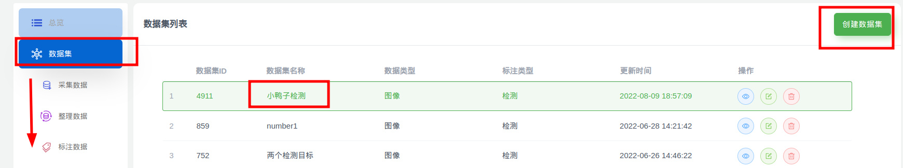

* 采集数据，可以从本地上传，也可以用手机在线拍照采集，也可以用设备拍照采集（比如 Maix-II-DocK）

* 标注数据，就是将要检测的物体框起来，并且给一个标签，比如这里只有一个duck；一张图里面可以有多个框，也可以只有一个框，最后训练出来的模型都能识别同一个画面的多个物体，数据量尽量多一点，覆盖的场景全面一点，这样实际到板子上跑起来准确率更高，最好使用什么板子跑就用什么板子采集数据，准确率会高些
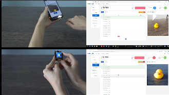
这里有训练集，验证集，测试集的概念，训练集就是拿来参与训练的数据，验证集不参与训练，但是每隔一段训练时间后会将模型在验证集上面跑一次，得到 `val_acc`也就是验证集精确度，即这个模型在这个从来没参与过训练的数据上正确率如何，一般用这个指标来评判模型的好坏；测试集则是完全没在训练过程中参与的数据，比如部署到板子上后实际识别的物体就算是测试集。所以为了让实际在板子上跑的时候准确度高，尽量将验证集的数据和实际应用的场景（测试集）相近，这样训练时在验证集上的准确率（val_acc）才能更精确地反应在测试集上的效果。
> 比如你实际识别的是哈士奇狗狗，训练集中放了各种狗狗图，验证集却放了中华田园犬，就算 val_acc 为 1，即全部识别正确，实际拿去识别哈士奇狗狗的时候可能完全无法识别

* 创建训练任务，一个项目里面可以多次创建任务，调整不同的参数。
注意要根据自己的设备选择对应的平台，比如 K210 选择 nncase， 普通没有 NPU 加速的单片机选择 TinyMaix，手机或者浏览器跑则选择 tfjs。分辨率使用默认的 224x224 效果最好，因为迁移训练就是基于一个已经训练过的模型微调训练模型，这个模型默认都是 224x224 下训练的，所以理论上效果最好。

另外，选择模型主干网络，网络越大效果越好（精确度越高），但是占用的内存就越大，以及运行消耗的时间就越久，也就是对算力的要求越大，根据你的数据集复杂度以及设备性能选择合适的主干网络（backbone）。
还有更多参数，可以看页面对应的文档说明即可，也可以到首页的交流群交流。

* 启动训练，训练任务多的时候可能需要排队，耐心等待就好了，如果加急可以联系官方或者管理员钞能力解决哈哈哈。
训练过程可以看到 `val_acc`， 即损失和精确度曲线，会慢慢上升，代表在验证集训练完成后可以看到
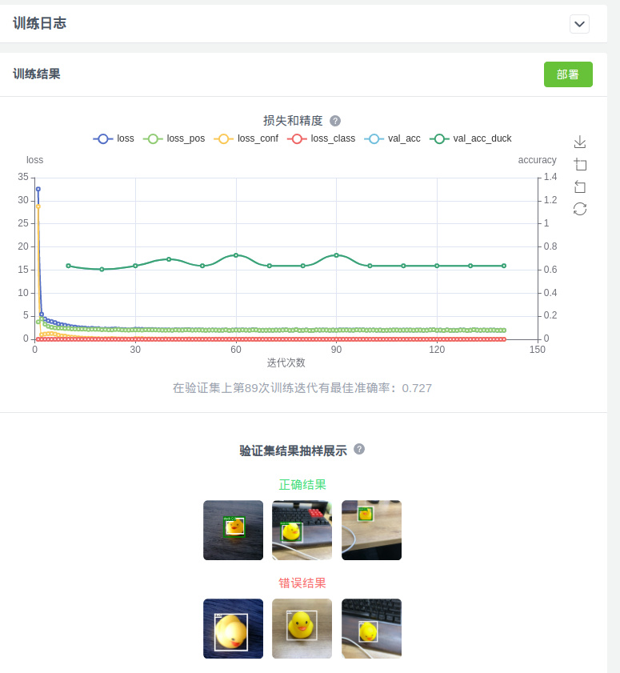
如前面所说，这里最重要的是 `val_acc`，即在验证集上的准确度，越接近 `1`越好（实际上这里 val_acc 是 MAP，MAP相关含义可自行搜索）。以及展示了部分识别正确的和识别错误（或者未识别到）的样例。

* 一键部署
根据不同设备支持的方式可能不同，可能是直接下载文件（具体使用方法看对应说明），也有（比如 Maix-II-Dock）支持一键部署，在设备上选择模型部署，扫描部署页面的二维码即可自动部署，然后就可以进行识别了。
需要注意的是一键部署需要设备已经联接互联网，设备选择联网功能，到 [maixhub.com/wifi](https://maixhub.com/wifi) 生成填写 WiFi 信息然后设备扫码连接 WiFi， 注意不是局域网，需要能访问互联网。

* 分享模型到模型库
训练的模型可以一键分享到模型库，如果你训练的模型实际在板子上运行的识别效果不错，欢迎点击左边导航栏分享模型分享到模型库，可以多写点图文介绍，推荐在 B 站上传一个视频后嵌入到模型描述里面~

更多功能持续在更新~ 持续关注哦~ 也欢迎来上传分享你自己的模型！

## 训练优化建议

* 尽量多采集实际使用场景的图片，覆盖更多使用场景有利于提高最终识别率。
* 图片数量尽量不要太小，虽然平台限制最小数量为 20 张图才可以训练， 但要打到比较好的效果，显然一个分类 200 张都不算多，不要一直在 30 张训练图片上纠结为什么训练效果不好。。。
* 默认分辨率但是 224x224， 是因为预训练模型是在 224x224 下训练的，当然也有其它分辨率的，比如 128x128，具体发现不支持的分辨率预训练模型，在训练日志中会打印警告信息。
* 为了让验证集的精确度的可信度更高（也就是在实际开发板上跑的精确度更接近训练时在验证集上的精确度），验证集的数据和实际应用的场景数据一致。比如训练集是在网上找了很多图片，那这些图片可能和实际开发板的摄像头拍出来的图有差距，可以往验证集上传一些实际设备拍的图来验证训练的模型效果。
这样我们就能在训练的时候根据验证集精确度（val_acc）来判断模型训练效果如何了，如果发现验证集精确度很低，那么就可以考虑增加训练集复杂度和数量，或者训练集用设备拍摄来训练。
* 对于检测训练项目，如果检测训练的物体很准，但是容易误识别到其它物体，可以在数据里面拍点其它的物体当背景；或者拍摄一些没有目标的图片，不添加任何标注也可以，然后在训练的时候勾选“允许负样本”来使能没有标注的图片。
* 检测任务可以同时检测到多个目标，如果你觉得识别类别不准，也有另外一种方式，先只检测模型检测到物体（一个类别），然后裁切出图片中的目标物体上传到分类任务，用分类任务来分辨类别。不过这样就要跑两个模型，需要写代码裁切图片（在板子跑就好了），以及需要考虑内存是否足够