Linux 系统可以使用 ssh 远程被操作，但是对于 M2Dock 还有另一种用法

<!-- more -->

内容较多，对新手很有帮助

## SSH 简介

SSH 为 Secure Shell 的缩写，是建立在应用层基础上的安全协议，可以有效防止远程管理过程中的信息泄露问题。
因为其易用且安全，所以被广泛使用。

## 软件准备

### MobaXterm

这里使用 [MobaXterm](https://mobaxterm.mobatek.net/) 来作为主要软件进行示例。
因为它免费且易用，所以就用它了。
当然这里主要是使用它的 SSH 功能，其他诸多强大功能各位可以自行尝试

#### 下载 MobaXterm
点击这个链接 [https://mobaxterm.mobatek.net/download-home-edition.html](https://mobaxterm.mobatek.net/download-home-edition.html) 可以跳转到下载界面。
这里我们选择 [Portable edition](https://download.mobatek.net/2212022060563542/MobaXterm_Portable_v22.1.zip) （携带版（下载后解压就可以用））

  
点开查看下载页面截图

  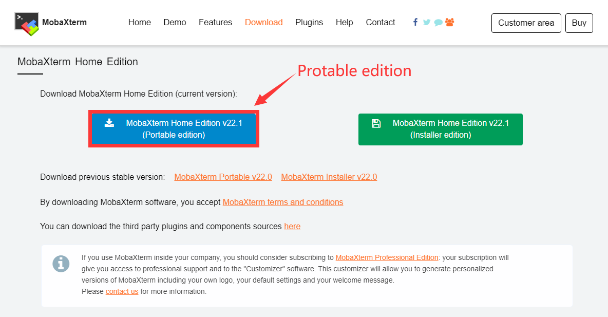

下载解压后文件夹里是这样的:

  
点开查看解压后文件夹

  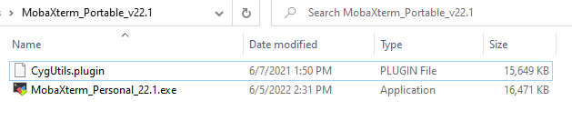

里面只有一个可执行的 mobaxterm 本体文件与一个插件文件

### ADB

M2Dock 带有 adb 功能。

可以进行端口转发然后通过 USB 数据线与电脑进行 SSH 连接，比使用无线 SSH 连接更加稳定。

如果曾经自行配置过 adb 那可以直接看[操作步骤](#操作步骤)

### 下载 adb

#### Linux 安装 adb

Ubuntu 用户可以直接使用包管理器来安装。

在命令行终端执行 `sudo apt-get install android-tools-adb` 来安装 adb。

且安装后能直接通过命令行调用 adb 程序。

#### Windows 配置 adb

Windows 用户可以在 [这里](https://developer.android.google.cn/studio/releases/platform-tools?hl=zh-cn) 下载 adb。

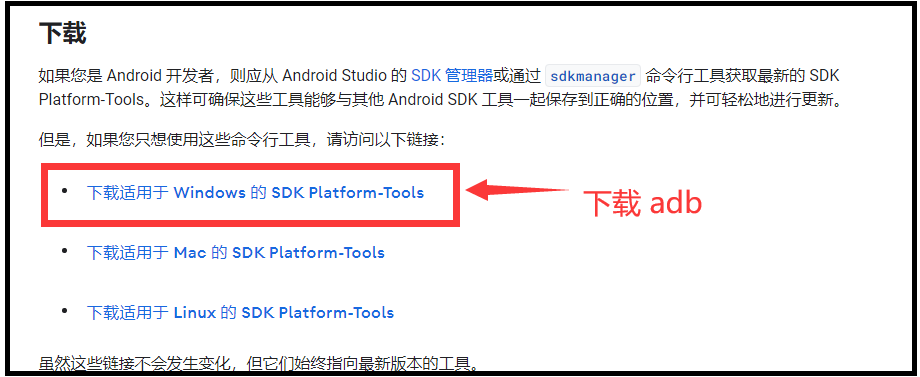

然后自行选择合适的地方解压文件，并把其文件路径复制一下：
比如我这里是直接把可执行文件(adb.exe)所在的路径全都复制了，因此**我**此次所用路径为 `Y:\platform-tools_r33.0.2-windows\platform-tools` (仅举例用)
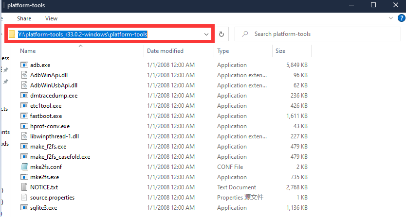

但是为了能够随时在命令行终端里使用 adb 命令我们需要把它添加到系统路径：

- Windows10 和 Windows11 用户可以直接在任务栏的搜索里面输入 `path` 来打开系统属性
- 其他版本可以通过点开下面的箭头来查看系统属性的方法：

  
点开查看打开系统属性方法

  右键此电脑然后选择最下面的属性选项 （鼠标右键 ① 处，然后鼠标左键点击弹出菜单的最下面的 ② 处的属性）
  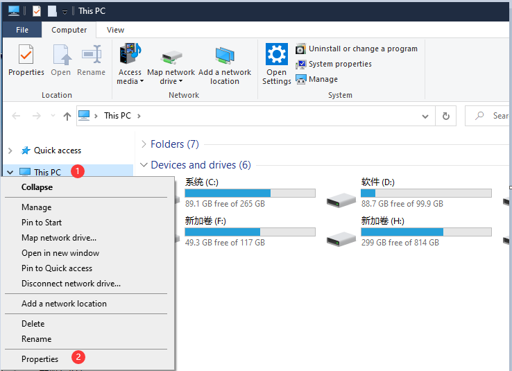

然后在弹出的系统属性窗口中依次点击 ① 和 ② 处来打开环境变量
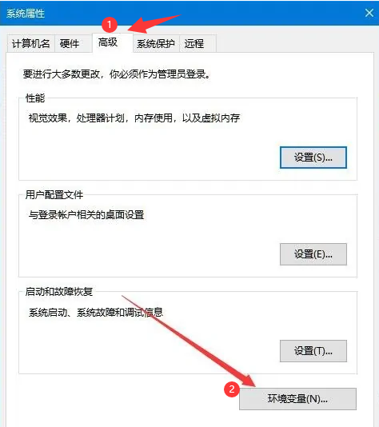

在弹出的窗口中上面的一栏中双击名为 Path 的变量来对其进行编辑
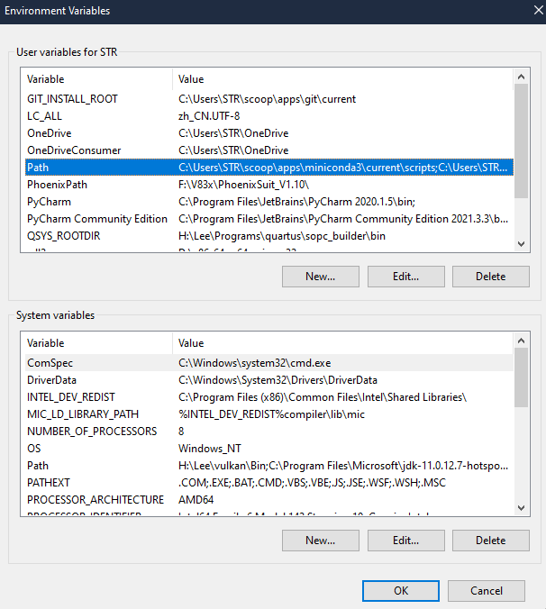

双击空白处相当于添加一个条目，这里我们把之前复制的 adb 路径存入其中，
比如对于我之前复制的路径为 `Y:\platform-tools_r33.0.2-windows\platform-tools`，因此在下面所所添加的内容就是 `Y:\platform-tools_r33.0.2-windows\platform-tools`，具体内容应当根据每个人的情况而定(不会有人和我一样的)
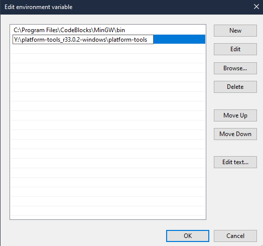

接着单击所有已打开窗口的 OK 来保存配置。

> 如果进行了错误的操作那就点击取消然后从头再来，系统环境是很危险的配置，不要随意删除

然后就可以在命令行终端中执行一次 adb 来检查一下是否正确配置了
  - 需要保存环境变量配置和系统属性后在进行这一步
  - 环境变量配置和系统属性保存需要新打开一个命令行终端来执行 adb 指令

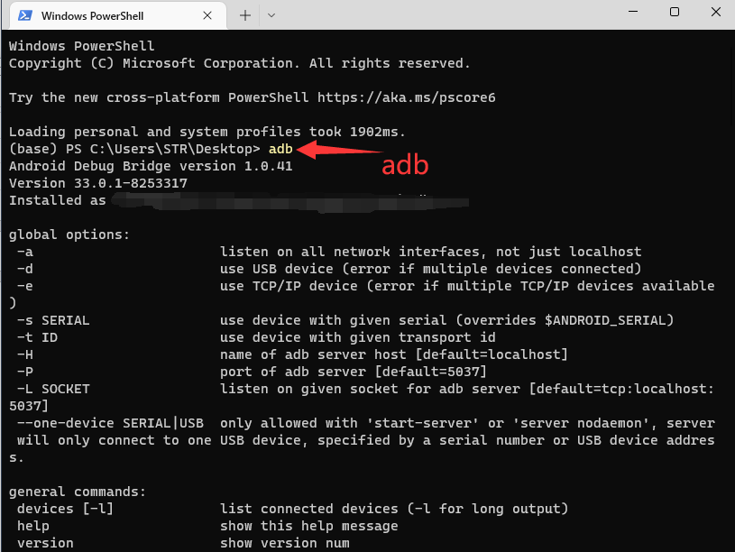
下面那一大堆就是相关的说明。但是在这里我们不太需要用，只要有对应的输出就行。

## 操作步骤

1. 将 M2Dock 通过 otg接口与电脑相连且已弹出 U盘
2. 在命令行中执行 `adb forward tcp:22 tcp:22` 来进行端口映射
   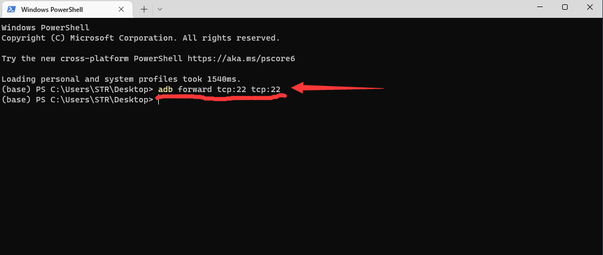
3. 运行 MobaXterm ，可按照下面的 gif 或者图文进行创建 ssh 会话操作

  
点开查看创建 ssh 会话的 gif 操作

  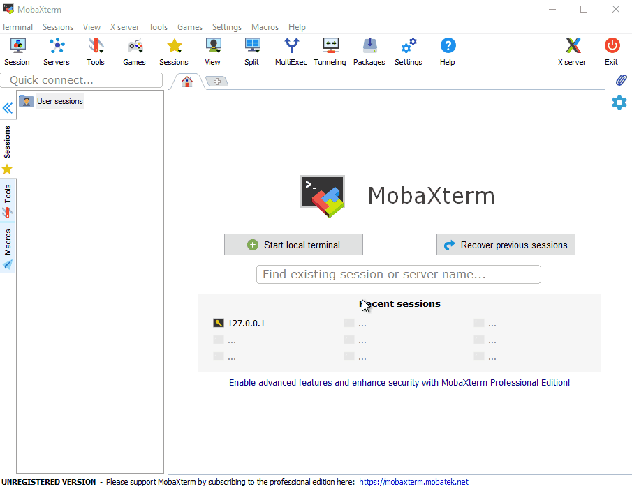

  
点开查看创建 ssh 会话的图文版操作

  单机左上角的 session 来创建会话
  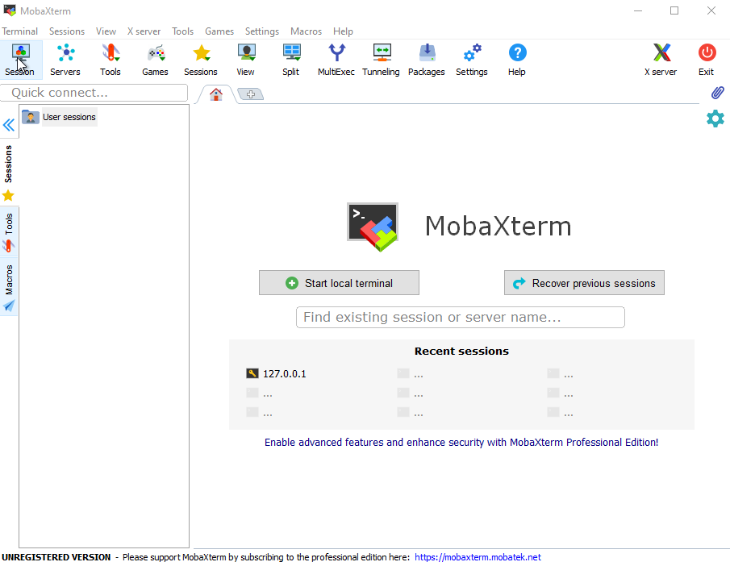
  在弹出的窗口中选择 SSH
  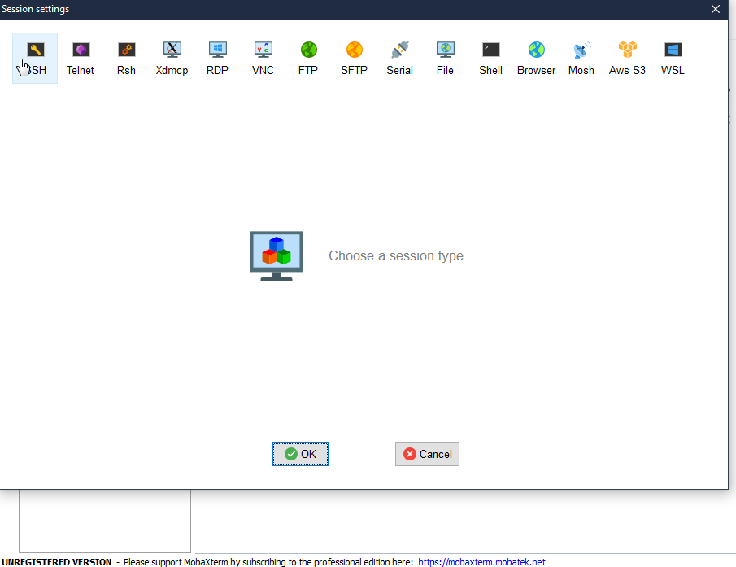
  因为前面执行过 adb forward 指令，因此在 Remote host 输入 127.0.0.1 
  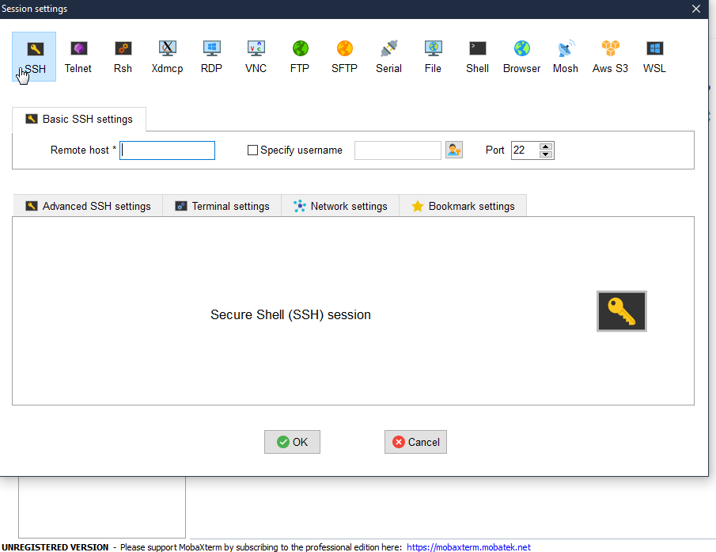
  点击下方 OK 就完成了 SSH 会话的创建，接着会要求我们输入用户名和密码，均为 root，自行输入即可
  输入密码的时候是没有输入显示的，但是错误就会提示。因此个人多试几次就行
  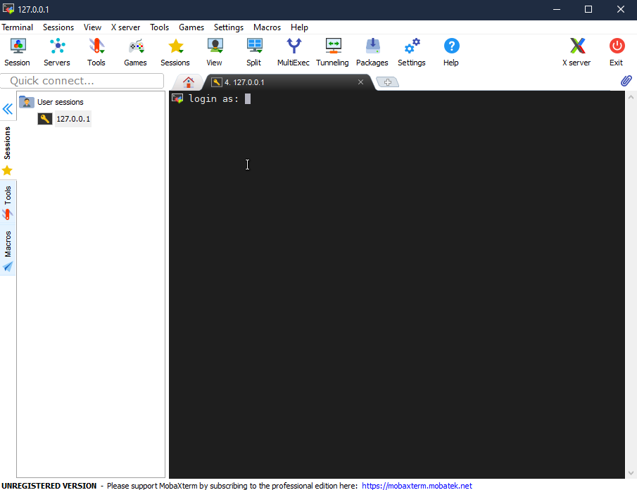
  紧接着就成功登陆进来了
    
  点一下左下角的 Remote monitoring ，就能监视设备运行状态了
  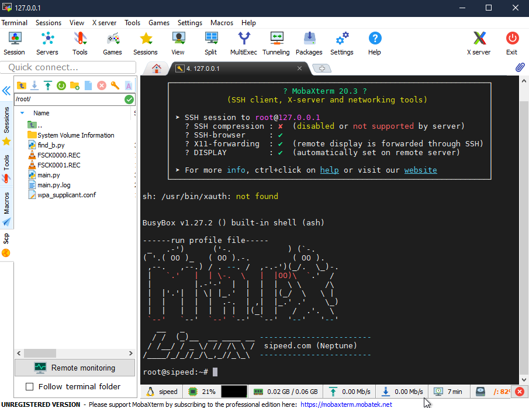

在成功使用 SSH 在 MobaXterm 软件中连上 M2Dock 后，可以看到在会话栏中看到设备里的文件。默认所查看的文件路径为当前用户的根目录。

我们可以手动拖入或者拖出文件或者文件夹来进行电脑与板子互传文件的操作
当然也可以双击文件然后对其进行文本编辑:
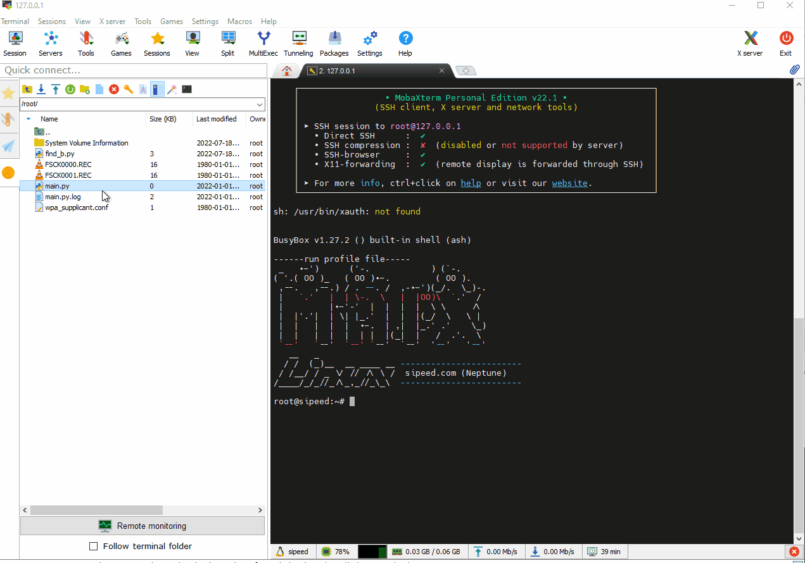

## 其他

### 开启自动保存

需要注意的是点击保存后还要选择一下确认保存到文件才行
比如出现下图的情况的话点击一次 Autosave 就可以让它以后不再弹出
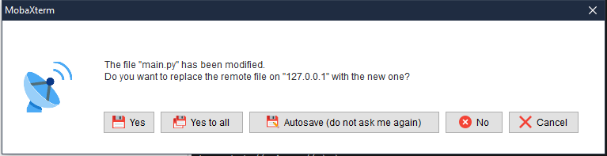

### 关闭 MaixPy3 IDE

使用 USB 数据线使电脑与板子进行 SSH 通信时，最好关闭电脑端的 MaixPy3 IDE，这样可以避免一些麻烦

### 使用无线连接

将板子联网之后可以通过命令行来得到其 IP。

然后可以在新建 SSH 会话的时候把板子的 IP 填入到 Remote host 中。
就可以通过无线网来使电脑与板子使用 SSH 进行通信

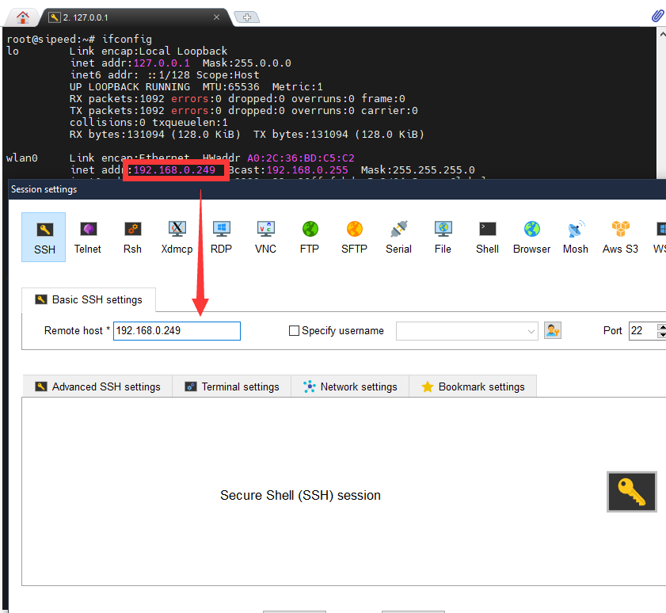

板子没能成功连接到无线网就不会被分配 IP

### adb forward

adb forward 的功能是建立一个端口转发，比如 `adb forward tcp:11111 tcp:22222` 的是将 PC 端的11111 端口收到的数据，转发给到 adb 设备的 22222 端口。

SSH 默认的端口为 22 ，因此使用 `adb forward tcp:22 tcp:22` 是将电脑端的 22 端口转发到 adb 设备的 22 端口。
例如使用  `adb forward tcp:1145 tcp:22` 命令的话，需要把配置 IP 处的端口修改一下:
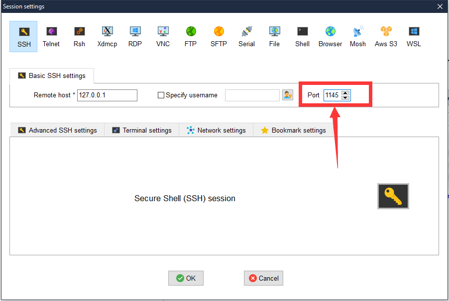