常用颜色表示方法： RGB HSV YUV LAB CMYK

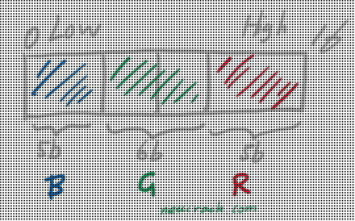

<!-- more -->

版权声明：本文为 neucrack 的原创文章，遵循 CC 4.0 BY-SA 版权协议，转载请附上原文出处链接及本声明。
原文链接：https://neucrack.com/p/294

## RGB

红绿蓝 三色，也是大家熟悉光学三原色

RGB 使用加色模式，也就是默认是黑色，三原色相加获得白色， 比如下图`蓝色+绿色=青色(cyan)`，得到`蓝色=青色-绿色`也就是`蓝色=青色+绿色`的互补色， 绿色的互补色就是图中的`M(品红色）magenta`（同理蓝色的互补色是Y黄色）（互补色就是两者相加为白色），所以`蓝色=青色+品红色`

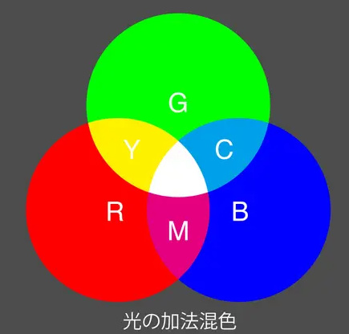

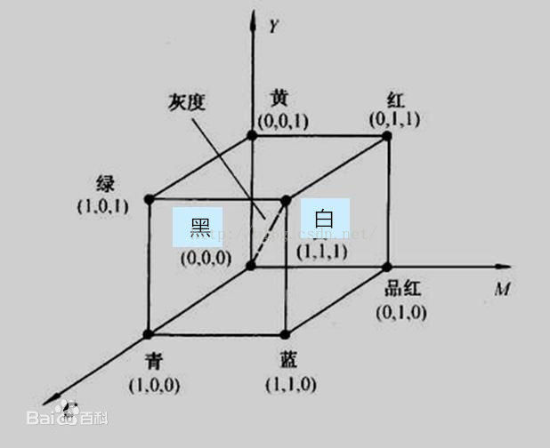

上图可以看到灰度图在正方体对角线上，即三个通道（轴）的值相等时，值越大越白

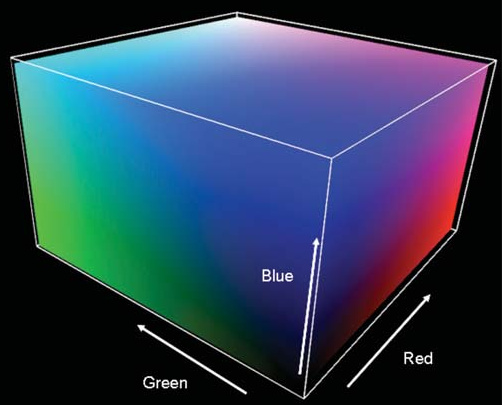

一般两种表示方法：

### RGB888(24bit)

RGB三个通道，每个通道分别用8bit长度表示，比如(255, 255, 255), 每个通道取值范围为[0, 255]，或者0xFFFFFF三个字节表示

### RGB565(16bit)

RGB三个通道分别用5bit 6bit 5bit表示，比如(31, 63, 31)，但一般不这样表示，使用两个字节表示，比如0xFFFF, 一般在编写程序时在内存中多使用以下两种布局方式：

- 第一种：

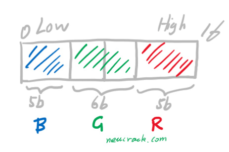

- 第二种：

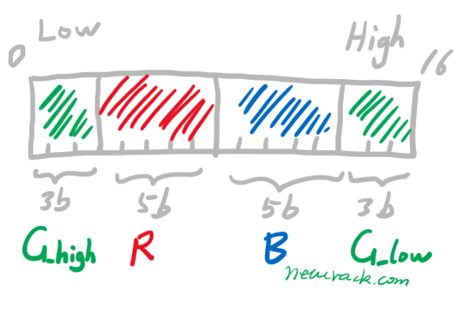

这两种方式的不同主要是因为 RGB565 共占用 2 个字节， 两个字节的顺序不同造成的，把第二张图从中间分隔成两份，右边移到左边，就变成了第一种的排列方式了

C语言结构体如下：
```c
#define COLOR_16_SWAP 1
typedef union
{
    struct
    {
#if COLOR_16_SWAP == 0
        uint16_t blue : 5;
        uint16_t green : 6;
        uint16_t red : 5;
#else
        uint16_t green_h : 3;
        uint16_t red : 5;
        uint16_t blue : 5;
        uint16_t green_l : 3;
#endif
    } ch;
    uint16_t full;
} color16_t;
```

比如`(1,2,3)` `(R, G, B)`：

使用第一种方式二进制值为 `B00001 000010 00011 ` 即 `B0000 1000 0100 0011`, 十六进制表示为 `0x0843`（注意这里表示方法从左到右是从高位到低位，上面的图从左到右是低位到高位）；

使用第二种方式二进制值为 `B010 00011 00001 000 `即 `B0100 0011 0000 1000`, 十六进制表示为 `0x4308`；

## HSV

相关解释：
- Hue（色调、色相）
- Saturation（饱和度、色彩纯净度）
- Value（明度）

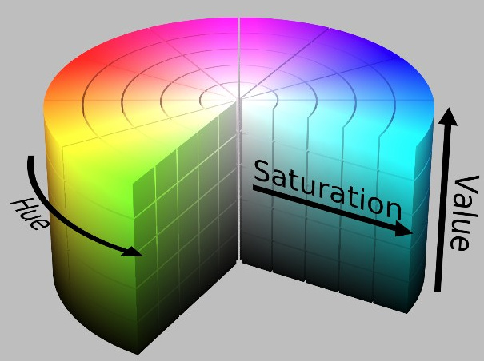

## HLS

HLS 中的 L 分量为亮度，亮度为100，表示白色，亮度为0，表示黑色；HSV 中的 V 分量为明度，明度为100，表示光谱色，明度为0，表示黑色。

提取白色物体时，使用 HLS 更方便，因为 HSV 中的Hue里没有白色，白色需要由S和V共同决定（S=0, V=100）。而在 HLS 中，白色仅由亮度L一个分量决定。所以检测白色时使用 HSL 颜色空间更准确。

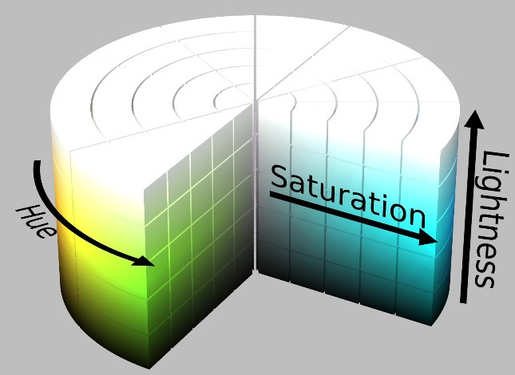

## YUV

Y'UV、YUV、YCbCr、YPbPr 几个概念其实是一回事儿。Y’UV、YUV 主要是用在彩色电视中，用于模拟信号表示。YCbCr 是用在数字视频、图像的压缩和传输，如 MPEG、JPEG。今天大家所讲的 YUV 其实就是指 YCbCr。Y 表示亮度（luma），CbCr 表示色度（chroma）。

另外Y’UV在取值上可以使正或者负数，但是Y’CbCr一般是 `16–235` 或者 `0–255`

Y’UV 设计的初衷是为了使彩色电视能够兼容黑白电视。对于黑白电视信号，只需要 Y 通道， 在彩色电视则显示 YUV 信息

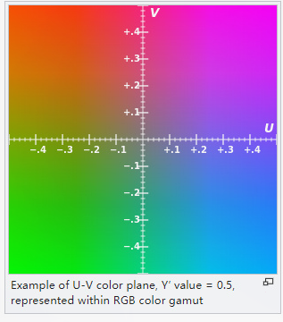

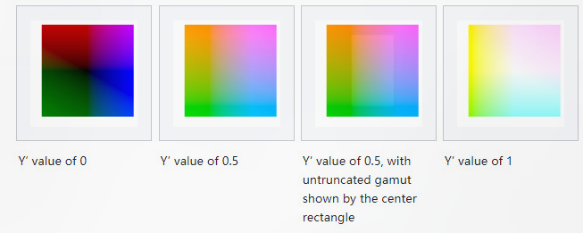

### 打包格式和采样

YUV 格式通常有两大类:打包(packed)格式和平面(planar)格式， 前者是每个像素为基本单位，一个一个像素的数据连续排列在内存中， 后者则是YUV 分成3个数组（内存块）存放， 另外还有Y和UV分开存放的（比如 YUV420SP（ Semi-Planar， U和V交叉放，即YYYYYYYY…UVUV…） 和 YUV420P（先放U再放V，即YYYYYYYY…UUVV））

人眼的视觉特点是对亮度更铭感，对位置、色彩相对来说不铭感。在视频编码系统中为了降低带宽，可以保存更多的亮度信息(luma)，保存较少的色差信息(chroma)。这叫做 chrominance subsamping, 色度二次采样。原则：在数字图像中，(1) 每一个图形像素都要包含 luma（亮度）值；（2）几个图形像素共用一个 Cb + Cr 值，一般是 2、4、8 个像素。 一般分为以下几种

- YUV444：就是每个 Y 值对应一个 U 和 一个 V 值
- YUV422: 就是图像的横轴（width方向） 4 个 Y 值公用 2 个 U 和V，纵轴（height方向）4 个 Y 对应了 4 个 U 和 4 个 V
- YUV420: 就是在 YUV422 的基础上， 纵轴的 U 和 V 数量也减半，每 2 个提供给 4 个 Y 配对使用
- YUV411: 同理，就是 4 个 Y， 对应横轴和纵轴的 1 个 U 和 V

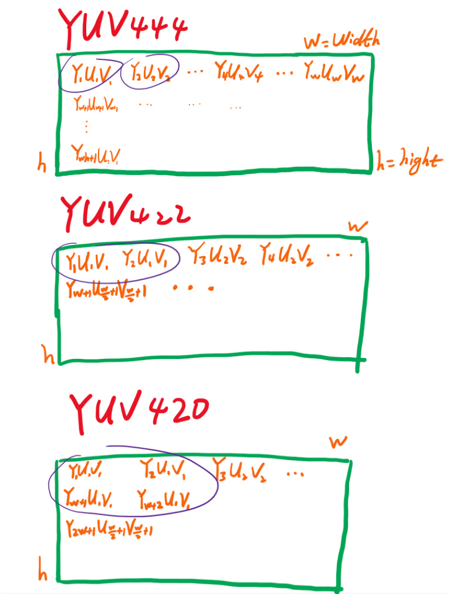

`SP`(Semi-Planar) 和 `P` 的说法， 区别就是在内存中的存放顺序不同, 比如

YUV420SP:

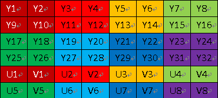

YUV420P:

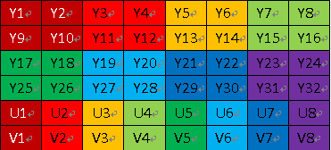

另外，还有 NV12 和 NV21 的区别， 就是在 UV 的存放上顺序不同

- NV12: IOS只有这一种模式。存储顺序是先存Y，再UV交替存储。YYYYUVUVUV
- NV21: 安卓的模式。存储顺序是先存Y，再存U，再VU交替存储。YYYYVUVUVU

YUV与RGB之间的转换

略

参考代码： https://github.com/latelee/yuv2rgb

## LAB

Lab颜色空间中的L分量用于表示像素的亮度，取值范围是[0,100],表示从纯黑到纯白；a表示从红色到绿色的范围，取值范围是[127,-128]；b表示从黄色到蓝色的范围，取值范围是[127,-128]


## CMY & CMYK

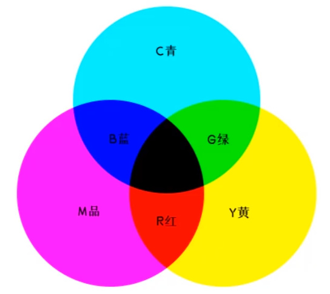

一般用在印刷， 因为人眼看到的物体的颜色是反射光，而不是自发光，一束白光照到物体上，默认反射所有，即白色，人眼实际看到的颜色是用光的颜色减去材料吸收后的颜色,这时涂上黑色的颜料，即吸收了所有白光，所以人眼看到的是黑色。
利用色料的三原色混色原理，加上黑色油墨，共计四种颜色混合叠加，形成所谓“全彩印刷”。四种标准颜色是：`C：Cyan = 青色`，又称为‘天蓝色’或是‘湛蓝’`M：Magenta = 品红色`，又称为‘洋红色’；`Y：Yellow = 黄色`；`K：blacK=黑色`，虽然有文献解释说这里的K应该是Key Color（定位套版色），但其实是和制版时所用的定位套版观念混淆而有此一说。此处缩写使用最后一个字母K而非开头的B，是为了避免与Blue混淆。CMYK模式是减色模式，相对应的RGB模式是加色模式。

印刷三原色如何得到黑色， 理论配色如下：

> C(100)  +M（100） +Y（100） = 黑色（100，100，100）

可见黑色就是青色、品与黄色之和，但是这三种颜色混成的黑色不够纯，所以印刷学就引进了K(Black)黑色，因为B已经被Blue占用，所以黑色就只好用引文字母黑色的最后一个字母K, 哪么真正印刷的黑色配色如下:

> C(100)  +M（100） +Y（100） + K(100) = 黑色 （100，100，100，100）

或者

> C(0)  +M(0) + Y(0) + K(100) = 黑色(0，0，0，100）

减色模式：前面说的由于物体是吸收了部分光，才呈现出特有的颜色，比如品红的物体，是吸收了它的互补色绿色（看前面的RGB对互补色的描述），也就是白色光减去了绿色才得到的颜色，所以称之为减色模式