网上发现一篇不错的文章。这里转载一下，有较大改动 [原文链接](https://bbs.elecfans.com/jishu_2290503_1_1.html)

<!-- more -->

## 前言

根据 官方MaixPy3 和 M2 Dock 的相关说明和官方文档与样例，在大家的帮助下，学习了基础的魔方色块的寻找功能。再此分享给大家。

## 基础科普

### 图传

图传的概念，在无人机中非常常见。

简单来讲，就是把摄像头拍摄的实时视频，又快又好的传递到终端设备上呈现——既要速度，不能卡，卡了没意思；也要质量，清晰度不能低，低了没得玩。而传输速度快，质量高，会占用较多的设备资源，以及需要较大的带宽。所以设计一个上好的图传方案和系统，是很多该行业厂家的重大追求目标之一。

### LAB

Lab是一种用数字化的方法来描述人的视觉感应的颜色系统。它是一种设备无关的、基于生理特征的颜色系统。在机器视觉中，Lab的概念会经常提及。
可以用一张图，来详细描述Lab颜色空间：

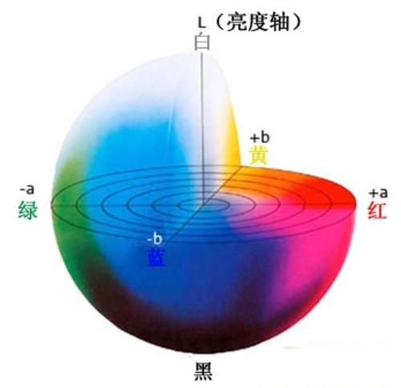

上示图片，是从人的视觉感应角度来看的。
- 首先是L：表示亮度，从纯黑到纯白，取值为 [0 -> 100]
- 然后是a：表示从蓝色到红色的范围，取值为 [-128 -> 127]
- 最后是b：表示从蓝色到黄色的范围，取值为 [-128 -> 127]

通常，Lab会以范围的形式来表示，也就是Lab阈值，因为因为现场环境的不同，我们看到的颜色，不可能是完完全全的理论纯色，所以给出一定的容错范围；
例如：[(0, 100, 21, 127, -128, -9)]，分别表示：L-min、L-max、a-min、a-max、b-min、b-max，机器视觉就根据这个范围，来进行颜色判断。

## M2Dock 启用图传

### 相关代码

了解相关概念后，可以开始使用 M2 Dock 图传功能了。

下面就是相关启用图传代码了。其实在[官方文档](https://wiki.sipeed.com/soft/maixpy3/zh/usage/net.html#MJPG-%E5%9B%BE%E4%BC%A0-%E6%80%8E%E4%B9%88%E7%94%A8%EF%BC%9F)都写过

```python
from maix import camera, mjpg, utils, display

queue = mjpg.Queue(maxsize=8)
mjpg.MjpgServerThread("0.0.0.0", 18811, mjpg.BytesImageHandlerFactory(q=queue)).start()

while True:
    img = camera.capture()
    jpg = utils.rgb2jpg(img.convert("RGB").tobytes(), img.width, img.height)
    queue.put(mjpg.BytesImage(jpg))
    display.show(img)
```

上面的代码有三种运行方式：
1. 在 jupyter 的网页编辑界面，运行上述代码
2. 可以用 adb shell 或者 ssh 连接到 M2 Dock 后，运行 python ，再输入代码运行
3. 用 adb shell 或者 ssh 连接到 M2 Dock 后，用vim编辑 tuchuan.py 并保存后，再执行 python ./tuchuan.py 来运行代码

当然对于小白来说，方式1最方便，方式2最麻烦。但是方式3运行效率最好

正确运行上述代码后，接可以开启图传功能了。

### 实际使用

要访问M2 Dock提供的图传功能，可以有几种方式，根据不同情况可以选择不同方式：

#### 使用 OTG 连接运行代码

使用 jyputer 或 adb shell 都可以算作是使用 otg 连接板子

这种情况在成功弹出U盘（即正常连接）后可以在浏览器访问 [http://127.0.0.1:18811](http://127.0.0.1:188811) 来打开图传页面。

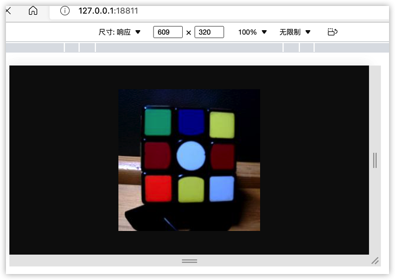

原理可查看[这里](https://wiki.sipeed.com/soft/maixpy3/zh/tools/MaixPy3_IDE.html#IDE-%E8%BF%9E%E6%8E%A5%E5%8E%9F%E7%90%86)

#### 非 OTG 运行代码

使用串口或者ssh或者设置成开机运行的代码的话，均可认为是非 OTG 运行代码，这个时候我们要通过IP来访问板子图传网址了，即访问 http://设备ip地址:18811 来查看图传实例

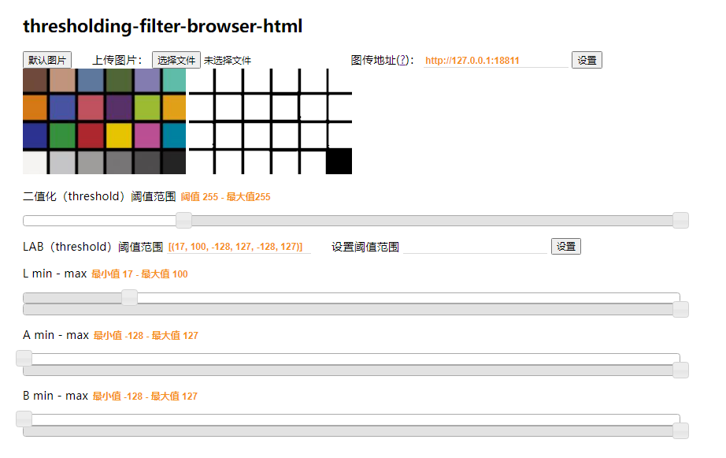

## Lab 阈值实例

前面说过，机器视觉中会利用到 Lab，同样的，MaixPy3 也提供了很简单的方法来应用 Lab 阈值。

这里有一个能直接使用的在线工具: [https://wiki.sipeed.com/threshold](https://wiki.sipeed.com/threshold)（加载有点慢） 

提供了一个简单的示例，可以自己通过调整下面滑块位置或者输入阈值数值来查看不同的效果


也可以自己手动上传图片然后查看不同阈值所产生的效果，当然这里主要介绍无线调整阈值功能。

> 由于浏览器安全因素，我们需要先打开网页 [https://wiki.sipeed.com/threshold](https://wiki.sipeed.com/threshold)，接着使用键盘上的 `Ctrl + S` 两个按键来将该网页保存到本地，接着双击文件来在本地浏览器上运行 threshold

成功运行上面[图传代码](#m2dock-启用图传)且能够在浏览器地址栏中输入板子相应的 IP 地址和图传端口号来访问图传画面后，就可以在本地阈值网页中输入正确的图传 IP 后来直接调整阈值了。下图中右上角有一个图传地址的输入栏，在那里输入正确查看 m2dock 图传的 IP 后就能够实时查看摄像头录制画面且能够实时调整阈值了。

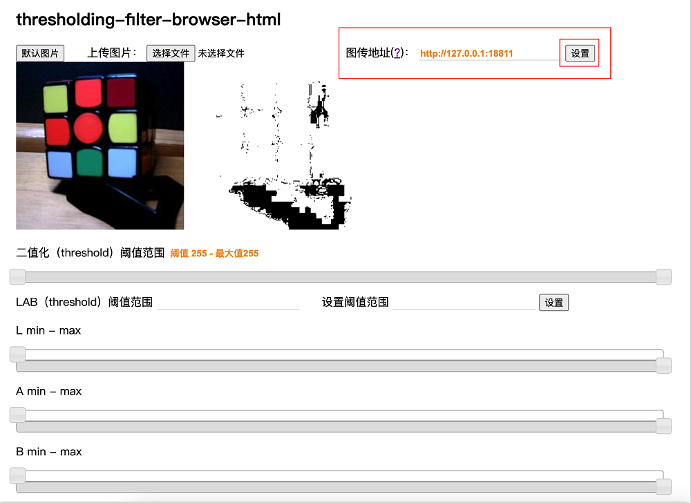

熟练的话可以知道能够调整a值来获取橙色色块阈值，做到下面的效果：

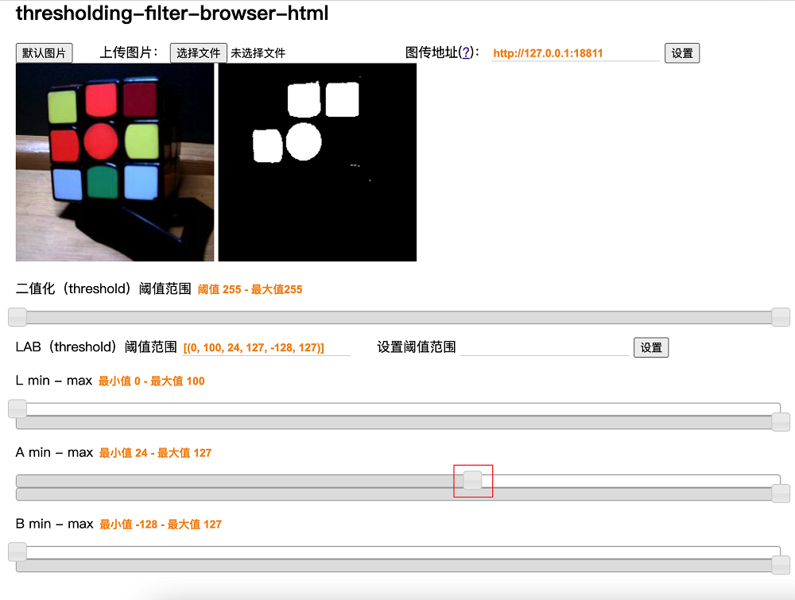

上图中可以看到除了红色和橙色之外的颜色都被过滤掉了，其他颜色都成了黑色区域。

可以再调整一下L，来使得比较黑的红色也被排除掉

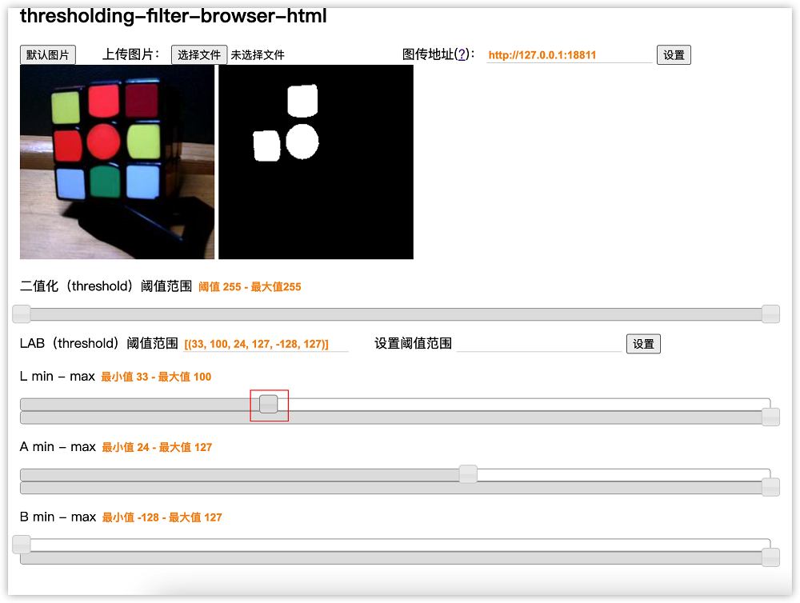

换到其他魔方面调整阈值来说橙色模块更准确点：

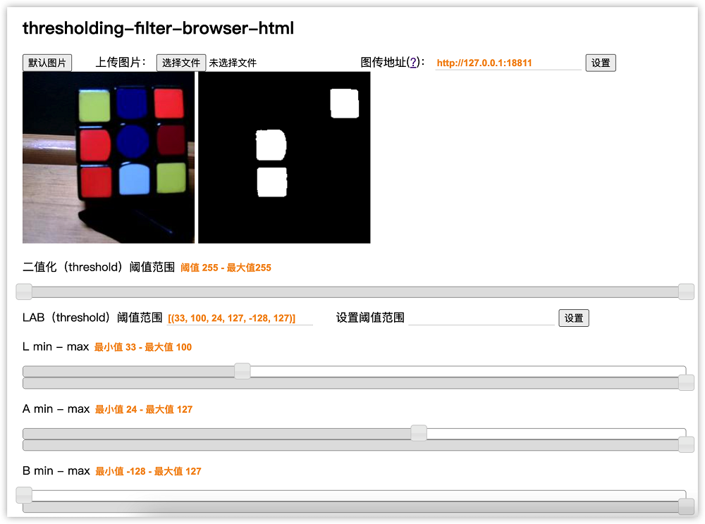

尽量在多个颜色里面来选出自己需要的颜色，因此像下面这种同一面颜色的不好选出差别

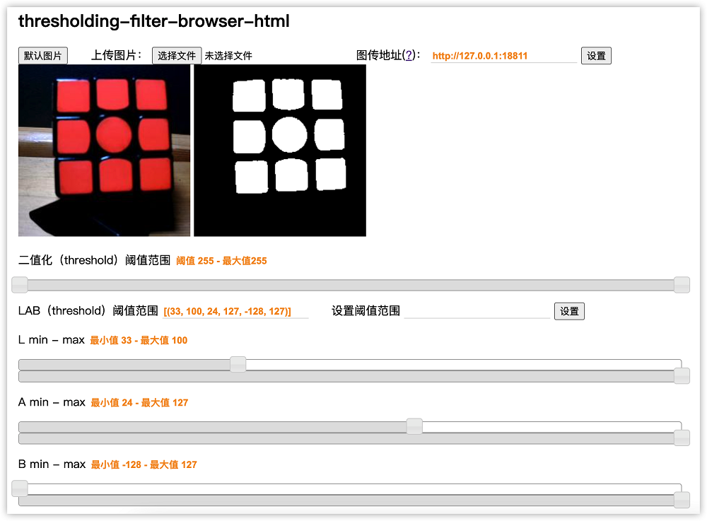

所以把魔方打乱后识别效果合适很多。

通过上述说明，可以逐步得到模仿六种颜色的阈值了。

## 实战演示

这里使用一个金字塔魔方来进行展示：

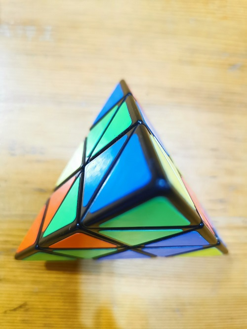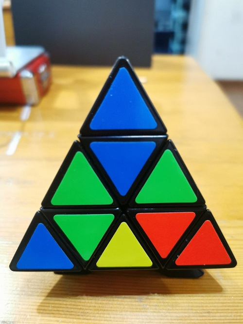

使用支架来将 m2dock 摄像头对准魔方

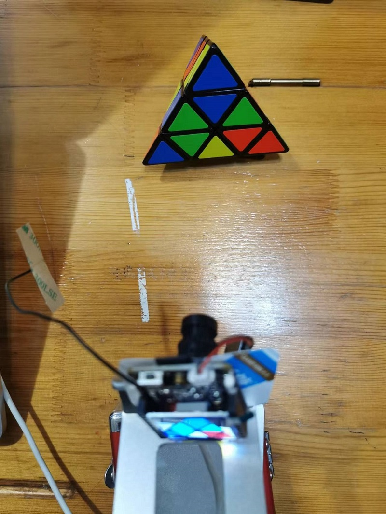

在电脑上进行阈值的调整

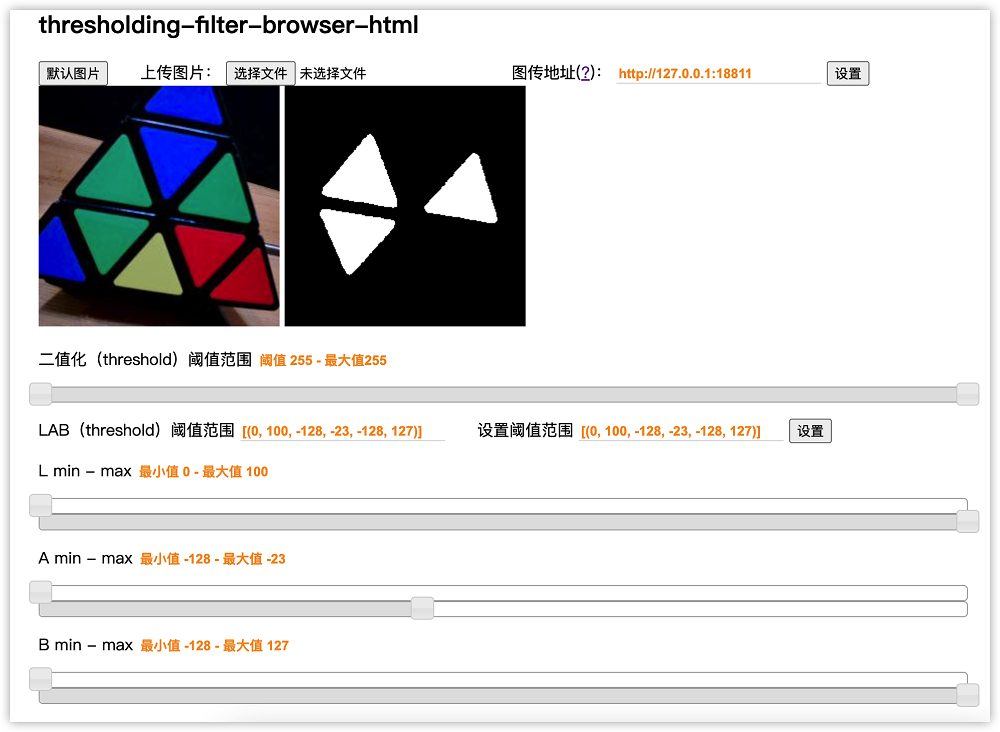

最终得到下面的四组值：

```python
[(0, 100, -128, -23, -128, 127)], #绿色
[(10, 100, 30, 127, -37, 127)],   #红色
[(40, 100, -25, 42, 7, 127)],     #黄色
[(0, 100, -128, 127, -128, -46)], #蓝色
```

根据官方例程修改后得到下面代码：

```python
from maix import image, display, camera
color = [
        [(0, 100, -128, -23, -128, 127)], #绿色
        [(10, 100, 30, 127, -37, 127)], #红色
        [(40, 100, -25, 42, 7, 127)], #黄色
        [(0, 100, -128, 127, -128, -46)], #蓝色
        ]  # 0.5.0 以后蓝色的 lab 阈值，0.4.9 之前为 [(13, 11, -91, 54, 48, -28)]
font_color = [ # 边框和文字颜色，暂时都用白色
    (255,255,255), # 绿色
    (255,255,255), # 红色
    (255,255,255), # 黄色
    (255,255,255)  # 白色
]
name_color = ('green', 'red', 'yellow', 'blue')
while True:
    img = camera.capture()
    for n in range(0,4):
        blobs = img.find_blobs(color[n])    #在图片中查找lab阈值内的颜色色块
        if blobs:
            for i in blobs:
                if i["w"]>15 and i["h"]>15:
                    img.draw_rectangle(i["x"], i["y"], i["x"] + i["w"], i["y"] + i["h"], 
                                       color=font_color[n], thickness=1) #将找到的颜色区域画出来
                    img.draw_string(i["x"], i["y"], name_color[n], scale = 0.8, 
                              color = font_color[0], thickness = 1) #在红色背景图上写下hello worl
    display.show(img)
```

运行上述代码后，识别的效果如下：

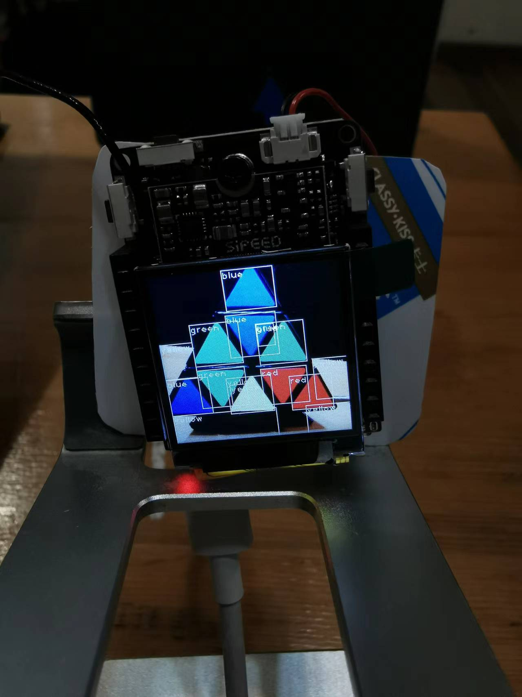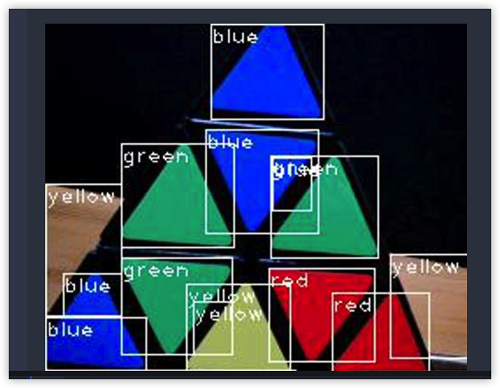

可以看到已经成功识别出魔方颜色块，且效果还不错。

具体效果视频可以前往 [原链接](https://bbs.elecfans.com/jishu_2290503_1_1.html) 查看
