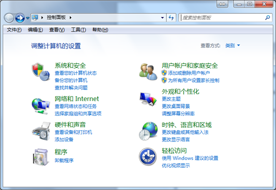

本文为转载网上文章，与任何产品的使用无关，本文仅方便用户快速了解 USB RNDIS 驱动安装的详细过程，故转载了这篇文章：[原文链接](https://www.foream.com/wiki/docs/mindoc/mindoc-1b2er0dm4pos9)

## 简述

 本文档主要描述 GHOST 4K 相机如何工作在 USB 网卡模式（符合 RNDIS 规范）如何 PC 端通过 USB 连接相机后与相机 TCP/IP 通讯，并通过 RTSP 或 RTMP 视频通讯协议获取到相机的视频流方法。本方法使用了 RNDIS `（Remote Network Driver Interface Specification）` 远程网络驱动接口规范， 就是在USB设备上跑 TCP/IP，让相机看上去像一块 PC 的网卡。
 RNDIS 是 Windows7 的一部分， 但遗憾的是如果默认安装（插上符合 RNDIS 的设备时）一般均会安装失败，本文档会描述如何重新安装 RNDIS 驱动。

## 如何 enable GHOST 4K 相机为USB网卡模式

1. 相机固件版本号： v2.0 以上

2. 在相机 SD 卡的根目录下创建文件名为 `fmcam.conf` 的文本文件

.. details:: 查看注意事项
   请注意有些系统配置会自动加上 `.txt` 的扩展名变为 `fmcam.conf.txt` 请删除 `.txt`,确保文件名只为 `fmcam.conf`。
   文件内容如下:
   usb_net=1
   usb_net_host=192.168.5.1
   usb_net_ip=192.168.5.2

3. 相机进入 USB 网卡模式后，相机 WIFI 指示灯会亮绿灯。

## 如何在 Windows7 上安装 RNDIS 驱动

1. 相机使用如上 `mcam.conf` 脚本文件开机后，插入 USB 并连接到 PC 端，Windows7 会弹出正在安装设备驱动程序软件消息。
   

>**注意**： 请确保相机先开机，识别到有效的 `fmcam.conf` 脚本文件才会进 USB 网卡模式，如果是关机插入 USB 连接电脑，会进入到 MSC U 盘模式。

2. Windows 会自动搜索并安装 RNDIS 驱动，不过片刻之后您会发现安装失败。
   

3. 右键点击桌面**计算机**图标，选择**管理**——**设备管理**，可以看到 `RNDIS/Ethernet Gadget` 设备，并且处于驱动未安装状态。
   

4. 右键点击 `RNDIS/Ethernet Gadget` 设备，选择**更新驱动程序软件**，在如何搜索设备软件提示窗口中，选择**浏览计算机查找驱动程序软件（R）**。选择从设备列表中选择**网络适配器**。
   

5. 选择**从计算机的设备驱动程序列表中选择(L)**。
   

6. 在硬件设备列表中往下拉，找到**网络适配器**,选中并**下一步**。
   

7. 在网络适配器窗口的制造商列表中选择**微软公司（Microsoft Corporation）**,右侧列表中选择远端 `RNDIS` 兼容设备（Remote NDIS Compatible Device）
   

8. 弹出如下警告窗口，请选 `YES`
   

9. 点击**是**并等待安装结束，`RNDIS` 设备将会安装成功
   

10. 在**控制面板**中选择**网络和Internet**下的**查看网络状态和任务**：
    

11. 选择**更改适配器设置**
    

12. 可以看到网络连接中多了一个本地连接`（RNDIS/Ethernet Gedget）`
    

13. 设置新增的 `USB` 网卡的 `IP` 地址（要求与相机配置文件 `fmcam.conf` 指定的 `usb_net_host` 的值一致）
   - 右击**本地连接（RNDIS/Ethernet Gadget)**
     

   - 选中 **Internet 协议版本 4(TCP/IPv4)**，点击**属性**按键，指定 `PC` 网卡的 `IP` 地址为: `192.168.5.1`.
     

14. 判断 `PC` 与相机是否可以 `ping` 通，检测方法如下：从电脑开始里找到运行，然后在运行对话框中输入 `CMD` 命令，之后按回车键，进入 `CMD` 命令操作界面，如下图：
    

    输入命令符按回车键（或点确认键）后即可进入 `CMD` 命令操作框，然后我们再输入 `ping` 命令，输入: `ping 192.168.5.2` ， 其中 `192.168.5.2` 是相机脚本文件，`fmcam.conf` 中用户设定的相机 `IP`。
    
    如果能 `ping` 通，说明相机与 `PC` 端建立 `TCP/IP` 连接成功。

## PC 端如何获取相机的视频流

### 设置视频流的分辨率及码率

在相机 `SD`卡中的配置文件 `fmcam.conf` 增加两个选项 `stream_resolution` 和  `stream_bitrate` 如：

```bash
usb_net=1

usb_net_host=192.168.5.1

usb_net_ip=192.168.5.2

stream_resolution=4KUHD

stream_bitrate=25000000
```
`stream_resolution` 用于设置相机视频流的分辨率，可以为 `4KUHD/1080P/720P/WVGA` , 均为 `30fps` 分别代表如下分辨率：

```bash
4KUHD： 3840*2160

1080P：  1920*1080

720P：   1280*720

WVGA：  848*420
```
`stream_bitrate` 用于设置相机视频流的码率，其中 1000000 代表 1Mbps, 25000000 代表 25Mbps, 800000 代表 800kbps.

### 获取 RTSP 视频流

`PC` 端安装 `VLC 播放器`，在菜单**媒体/打开网络串流**中输入 `rtsp://192.168.5.2/live`，可获得 `RTSP` 协议的视频流，其中 `192.168.5.2` 为相机的 `IP` 地址。


### 如何 PC 端通过 USB 网卡模式获取多台 GHOST 4K 的视频流

1. 配置相机为 `USB` 网卡模式，并配置为不同的网段：

   CAM1 的脚本文件 `fmcam.conf` 如下：

   ```bash
    usb_net=1

    usb_net_host=192.168.5.1

    usb_net_ip=192.168.5.2

    stream_resolution=4KUHD

    stream_bitrate=25000000
    ```

    CAM2 的脚本文件如下：

    ```bash
    usb_net=1

    usb_net_host=192.168.6.1

    usb_net_ip=192.168.6.2

    stream_resolution=4KUHD

    stream_bitrate=25000000
    ```

    CAM3 的脚本文件如下：

    ```bash
    usb_net=1

    usb_net_host=192.168.7.1

    usb_net_ip=192.168.7.2

    stream_resolution=4KUHD

    stream_bitrate=25000000
    ```

    CAM4 的脚本文件如下：

    ```bash
    usb_net=1

    usb_net_host=192.168.8.1

    usb_net_ip=192.168.8.2

    stream_resolution=4KUHD

    stream_bitrate=25000000
    ```

2. 当这 4 台相机通过 `USB` 连接 `PC` 端后， 会分别提示安装 `RNDIS/Ethernet Gedget` 驱动，按上述方法安装驱动成功后，在网络连接中会多 4 个 `RNDIS/Ethernet Getget` 网卡，分别设置对应相机的 `USB` 网卡地址为如：

    CAM1 USB 网卡 IP 地址：`192.168.5.1`

    CAM2 USB 网卡 IP 地址：`192.168.6.1`

    CAM3 USB 网卡 IP 地址：`192.168.7.1`

    CAM4 USB 网卡 IP 地址：`192.168.8.1`

3. 获取多台设备的视频流, 这 4 台设备的 `RTSP` 视频流地址分别为：

    CAM1 USB 网卡 IP 地址：`rtsp://192.168.5.2/live`

    CAM2 USB 网卡 IP 地址：`rtsp://192.168.6.2/live`

    CAM3 USB 网卡 IP 地址：`rtsp://192.168.7.2/live`

    CAM4 USB 网卡 IP 地址：`rtsp://192.168.8.2/live`