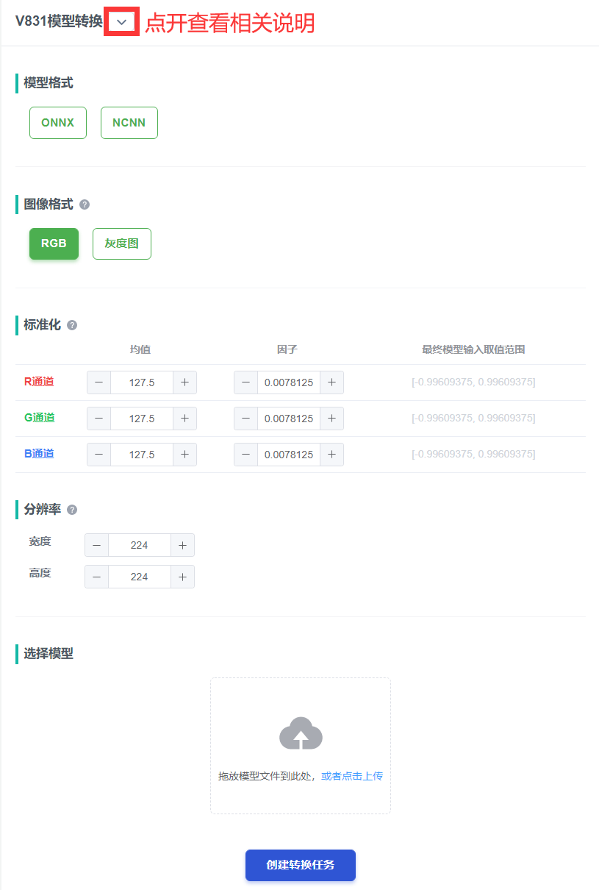

在V831上（awnn）跑 pytorch resnet18 模型，和模型转换方法

<!-- more -->

版权声明：本文为 neucrack 的原创文章，遵循 CC 4.0 BY-SA 版权协议，转载请附上原文出处链接及本声明。
原文链接：https://neucrack.com/p/358

原文时间：2021.04.10， 搬运有改动

- 可以参考一下

## 直接使用 Pytorch hub 与模型训练

此处省略模型定义和训练过程，仅使用 pytorch hub 的 resnet18 预训练模型进行简单介绍

https://pytorch.org/hub/pytorch_vision_resnet/

## 在 PC 端测试模型推理

根据上面链接的使用说明，使用下面代码可以运行模型

其中，label 下载：https://raw.githubusercontent.com/pytorch/hub/master/imagenet_classes.txt

```python
import os
import torch
from torchsummary import summary

## model
model = torch.hub.load('pytorch/vision:v0.6.0', 'resnet18', pretrained=True)
model.eval()
input_shape = (3, 224, 224)
summary(model, input_shape, device="cpu")

## test image
filename = "out/dog.jpg"
if not os.path.exists(filename):
    if not os.path.exists("out"):
        os.makedirs("out")
    import urllib
    url, filename = ("https://github.com/pytorch/hub/raw/master/images/dog.jpg", filename)
    try: urllib.URLopener().retrieve(url, filename)
    except: urllib.request.urlretrieve(url, filename)
print("test image:", filename)

## preparing input data
from PIL import Image
import numpy as np
from torchvision import transforms
input_image = Image.open(filename)

# input_image.show()
preprocess = transforms.Compose([
    transforms.Resize(max(input_shape[1:3])),
    transforms.CenterCrop(input_shape[1:3]),
    transforms.ToTensor(),
    transforms.Normalize(mean=[0.485, 0.456, 0.406], std=[0.229, 0.224, 0.225]),
])
input_tensor = preprocess(input_image)
print("input data max value: {}, min value: {}".format(torch.max(input_tensor), torch.min(input_tensor)))
input_batch = input_tensor.unsqueeze(0) # create a mini-batch as expected by the model

## forward model
# move the input and model to GPU for speed if available
if torch.cuda.is_available():
    input_batch = input_batch.to('cuda')
    model.to('cuda')
with torch.no_grad():
    output = model(input_batch)

## result    
# Tensor of shape 1000, with confidence scores over Imagenet's 1000 classes
# print(output[0])
# The output has unnormalized scores. To get probabilities, you can run a softmax on it.
max_1000 = torch.nn.functional.softmax(output[0], dim=0)
max_idx = int(torch.argmax(max_1000))
with open("imagenet_classes.txt") as f:
    labels = f.read().split("\n")
print("result: idx:{}, name:{}".format(max_idx, labels[max_idx]))
```

运行结果如下：

```python
Using cache found in /home/neucrack/.cache/torch/hub/pytorch_vision_v0.6.0
----------------------------------------------------------------
        Layer (type)               Output Shape         Param #
================================================================
            Conv2d-1         [-1, 64, 112, 112]           9,408
       BatchNorm2d-2         [-1, 64, 112, 112]             128
              ReLU-3         [-1, 64, 112, 112]               0
         MaxPool2d-4           [-1, 64, 56, 56]               0
            Conv2d-5           [-1, 64, 56, 56]          36,864
       BatchNorm2d-6           [-1, 64, 56, 56]             128
              ReLU-7           [-1, 64, 56, 56]               0
            Conv2d-8           [-1, 64, 56, 56]          36,864
       BatchNorm2d-9           [-1, 64, 56, 56]             128
             ReLU-10           [-1, 64, 56, 56]               0
       BasicBlock-11           [-1, 64, 56, 56]               0
           Conv2d-12           [-1, 64, 56, 56]          36,864
      BatchNorm2d-13           [-1, 64, 56, 56]             128
             ReLU-14           [-1, 64, 56, 56]               0
           Conv2d-15           [-1, 64, 56, 56]          36,864
      BatchNorm2d-16           [-1, 64, 56, 56]             128
             ReLU-17           [-1, 64, 56, 56]               0
       BasicBlock-18           [-1, 64, 56, 56]               0
           Conv2d-19          [-1, 128, 28, 28]          73,728
      BatchNorm2d-20          [-1, 128, 28, 28]             256
             ReLU-21          [-1, 128, 28, 28]               0
           Conv2d-22          [-1, 128, 28, 28]         147,456
      BatchNorm2d-23          [-1, 128, 28, 28]             256
           Conv2d-24          [-1, 128, 28, 28]           8,192
      BatchNorm2d-25          [-1, 128, 28, 28]             256
             ReLU-26          [-1, 128, 28, 28]               0
       BasicBlock-27          [-1, 128, 28, 28]               0
           Conv2d-28          [-1, 128, 28, 28]         147,456
      BatchNorm2d-29          [-1, 128, 28, 28]             256
             ReLU-30          [-1, 128, 28, 28]               0
           Conv2d-31          [-1, 128, 28, 28]         147,456
      BatchNorm2d-32          [-1, 128, 28, 28]             256
             ReLU-33          [-1, 128, 28, 28]               0
       BasicBlock-34          [-1, 128, 28, 28]               0
           Conv2d-35          [-1, 256, 14, 14]         294,912
      BatchNorm2d-36          [-1, 256, 14, 14]             512
             ReLU-37          [-1, 256, 14, 14]               0
           Conv2d-38          [-1, 256, 14, 14]         589,824
      BatchNorm2d-39          [-1, 256, 14, 14]             512
           Conv2d-40          [-1, 256, 14, 14]          32,768
      BatchNorm2d-41          [-1, 256, 14, 14]             512
             ReLU-42          [-1, 256, 14, 14]               0
       BasicBlock-43          [-1, 256, 14, 14]               0
           Conv2d-44          [-1, 256, 14, 14]         589,824
      BatchNorm2d-45          [-1, 256, 14, 14]             512
             ReLU-46          [-1, 256, 14, 14]               0
           Conv2d-47          [-1, 256, 14, 14]         589,824
      BatchNorm2d-48          [-1, 256, 14, 14]             512
             ReLU-49          [-1, 256, 14, 14]               0
       BasicBlock-50          [-1, 256, 14, 14]               0
           Conv2d-51            [-1, 512, 7, 7]       1,179,648
      BatchNorm2d-52            [-1, 512, 7, 7]           1,024
             ReLU-53            [-1, 512, 7, 7]               0
           Conv2d-54            [-1, 512, 7, 7]       2,359,296
      BatchNorm2d-55            [-1, 512, 7, 7]           1,024
           Conv2d-56            [-1, 512, 7, 7]         131,072
      BatchNorm2d-57            [-1, 512, 7, 7]           1,024
             ReLU-58            [-1, 512, 7, 7]               0
       BasicBlock-59            [-1, 512, 7, 7]               0
           Conv2d-60            [-1, 512, 7, 7]       2,359,296
      BatchNorm2d-61            [-1, 512, 7, 7]           1,024
             ReLU-62            [-1, 512, 7, 7]               0
           Conv2d-63            [-1, 512, 7, 7]       2,359,296
      BatchNorm2d-64            [-1, 512, 7, 7]           1,024
             ReLU-65            [-1, 512, 7, 7]               0
       BasicBlock-66            [-1, 512, 7, 7]               0
AdaptiveAvgPool2d-67            [-1, 512, 1, 1]               0
           Linear-68                 [-1, 1000]         513,000
================================================================
Total params: 11,689,512
Trainable params: 11,689,512
Non-trainable params: 0
----------------------------------------------------------------
Input size (MB): 0.57
Forward/backward pass size (MB): 62.79
Params size (MB): 44.59
Estimated Total Size (MB): 107.96
----------------------------------------------------------------
out/dog.jpg
tensor(2.6400) tensor(-2.1008)
idx:258, name:Samoyed, Samoyede
```

可以看到模型有 11,689,512 个参数，差不多 11MiB 左右，这个大小也几乎是实际在 831 上运行的模型大小了

## 将模型转换为 V831 能使用的模型文件

转换过程如下：

使用 Pytorch 将模型导出为 onnx 模型， 得到 onnx 文件

```python
def torch_to_onnx(net, input_shape, out_name="out/model.onnx", input_names=["input0"], output_names=["output0"], device="cpu"):
    batch_size = 1
    if len(input_shape) == 3:
        x = torch.randn(batch_size, input_shape[0], input_shape[1], input_shape[2], dtype=torch.float32, requires_grad=True).to(device)
    elif len(input_shape) == 1:
        x = torch.randn(batch_size, input_shape[0], dtype=torch.float32, requires_grad=False).to(device)
    else:
        raise Exception("not support input shape")
    print("input shape:", x.shape)
    # torch.onnx._export(net, x, "out/conv0.onnx", export_params=True)
    torch.onnx.export(net, x, out_name, export_params=True, input_names = input_names, output_names=output_names)
onnx_out="out/resnet_1000.onnx"
ncnn_out_param = "out/resnet_1000.param"
ncnn_out_bin = "out/resnet_1000.bin"
input_img = filename
torch_to_onnx(model, input_shape, onnx_out, device="cuda:0")
```

如果你不是使用 pytorch 转换的, 而是使用了现成的 ncnn 模型, 不知道输出层的名字, 可以在 https://netron.app/ 打开模型查看输出层的名字

使用 onnx2ncnn 工具将 onnx 转成 ncnn 模型，得到一个 .param 文件和一个 .bin 文件
按照 ncnn 项目的编译说明编译，在 build/tools/onnx 目录下得到 onnx2ncnn 可执行文件

```python
def onnx_to_ncnn(input_shape, onnx="out/model.onnx", ncnn_param="out/conv0.param", ncnn_bin = "out/conv0.bin"):
    import os
    # onnx2ncnn tool compiled from ncnn/tools/onnx, and in the buld dir
    cmd = f"onnx2ncnn {onnx} {ncnn_param} {ncnn_bin}"
    os.system(cmd)
    with open(ncnn_param) as f:
        content = f.read().split("\n")
        if len(input_shape) == 1:
            content[2] += " 0={}".format(input_shape[0])
        else:
            content[2] += " 0={} 1={} 2={}".format(input_shape[2], input_shape[1], input_shape[0])
        content = "\n".join(content)
    with open(ncnn_param, "w") as f:
        f.write(content)
onnx_to_ncnn(input_shape, onnx=onnx_out, ncnn_param=ncnn_out_param, ncnn_bin=ncnn_out_bin)

```
## 使用全志提供的awnn工具将ncnn模型进行量化到int8模型

在 maix.sipeed.com 模型转换 将 ncnn 模型转换为 awnn 支持的 int8 模型 （网页在线转换很方便人为操作，另一个方面因为全志要求不开放 awnn 所以暂时只能这样做）

阅读转换说明，可以获得更多详细的转换说明



这里有几组参数：

- 均值 和 归一化因子： 在 pytorch 中一般是 `(输入值 - mean ) / std`, awnn 对输入的处理是 `(输入值 - mean ) * norm`, 总之，让你训练的时候的输入到第一层网络的值范围和给 awnn 量化工具经过 `(输入值 - mean ) * norm` 计算后的值范围一致既可。 比如这里打印了实际数据的输入范围是 [-2.1008, 2.6400]， 是代码中 preprocess 对象处理后得到的，即 `x = (x - mean) / std ==> (0-0.485)/0.229 = -2.1179`, 到 awnn 就是 `x = (x - mean_2*255) * (1 / std * 255)` 即 `mean2 = mean * 255`, `norm = 1/(std * 255)`, 更多可以看[这里](https://github.com/Tencent/ncnn/wiki/FAQ-ncnn-produce-wrong-result#pre-process)。
所以我们这里可以设置 均值为 `0.485 * 255 = 123.675`， 设置 归一化因子为 `1/ (0.229 * 255) = 0.017125`， 另外两个通道同理。但是目前 awnn 只能支持三个通道值一样。。。所以填 `123.675, 123.675, 123.675，0.017125, 0.017125, 0.017125` 即可，因为这里用了 pytorch hub 的预训练的参数，就这样吧， 如果自己训练，可以好好设置一下

- 图片分辨率（问不是图片怎么办？貌似 awnn 暂时之考虑到了图片。。）

- RGB 格式： 如果训练输入的图片是 RGB 就选 RGB
- 量化图片， 选择一些和输入尺寸相同的图片，可以从测试集中拿一些，不一定要图片非常多，但尽量覆盖全场景（摊手

自己写的其它模型转换如果失败，多半是啥算子不支持，上图框出的地方查看所支持的算子，比如现在的版本view、 flatten、reshape 都不支持所以写模型要相当小心，后面的版本会支持 flatten reshape 等 CPU 算子

如果不出意外， 终于得到了量化好的 awnn 能使用的模型， *.param 和 *.bin

## 使用模型，在v831上推理

可以使用 python 或者 C 写代码，以下两种方式

### MaixPy3

python 请看 [MaixPy3](https://wiki.sipeed.com/soft/maixpy3/zh/)

不想看文档的话，就是在系统开机使用的基础上， 更新 MaixPy3 就可以了：

```bash
pip install --upgrade maixpy3
```

然后在终端使用 python 运行脚本（可能需要根据你的文件名参数什么的改一下代码）：

https://github.com/sipeed/MaixPy3/blob/main/ext_modules/_maix_nn/example/load_forward_camera.py

label 在这里： https://github.com/sipeed/MaixPy3/blob/main/ext_modules/_maix_nn/example/classes_label.py

```python
from maix import nn
from PIL import Image, ImageDraw
from maix import camera, display

test_jpg = "/root/test_input/input.jpg"
model = {
    "param": "/root/models/resnet_awnn.param",
    "bin": "/root/models/resnet_awnn.bin"
}

camera.config(size=(224, 224))

options = {
    "model_type":  "awnn",
    "inputs": {
        "input0": (224, 224, 3)
    },
    "outputs": {
        "output0": (1, 1, 1000)
    },
    "first_layer_conv_no_pad": False,
    "mean": [127.5, 127.5, 127.5],
    "norm": [0.00784313725490196, 0.00784313725490196, 0.00784313725490196],
}
print("-- load model:", model)
m = nn.load(model, opt=options)
print("-- load ok")

print("-- read image")
img = Image.open(test_jpg)
print("-- read image ok")
print("-- forward model with image as input")
out = m.forward(img, quantize=True)
print("-- read image ok")
print("-- out:", out.shape)
out = nn.F.softmax(out)
print(out.max(), out.argmax())

from classes_label import labels
while 1:
    img = camera.capture()
    if not img:
        time.sleep(0.02)
        continue
    out = m.forward(img, quantize=True)
    out = nn.F.softmax(out)
    msg = "{:.2f}: {}".format(out.max(), labels[out.argmax()])
    print(msg)
    draw = ImageDraw.Draw(img)
    draw.text((0, 0), msg, fill=(255, 0, 0))
    display.show(img)
```

### C 语言 SDK,libmiax

按照 https://github.com/sipeed/libmaix 的说明克隆仓库，并编译 https://github.com/sipeed/libmaix/tree/master/examples/nn_resnet

上传编译成功后dist目录下的所有内容到 v831, 然后执行./start_app.sh即可