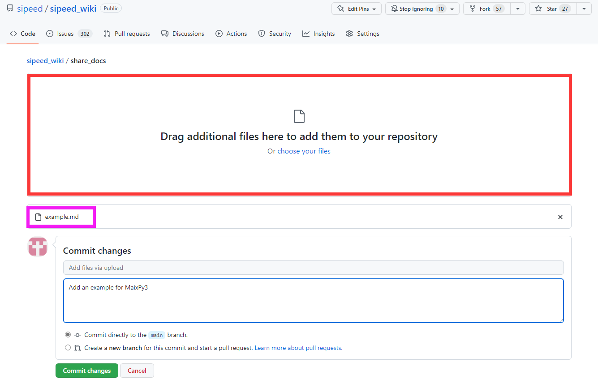

# Share article

If you want to share articles, you can add it to wiki.

Here are the steps:

---

Our wiki supports markdown and ipynb these two documents type

Visit https://github.com/sipeed/sipeed_wiki/tree/main/docs add click 'Upload files'

Then follow the prompts in the red box, the purple box shows the added document, and enter your additional notes in blue box. After these are done, click the green button `Commit changes` to finish adding document.

The repository administrator will migrate the document to the correct location according to the additional notes in the blue box when seeing it.

> Thanks for your participation in construction of open source documentation