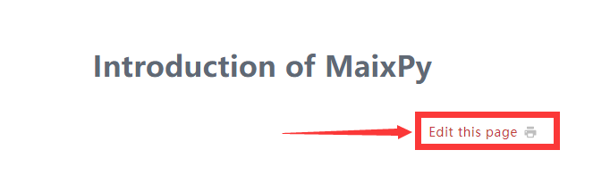
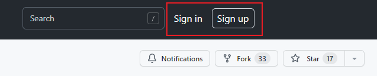
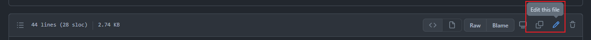
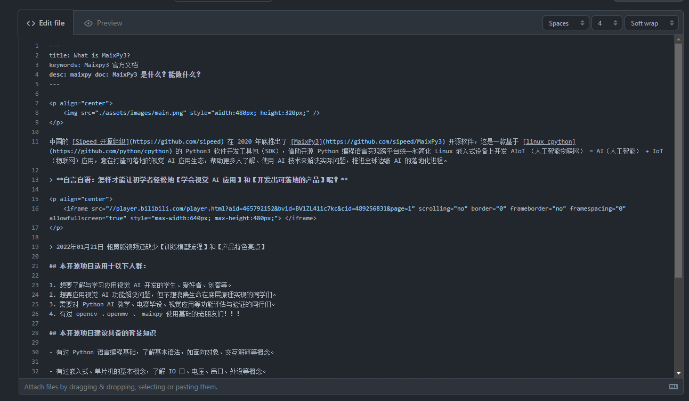
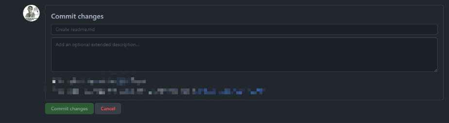

# Edit document

Because too many documents are in this site, editors may not notice errors or bugs in documents.

So if you find something wrong or incorrect, you can edit this page.

1. Go to the target site
2. Click Edit this page 

3. Sign in github

4. Click the edit icon on text box to change the content of article.

The content may show as below, just correct what you think need to be changed. 

5. Pull requset after your finishing editing and add the reason why change it.   

We will merge request if ok.