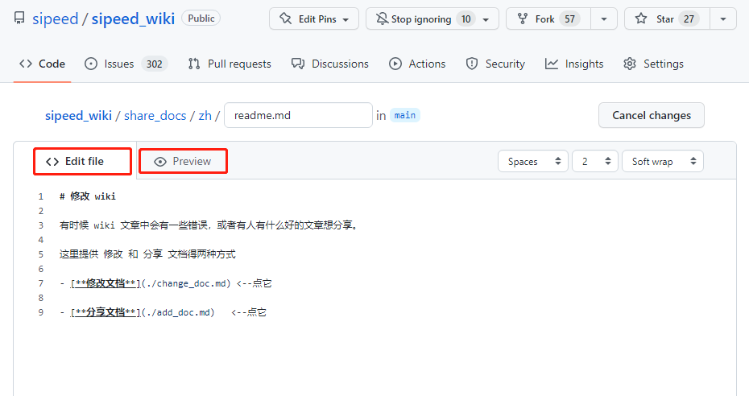
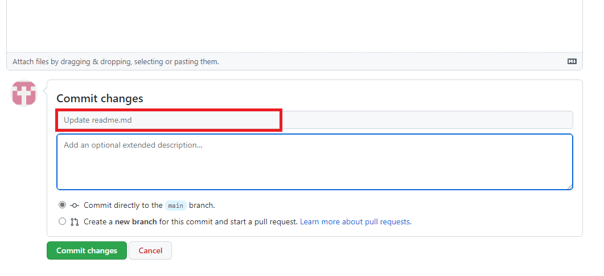

# 编辑文档

现在的文档仓库数量庞大，存在着一些编者都没有注意的错误。
当读者发现错误的时候，可以进行修改。

## 定位文件

进入需要修改的文档页面，点击 “编辑本页”

就会跳转到想要修改页面所在的 github 原文件位置。~~github 上不去的话很正常~~

## 登录 github

点击 github 页面右上角的 `sign in` 来登陆账号

## 修改文档

点击上图所框出的图标来编辑当前文件，就相当于直接对 wiki 网页编辑了。
文件主要以 markdown 为主，少部分为 ipynb 。

编辑页面如下所示，其中两个红框分别是 编辑文件 页面和 预览 页面。编辑时可以随时切换到预览页面来查看一下编辑结果

## 提交

文档修改完毕后，在编辑框最底下进行提交。
可以在红框中简述修改信息，并且在蓝框中补充说明。
也可以不进行说明直接点下方的绿色的 'Commit Changes'来进行提交

仓库管理员看到之后，会在确认可用之后合并到仓库中。

> 感谢参与建设开源文档