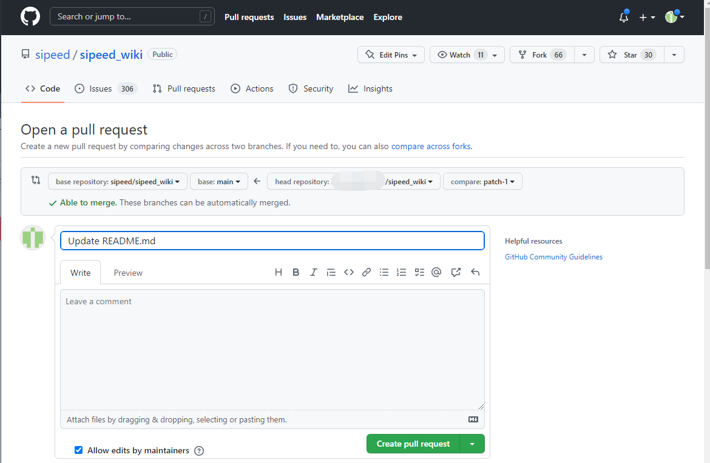

# 编辑文档

现在的 wiki 仓库内容过多，部分文档存在着一些没注意到的错误。
当读者发现错误的时候，可以自行进行修改。

可以分为几个步骤：
- 定位文档 -> 编辑本页
- 登录 github
- 编辑文档
- 增加修改说明
- 提交 PR

## 定位文件

进入需要修改的文档页面，点击 “编辑本页” 后会跳转到文档所在的 github 的网址.

没能够成功跳转的话可以尝试刷新网页或者自行搜索一下 github 打开方式（你以后会用得到）

成功跳转后会看到类似如下的界面：

## 登录 github

因为 github 上对于仓库所做的任何更改都会留下相关记录，所以需要登录账号来确定相关身份。

点击 github 页面右上角的 `sign in` 来登陆账号

## 修改文档

点击下图所框出的图标就可以编辑当前文件。

wiki 文档文件主要以 markdown 为主，少部分为 ipynb 。

点击编辑当前文件后的界面如下所示，其中两个红框分别是 编辑文件 页面和 预览 页面。
编辑文件时可以切换到预览页面来查看一下编辑效果。

## 增加修改说明

文档修改完毕后，需要在编辑框最底下进行提交。

可以在红框中简述修改信息，并且在蓝框中补充说明。
也可以不进行说明直接点下方的绿色的 `Commit Changes` 来进行提交

## 提交 PR

进行完上面的修改说明后，会跳转到如下图所示的界面。

出现下图红框处的 `Able to merge` 的话就说明能够正常提交了，这个时候点击如图右下方的 `Create pull request` 来提交申请。

点击下图中的 `Create pull request` 来确定提交。

仓库管理员看到之后，会在确认合理、可用后接受提交申请。

> 感谢参与建设开源文档