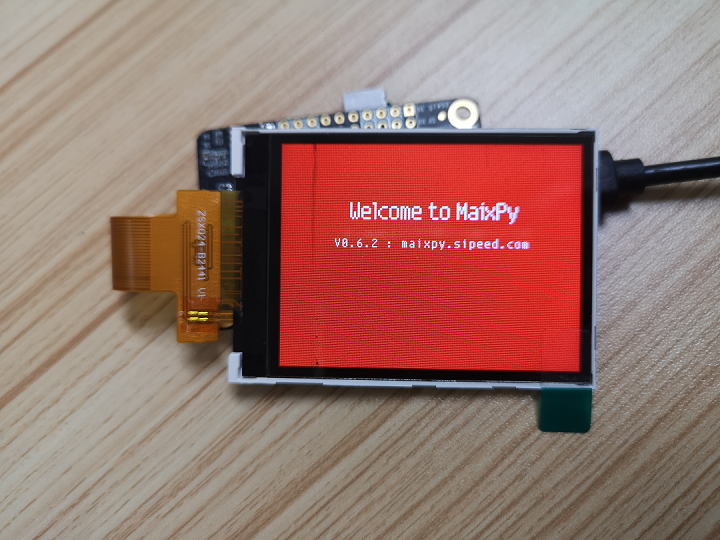

当我们拿到 MaixPy 开发板之后

## 检查硬件

检查硬件是否有损坏， 以及摄像头和屏幕是否接好，排线千万不要接反了。


## 连接硬件

连接 Type C 线， 一端电脑一端开发板

查看设备是否已经正确识别：

在 Windows 下可以打开设备管理器来查看

在 Linux 下可以通过 `ls /dev/ttyUSB*` 或者 `ls /dev/ttyACM*` 来查看， 如果没有可以 `ls /dev` 来找找，具体的设备名跟串口芯片和驱动有关


如果没有发现设备， 需要确认有没有装驱动以及接触是否良好

上电后， 如果是新出厂的开发板， 可能会显示红色背景，前景是简单的 MaixPy 介绍，包括官网地址，画面是静止的，需要通过接下来的编程让它改变。



## 检查固件版本

使用**串口终端**打开串口，然后复位，看输出的版本信息，与[github](https://github.com/sipeed/MaixPy-v1releases) 或者 [master 分支](http://dl.sipeed.com/MAIX/MaixPy/release/master/) 的固件版本对比，根据当前版本情况考虑升级到最新版本

比如：

```python
[MaixPy] init end

 __  __              _____  __   __  _____   __     __
|  \/  |     /\     |_   _| \ \ / / |  __ \  \ \   / /
| \  / |    /  \      | |    \ V /  | |__) |  \ \_/ /
| |\/| |   / /\ \     | |     > <   |  ___/    \   /
| |  | |  / ____ \   _| |_   / . \  | |         | |
|_|  |_| /_/    \_\ |_____| /_/ \_\ |_|         |_|

Official Site : https://www.sipeed.com
Wiki          : https://maixpy.sipeed.com

MicroPython v0.5.0-12-g284ce83 on 2019-12-31; Sipeed_M1 with kendryte-k210
Type "help()" for more information.
```

**查看版本号：**

  这里版本是 `v0.5.0-12-g284ce83`， 也可以使用下面的代码查看版本

> **注：** 固件可以从下载站 [dl.sipeed.com](http://dl.sipeed.com/MAIX/MaixPy/release/master/) 中获取

```python
import sys
print(sys.implementation.version)
```

如果你在开发过程中遇到了问题， 也可以先尝试更新固件到最新版本

## 执行代码

* 打开串口终端后，按开发板的复位按钮就可以看到打印的开机信息了，会输出

```shell
>>>
```
即在等待我们输入代码，如果没有这个符号，可能是有开机自动运行的程序正在运行，可以按`Ctrl+C`来取消正在运行的程序

* 然后输入程序执行

```python
>>> print("hello world")
hello world
>>>
```

## 粘贴执行多行代码

当我们有多行代码是从其它地方复制过来的，比如
```python
import os
f = os.listdir()
print(f)
```

* 先复制好代码
* 串口终端按 `Ctrl+E`
* 粘贴代码
* 按 `Ctrl+D`（注意如果之前没有按 `Ctrl+E` 则是软件复位命令，MaixPy 会软复位），然后就可以看到所有代码执行了

```python
>>>
['boot.py','main.py', 'freq.conf']
>>>

```

> 如果数据量比较大，串口可能丢失数据，会导致提示语法错误，可以多试几次
